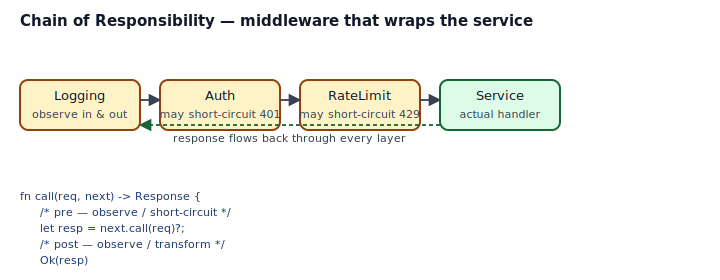
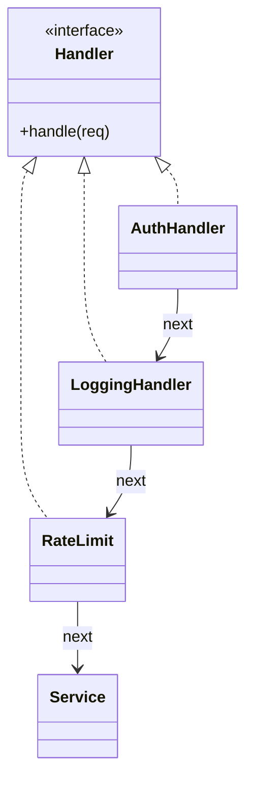
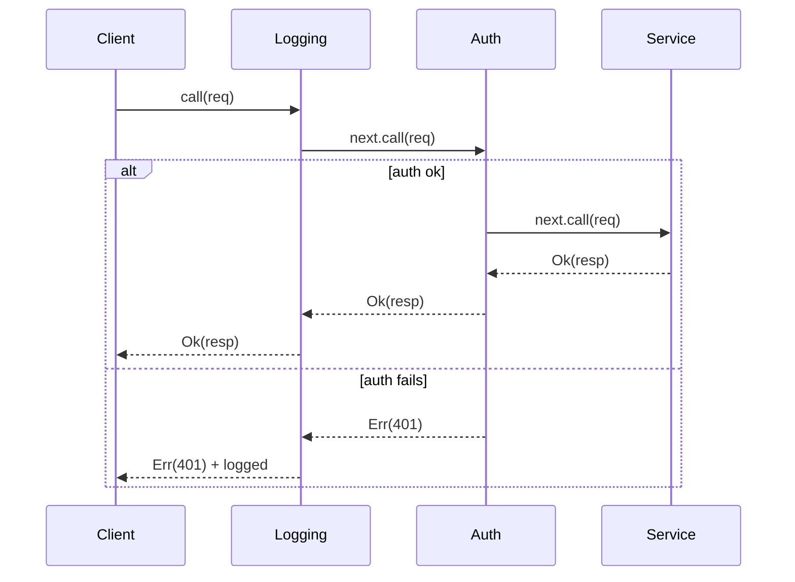

## Intent

Avoid coupling the sender of a request to its receiver by giving more than one object a chance to handle the request. Chain the receiving objects and pass the request along the chain until one of them handles it — or decides the whole chain should short-circuit.

In Rust, this pattern is the *middleware chain*: logging, auth, rate limiting, compression, CORS, timeouts — each wraps the next. The web ecosystem (`tower`, `axum`, `actix`, `warp`) is built on it. The pattern itself is small; picking the right representation (runtime `Vec<Box<dyn Handler>>` vs compile-time nested generics) is the interesting choice.

## Problem / Motivation

An HTTP server needs a pipeline of concerns around the actual handler:

1. **Logging** — observe request and response.
2. **Auth** — reject unauthenticated requests before they reach the service.
3. **RateLimit** — reject requests that exceed quotas.
4. **Compression** — encode the response.

Each of these is orthogonal. They compose cleanly if every layer has the same shape: `fn call(&self, req, next) -> Response`.



## Classical GoF Form



The literal translation is a linked list of handlers (`struct LinkedHandler { next: Option<Box<LinkedHandler>>, ... }`). It works; it's also awkward to *append* in Rust (you need to walk to the tail). Prefer one of the Rust shapes below.

## Idiomatic Rust Forms

Full code: [`code/idiomatic.rs`](./code/idiomatic.rs).

### A. `Vec<Box<dyn Handler>>` + a `Next` cursor

```rust
pub trait Handler: Send + Sync {
    fn call(&self, req: &Request, next: &Next) -> ChainResult;
}

pub struct Next<'a> {
    chain: &'a [Box<dyn Handler>],
    service: &'a dyn Fn(&Request) -> Response,
}

impl<'a> Next<'a> {
    pub fn call(&self, req: &Request) -> ChainResult {
        match self.chain.split_first() {
            Some((first, rest)) => first.call(req, &Next { chain: rest, service: self.service }),
            None => Ok((self.service)(req)),
        }
    }
}
```

Each handler receives a borrowed `Next` that walks the remaining handlers. To forward, call `next.call(req)`. To short-circuit, return `Err(Response { ... })` (or whatever your domain's "stop" signal is) without calling `next`.



Use when the middleware set is chosen at runtime (feature flags, config-driven, per-route overrides). Costs a vtable lookup per handler per request — usually negligible.

### B. Nested generic layers — the Tower/axum pattern

```rust
pub trait Service { fn call(&self, req: &Request) -> Response; }

pub struct Auth<S> { pub inner: S }
impl<S: Service> Service for Auth<S> {
    fn call(&self, req: &Request) -> Response { ... self.inner.call(req) ... }
}

let svc = Logging { inner: Auth { inner: CoreService } };
```

Each layer is generic over the next. The whole stack is monomorphized, inlined, and has zero vtable lookups. The *cost* is that the type signature of the composed service is the stack (`Logging<Auth<RateLimit<CoreService>>>`) — messy in error messages, solved by type aliases or builder APIs that produce `impl Service`.

This is how [`tower::Service`](https://docs.rs/tower) and `axum::middleware` work. Use when middleware is fixed at startup and you want zero overhead in the hot path.

## Short-circuiting vs Forwarding

Every handler has four moves:

1. **Observe the request** (logging headers, incrementing counters).
2. **Short-circuit** — return a response without calling `next`. Use for auth failures, rate limits, circuit breakers.
3. **Modify the request** before forwarding — rewrite paths, inject headers, decompress body.
4. **Observe/modify the response** after `next` returns — log status, encode body, strip sensitive headers.

A handler that always calls `next` is a pure observer. A handler that sometimes doesn't is a gatekeeper. Both are legitimate; the pattern accommodates both with the same shape.

## Anti-patterns & Rust-specific Caveats

- ⚠️ **Don't store handlers as `Vec<dyn Handler>`.** Trait objects are unsized. You need `Vec<Box<dyn Handler>>` or `Vec<Arc<dyn Handler>>`. See [`code/broken.rs`](./code/broken.rs).
- ⚠️ **Don't build the linked-list form "because it looks like the diagram".** Appending to a singly-linked list in Rust fights ownership — you end up taking `self` by value, rebuilding, and returning a new list. A `Vec` is simpler and the order is explicit.
- ⚠️ **Don't let a handler panic to short-circuit.** The chain should observe every response, successful or not. `return Err(Response { status: 401 })` preserves the observer contract; `panic!("unauthed")` breaks logging, metrics, and error reporting.
- ⚠️ **Don't hold locks across `next.call`.** If a handler acquires a mutex to measure something, it MUST release it before calling `next` or the rest of the chain runs under the lock — deadlock-prone and contention-heavy.
- ⚠️ **Don't share mutable state between handlers via `&mut self`.** The chain calls handlers via `&self` (since one chain can serve many requests). If a handler needs per-request state (attempts, timers), pass it through the request, a task-local, or an interior-mutability primitive scoped correctly.
- ⚠️ **Don't mix async and sync handlers.** A chain where half the layers are sync and half are async is a nightmare. Pick one: Tower's `Service` is async (`async fn call`); some simpler chains are sync. `axum` commits to async everywhere.
- ⚠️ **Don't let layers order themselves.** Middleware order is a global property of the app. Express it at the assembly site (`Builder::new().layer(Logging).layer(Auth).layer(RateLimit).service(core)`), not inside individual handlers.

## Compiler-Error Walkthrough

[`code/broken.rs`](./code/broken.rs) stores a collection of unsized trait objects:

```rust
pub struct Chain {
    pub handlers: Vec<dyn Handler>,
}
```

```
error[E0277]: the size for values of type `(dyn Handler + 'static)` cannot be known at compilation time
  |
  |     pub handlers: Vec<dyn Handler>,
  |                       ^^^^^^^^^^^ doesn't have a size known at compile-time
  |
help: use `Vec<Box<dyn Handler>>` instead
```

Read it: `Vec<T>` requires `T: Sized`. `dyn Handler` isn't. The fix is to put each handler behind a pointer: `Vec<Box<dyn Handler>>` (owned) or `Vec<Arc<dyn Handler>>` (shared).

### The second mistake in `broken.rs`

A self-referential linked-list `LinkedHandler { next: Option<Box<LinkedHandler>> }` compiles but is awkward to *append* to: reaching the tail means recursing through each Box, and if you try that with `&mut self`, the nested borrows conflict (E0499). The `Vec<Box<dyn Handler>>` form sidesteps the entire tangle.

`rustc --explain E0277` covers sized bounds; `rustc --explain E0499` covers multiple mutable borrows.

## When to Reach for This Pattern (and When NOT to)

**Use Chain of Responsibility when:**
- You have a pipeline of orthogonal concerns wrapping a core operation.
- Each layer can *observe*, *short-circuit*, or *transform*.
- The set of layers is stable within the application but might change per environment.

**Prefer the `Vec<Box<dyn Handler>>` form when:**
- Middleware is picked at runtime, from config or feature flags.
- Handlers are trivial and the vtable cost is noise.

**Prefer nested generic layers (Tower style) when:**
- Middleware is fixed at startup.
- The hot path matters and you want full inlining.
- You're already in an ecosystem (Tower, axum) that speaks this dialect.

**Skip the pattern when:**
- One handler does it all. A function is fine.
- The "chain" is really a sequence of mutations. Use pipeline / iterator adapters.
- The order of "handlers" matters in a non-linear way (some parallel, some conditional). That's orchestration, not a chain.

## Verdict

**`use-with-caveats`** — this is one of the most-used Rust patterns in practice (every Tower/axum user is using it), but it can be over-engineered quickly. Start with a `Vec<Box<dyn Handler>>` if you need runtime composition; reach for Tower's nested Layer pattern when you're building infrastructure that must be zero-cost.

## Related Patterns & Next Steps

- [Decorator](../../gof-structural/decorator/index.md) — each middleware layer is a decorator wrapping the next. The patterns rhyme; CoR adds the "short-circuit" contract.
- [Command](../command/index.md) — a queue of commands is a degenerate chain where every handler runs and none short-circuits.
- [Observer](../observer/index.md) — an observer fans out an event; a chain pipes a request through sequentially.
- [Strategy](../strategy/index.md) — a chain of strategies is a middleware pipeline; a single strategy is one layer.
- [Closure as Callback](../../rust-idiomatic/closure-as-callback/index.md) — simple middleware can be a `Vec<Box<dyn Fn(&Request, &Next) -> Response>>`, no trait required.
