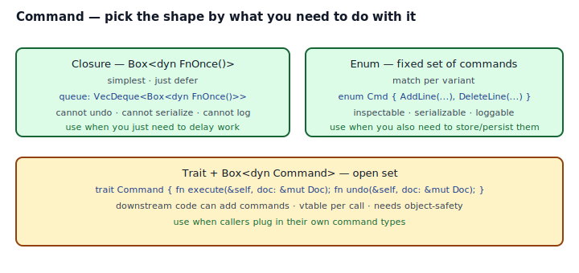
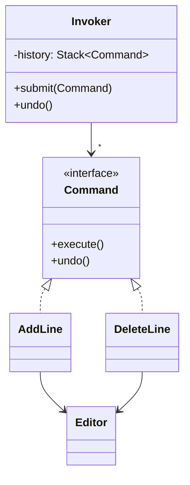

## Intent

Encapsulate a request as an object, thereby letting you parameterize clients with different requests, queue or log them, and support undoable operations.

In Rust, "request as an object" has three natural shapes: a closure (`Box<dyn FnOnce()>`), an enum + match, or a trait + `Box<dyn Command>`. Pick by what you actually need to *do* with the command object beyond calling it.

## Problem / Motivation

A text editor wants undo/redo. A task runner wants a queue of deferred work. A remote-procedure-call system wants messages it can serialize. All three are "Command" — but they need different capabilities:

| Need | Minimum shape |
|---|---|
| Just defer work | `Box<dyn FnOnce()>` |
| Inspect / serialize | `enum` with named variants |
| Undo | `enum` or `trait` with `undo()` |
| Plugins add commands | `trait` + `Box<dyn Command>` |



Rust pushes you to pick consciously. That's a feature — each shape has different costs, and the GoF drawing conflates them.

## Classical GoF Form



The Rust port lives in [`code/gof-style.rs`](./code/gof-style.rs). It's the right shape when commands come from *outside* your crate — plugins, user-defined macros, scripts — and the set is genuinely open. For a closed set, the enum form below is usually cleaner.

## Idiomatic Rust Forms

Full code: [`code/idiomatic.rs`](./code/idiomatic.rs).

### A. Enum + match — closed, serializable, undoable

```rust
pub enum Cmd {
    AddLine    { text: String, inserted_at: Option<usize> },
    DeleteLine { index: usize, removed:     Option<String> },
}

impl Cmd {
    pub fn execute(&mut self, doc: &mut Editor) { match self { ... } }
    pub fn undo(&mut self,   doc: &mut Editor) { match self { ... } }
}
```

- **Inspectable** — `match` on the variant; print, log, persist.
- **Serializable** — `#[derive(Serialize, Deserialize)]` works out of the box.
- **Closed** — new command types require editing this module. That is a feature when you want a command audit trail or a serialization schema.
- **Zero indirection** — the variant tag is a small integer; no heap allocation per command, no vtable.

### B. Closure — `Box<dyn FnOnce()>` for deferred work

```rust
pub struct Queue {
    work: VecDeque<Box<dyn FnOnce() + Send + 'static>>,
}

impl Queue {
    pub fn submit<F: FnOnce() + Send + 'static>(&mut self, f: F) {
        self.work.push_back(Box::new(f));
    }
    pub fn run_all(&mut self) {
        while let Some(cmd) = self.work.pop_front() { cmd(); }
    }
}
```

- **Zero ceremony** — callers write the command inline, captures captured.
- **One-shot** — `FnOnce` by default because deferred work rarely repeats. Use `FnMut` for repeated callbacks.
- **Cannot undo, cannot inspect, cannot serialize.** When you only need "run this later", this is the shape. See also [Closure as Callback](../../rust-idiomatic/closure-as-callback/index.md).

### C. Trait + `Box<dyn Command>` — open set

```rust
pub trait Command {
    fn execute(&mut self, doc: &mut Editor);
    fn undo(&mut self,    doc: &mut Editor);
    fn name(&self) -> &'static str;
}
```

- **Open set** — callers in other crates implement `Command` for their own types.
- **Vtable dispatch** per call. Usually negligible, measurable in hot loops.
- **Object-safe design required** — no `Self`-returning methods, no generic methods.

## Decision Guide

| Situation | Shape |
|---|---|
| Closed set + need undo / persistence / inspection | **Enum** (`A`) |
| Just "defer this work", no audit, no undo | **Closure** (`B`) |
| Plugins / user-defined command types | **Trait + `Box<dyn>`** (`C`) |

## Anti-patterns & Rust-specific Caveats

- ⚠️ **Don't reach for `Box<dyn Command>` first.** An enum is lighter, cheaper, and closer to Rust's strengths. Use `dyn` when the set is genuinely open.
- ⚠️ **Don't put `FnOnce` behind a shared reference.** Calling a `Box<dyn FnOnce()>` through `&dyn FnOnce()` is a compile error — `FnOnce` consumes itself, so you need ownership (a `Box<dyn FnOnce()>` by value or a `Vec<Box<dyn FnOnce()>>` you `.pop()` from). See [`code/broken.rs`](./code/broken.rs).
- ⚠️ **Don't mix trait + enum by "just making the enum implement the trait."** Pick one. Either the enum is the command (match in its methods) or a trait is (open set). Mixing them doubles the API surface.
- ⚠️ **Don't forget the undo state.** Every reversible command carries both *what to do* and *what was undone's worth*. For `AddLine`, you need `inserted_at: Option<usize>` populated on `execute()` so `undo()` knows what to pop. Store that state on the command itself, not on the invoker.
- ⚠️ **Don't undo after replay.** Invoker stacks are deceptive: a sloppy `submit()` implementation should *clear* the redo stack (a new action invalidates future redo). Show it in code: `self.redo.clear();`.
- ⚠️ **Don't serialize `Box<dyn Command>`.** `serde` can't serialize trait objects without help. If you need serialization, use the enum form and derive `Serialize`.
- ⚠️ **Don't log the command's `.execute()` side effect** as "the log of what happened." Log the *command* (the enum variant). Replay = re-execute the log. Undo = read backwards.

## Compiler-Error Walkthrough

[`code/broken.rs`](./code/broken.rs) shows two classic failures.

### Mistake 1: calling `FnOnce` through `&self`

```rust
pub fn run(&self) {
    for cmd in &self.work { cmd(); }   // E0507
}
```

```
error[E0507]: cannot move out of `*cmd` which is behind a shared reference
  |     for cmd in &self.work { cmd(); }
  |                             ^^^ move occurs because the function's
  |                                 self parameter is `FnOnce`
```

Read it: `FnOnce` consumes the closure. Iterating via `&self` only hands you shared references; calling each closure would require moving it out. The fix is to iterate via `&mut` + `Vec::drain` or `VecDeque::pop_front`, both of which hand you ownership:

```rust
pub fn run(&mut self) {
    while let Some(cmd) = self.work.pop_front() { cmd(); }
}
```

### Mistake 2: non-object-safe trait behind `dyn`

```rust
pub trait Command {
    fn execute(&mut self);
    fn clone_command(&self) -> Self;   // references Self
}
pub fn run_boxed(_c: Box<dyn Command>) {}
```

```
error[E0038]: the trait `Command` cannot be made into an object
  |     pub trait Command {
  |               ------- this trait cannot be made into an object...
  |         fn clone_command(&self) -> Self;
  |                                    ---- ...because method
  |                                         `clone_command` references the
  |                                         `Self` type in its return type
```

Read it: object-safety rules forbid methods that return `Self` (because the concrete type isn't known behind `dyn`). Fix by moving Self-returning methods into a separate non-object-safe supertrait, or by replacing them with `Box<dyn Command>` return types.

`rustc --explain E0038` covers object-safety rules in full.

## When to Reach for This Pattern (and When NOT to)

**Use Command when:**
- You need undo/redo.
- You need a queue of deferred operations.
- You want to log, serialize, or replay actions.
- You want to parameterize a subsystem by the *action*, not the data.

**Skip Command when:**
- You have one function and one caller and the "command" is just the function call. YAGNI.
- The "command" never leaves the current stack frame. Just call it.
- You'd be writing a Command class with one `execute()` method. That's a closure.

## Verdict

**`use-with-caveats`** — the pattern's intent is real and often needed (editors, task runners, RPC, reactive frameworks). The trap is defaulting to the heaviest form. Pick the enum for closed sets, the closure for pure deferral, the trait only for open sets.

## Related Patterns & Next Steps

- [Closure as Callback](../../rust-idiomatic/closure-as-callback/index.md) — the Fn-family treatment the closure form of Command relies on.
- [Observer](../observer/index.md) — often paired: observers fire commands.
- [Memento](../memento/index.md) — a per-command snapshot is one way to implement undo when commands are too entangled to invert.
- [State](../state/index.md) — state transitions and commands are duals; a state change is an executed command, an undo reverses it.
- [Iterator](../iterator/index.md) — `for cmd in history.drain(..) { cmd.execute(doc); }` is the replay path.
