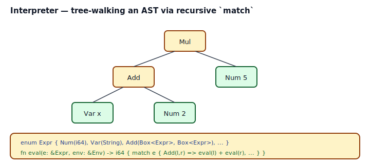
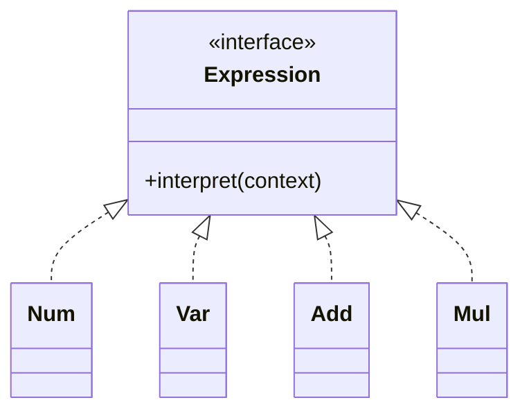
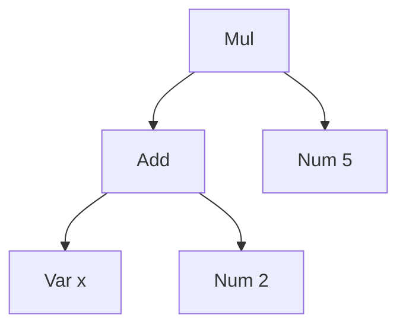

## Intent

Given a language, define a representation for its grammar along with an interpreter that uses the representation to interpret sentences in the language.

In Rust, the "representation of grammar" is an **enum** — one variant per grammar rule. The "interpreter" is a **recursive `match`** — one function per interpretation mode (eval, pretty-print, constant-fold, type-check). No Visitor hierarchy, no per-rule class, no double dispatch. The AST enum and the interpretation functions are independent axes.

This is the same closed-data-type shape [Visitor](../visitor/index.md) describes from the other direction. Interpreter is Visitor's "many operations, one tree" sibling.

## Problem / Motivation

You want a small domain-specific language: arithmetic, path expressions, access-control rules, template strings. You need:

- A data structure for the parsed program.
- At least one way to execute or inspect it — evaluate, pretty-print, serialize, optimize.

Rolling a full compiler is overkill. Hand-writing if-chains over strings is fragile. The Interpreter pattern sits in between: a typed AST + a recursive walker per interpretation.



The classical GoF solution uses a class per grammar rule, all implementing `Expression::interpret(&Context)`. Rust's closed-enum form is strictly smaller: one `enum Expr` with variants per rule, one function with a `match` per interpretation.

## Classical GoF Form



Direct Rust translation in [`code/gof-style.rs`](./code/gof-style.rs) — a trait plus one struct per rule, with `Box<dyn Expression>` for children. It works; it's also four heap allocations per expression tree, four vtable lookups per eval, and — importantly — you lose the compiler's exhaustive-match refactor signal. Adding a new grammar rule (`Sub`) doesn't break old `match`es on `dyn Expression` because there isn't one; the cost is that bugs-from-new-rules appear at runtime.

## Idiomatic Rust Form

Full code: [`code/idiomatic.rs`](./code/idiomatic.rs).

```rust
pub enum Expr {
    Num(i64),
    Var(String),
    Add(Box<Expr>, Box<Expr>),
    Sub(Box<Expr>, Box<Expr>),
    Mul(Box<Expr>, Box<Expr>),
}

pub fn eval(e: &Expr, env: &Env) -> Result<i64, EvalError> {
    match e {
        Expr::Num(n)     => Ok(*n),
        Expr::Var(name)  => env.get(name).copied().ok_or_else(|| EvalError::UnknownVar(name.clone())),
        Expr::Add(a, b)  => Ok(eval(a, env)? + eval(b, env)?),
        Expr::Sub(a, b)  => Ok(eval(a, env)? - eval(b, env)?),
        Expr::Mul(a, b)  => Ok(eval(a, env)? * eval(b, env)?),
    }
}
```



The same shape handles `pretty(&Expr)`, `fold(&Expr)` (constant folding), `free_vars(&Expr)` — each is a fresh `match`. Adding a new interpretation is adding a new function. Adding a new grammar rule is adding a new enum variant and getting E0004 in every function with the obvious list of cases to handle — the compiler's refactor assistant.

### Constructors for readable ASTs

The `Box<Expr>` in every binary variant is necessary for sizing but noisy at use sites. Ship helper constructors so callers write `Expr::mul(a, b)` instead of `Expr::Mul(Box::new(a), Box::new(b))`. See `Expr::add`, `Expr::sub`, `Expr::mul` in `code/idiomatic.rs`.

### Typed errors, not panics

Missing variable? `eval` returns `Err(EvalError::UnknownVar(name))`. Division by zero? `Err(EvalError::DivByZero)`. Keep the `EvalError` enum `#[non_exhaustive]` so adding a variant isn't a breaking change. A tree-walking interpreter that `.unwrap()`s on unknown names ships bugs to production the first time a user types a typo.

### When to escalate past this pattern

An interpreter-pattern enum works great for:

- Configuration DSLs (path expressions, pattern matchers, simple predicates).
- Template engines (substitution + simple conditionals).
- Small query/filter languages (JSONPath-like selectors).
- Tutorial compilers and calculators.

It breaks down when:

- **The grammar is large or formal.** Parse with `nom`, `pest`, `chumsky`, or `lalrpop`; they generate the `Expr` enum for you from a grammar spec.
- **Performance matters.** Tree-walking is ~10–100× slower than bytecode or JIT. For hot-loop scripting, compile the AST to a byte-coded IR and run that; for native speed, `cranelift` or `inkwell` (LLVM) emit real code.
- **The language has scopes, closures, types.** The AST grows fast; you'll want an intermediate representation (IR) rather than folding everything into `Expr`.

Know when to escalate. The pattern is for small languages.

## Interpreter vs Visitor

Same data shape; different angle:

| Axis | Interpreter | Visitor |
|---|---|---|
| Emphasis | Many **operations** over one tree | Separating operations from structure |
| Typical rendering | `fn eval(&Expr, &Env)` / `fn pretty(&Expr)` | `trait Visitor { fn visit_X(...) }` + `Element::accept` |
| Rust default | enum + recursive `match` | enum + recursive `match` |
| GoF double-dispatch | Not needed (rules are functions) | Classic double-dispatch on `Element::accept(&Visitor)` |

In Rust, both collapse to the same enum-and-match form. Reach for the trait-object Visitor only for the open-hierarchy case. See [Visitor](../visitor/index.md).

## Anti-patterns & Rust-specific Caveats

- ⚠️ **Don't write recursive variants without `Box`.** `Expr::Add(Expr, Expr)` fails with E0072 (recursive type has infinite size). `Box<Expr>` adds the necessary indirection; `Vec<Expr>` works for variadic children.
- ⚠️ **Don't use `_` in `match` to silence the exhaustiveness check.** A wildcard hides the new-variant refactor signal — the whole point of the enum form. Reserve `_` for genuinely "handle everything else" cases (default arms in pretty-print fallbacks, etc.).
- ⚠️ **Don't recurse unboundedly.** Tree-walking `eval` on a 60,000-deep left-leaning Add will blow the stack. For production interpreters, use an explicit work stack, tail-call into loops where possible, or run on a thread with a large explicit stack (`std::thread::Builder::stack_size`).
- ⚠️ **Don't `.unwrap()` in `eval`.** Unknown variables, type mismatches, divide-by-zero are runtime-possible; they deserve typed errors, not panics. Return `Result<_, EvalError>`.
- ⚠️ **Don't embed parsing into the interpreter.** Separate concerns: a parser produces `Expr`; `eval` consumes `Expr`. Inline parsing inside `eval` makes testing, error messages, and tooling harder.
- ⚠️ **Don't forget lifetimes for string children.** If `Var` wraps `&'a str`, the whole AST gets a lifetime parameter, which ripples everywhere. `String` (owned) is the painless default; trade up to `Arc<str>` or `Cow<'a, str>` only after profiling.
- ⚠️ **Don't conflate environment and AST.** `Env` is runtime state (variables, stack); `Expr` is syntax. Pass the env as an argument; don't stash it in the AST.
- ⚠️ **Don't hand-code large grammars.** If your language has more than ~15 rules, start with a parser generator (`pest`, `lalrpop`) or a parser combinator library (`nom`, `chumsky`). They produce the AST and you're back in the enum-and-match rhythm.

## Compiler-Error Walkthrough

[`code/broken.rs`](./code/broken.rs) contains three teaching mistakes.

### Mistake 1: recursive enum without `Box`

```rust
pub enum Expr {
    Num(i64),
    Add(Expr, Expr),
}
```

```
error[E0072]: recursive type `Expr` has infinite size
  |
  | pub enum Expr {
  | ^^^^^^^^^^^^^
  |     Add(Expr, Expr),
  |         ---- recursive without indirection
  |
help: insert some indirection (e.g., a `Box`, `Rc`, or `&`) to break the cycle
```

**Fix**: `Add(Box<Expr>, Box<Expr>)`. One pointer-sized indirection per child breaks the recursion. Same story as [Composite](../../gof-structural/composite/index.md).

### Mistake 2: missing arm after adding a variant

```rust
pub enum Expr2 { Num(i64), Add(Box<Expr2>, Box<Expr2>), Sub(Box<Expr2>, Box<Expr2>) }

pub fn eval(e: &Expr2) -> i64 {
    match e {
        Expr2::Num(n) => *n,
        Expr2::Add(a, b) => eval(a) + eval(b),
        // Sub missing — E0004
    }
}
```

```
error[E0004]: non-exhaustive patterns: `Sub(_, _)` not covered
```

**This is the compiler enforcing the refactor.** When the grammar grows, every interpretation function that handles old variants must handle the new one — or pick a deliberate default. Rust makes the compiler your reviewer.

### Mistake 3 (runtime): deep recursion

Not a compile error; the teaching point is that tree-walking interpreters blow the stack at ~60k depth. Production implementations use an explicit `Vec<Expr>` work stack, or wrap `eval` in a thread with `stack_size(32 * 1024 * 1024)`.

`rustc --explain E0072` covers recursive-type sizing; `rustc --explain E0004` covers exhaustive-match requirements.

## When to Reach for This Pattern (and When NOT to)

**Use the enum-based Interpreter when:**
- You have a small DSL — config expressions, predicates, template fragments.
- You'll add operations over time (eval, print, lint, optimize).
- You want the compiler to force you to handle every variant in every operation.

**Escape this pattern when:**
- The grammar has more than ~15 rules — use a parser generator.
- Performance matters — compile to a byte-coded IR or native code.
- You need scopes, closures, types, or module systems — build an IR and a real compiler.

**Skip Interpreter entirely when:**
- The "language" is three string substitutions. A `String::replace` loop is enough.
- The problem is data, not code. A `HashMap<String, i64>` is not a language.

## Verdict

**`use-with-caveats`** — Interpreter maps to Rust's enum + `match` with zero friction, and the compiler's exhaustiveness check makes the pattern safer than in any class-based language. The caveats: recursive variants need `Box`; don't hide new-variant bugs with `_`; know when to escalate to a real parser and IR.

## Related Patterns & Next Steps

- [Visitor](../visitor/index.md) — sibling pattern; same enum + match core, different emphasis.
- [Composite](../../gof-structural/composite/index.md) — the AST is a Composite; every grammar rule is a node.
- [Command](../command/index.md) — compiled bytecode is a Vec of Commands; `eval` becomes a loop over them.
- [Strategy](../strategy/index.md) — alternate eval strategies (strict, lazy, memoizing) are Strategy-parameterized closures over the same AST.
- [Iterator as Strategy](../../rust-idiomatic/iterator-as-strategy/index.md) — iterator-based AST traversal is often cleaner than hand-rolled recursion for bulk transforms.
