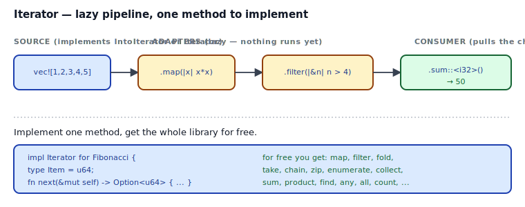
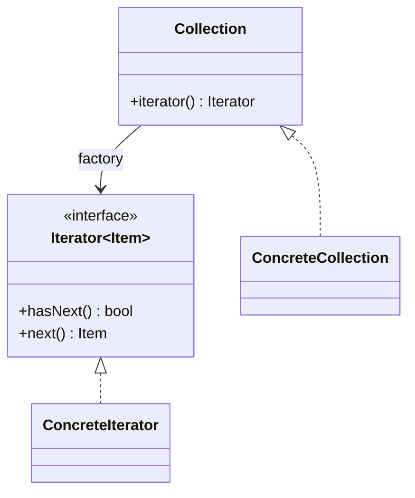

## Intent

Provide a way to access the elements of a collection sequentially without exposing its underlying representation.

Iterator is the one GoF pattern that Rust's standard library adopts wholeheartedly, extends dramatically, and makes free to implement. Every collection in `std` is iterable; every iterator gets dozens of combinators for free. The pattern is essentially "implement one method (`next`), get a whole library."

## Problem / Motivation

Traversing a collection — array, tree, hash map, file-by-line, Fibonacci — should be uniform. Callers shouldn't have to know whether the collection is contiguous, linked, hashed, or lazily generated. The GoF answer: an `Iterator` interface with `hasNext`/`next`, created by an `iterator()` factory method on the collection.



Rust's version dispenses with `hasNext` — `next()` simply returns `Option<Item>`, and `None` means "done." Everything else is built on top of that single operation.

## Classical GoF Form



The direct Rust port lives in [`code/gof-style.rs`](./code/gof-style.rs). It compiles, but it's stripped of the whole reason you'd write an iterator in the first place: none of the standard combinators (`map`, `filter`, `fold`, `collect`, …) apply to your custom `GofIterator` trait, because those are defined on `std::iter::Iterator`.

## Why the Rust Standard Library Form Wins

The Rust `Iterator` trait is the canonical implementation of this pattern. Two reasons the standard form dominates:

1. **One method to implement, ~70 methods to use.** Implement `fn next(&mut self) -> Option<Item>` and you inherit default implementations of `map`, `filter`, `fold`, `sum`, `count`, `chain`, `zip`, `enumerate`, `take`, `skip`, `flat_map`, `collect`, `any`, `all`, `find`, `position`, and many more.
2. **Lazy by construction.** `iter.map(f).filter(p)` returns an adapter struct whose `next()` threads items through `f` and `p` one at a time. Nothing is materialized until a consumer (`collect`, `sum`, `for_each`, `count`) pulls the chain.

```mermaid
flowchart LR
    Src[vec![1,2,3,4,5]] -->|.iter()| M[.map<br/>|x| x*x]
    M -->|lazy| F[.filter<br/>|&n| n > 4]
    F -->|lazy| C{consumer}
    C -->|.collect| Vec1[Vec]
    C -->|.sum| Sum[i32]
    C -->|.count| Cnt[usize]
```

Full code: [`code/idiomatic.rs`](./code/idiomatic.rs) — a `Fibonacci` struct and an in-order `Tree` traversal, both expressed as ~15-line `impl Iterator` blocks, then composed with the standard combinators.

### The `iter` / `iter_mut` / `into_iter` trinity

Every standard collection gives you three ways to iterate:

| Method | Yields | Collection after |
|---|---|---|
| `.iter()` | `&T` | unchanged, borrowed immutably |
| `.iter_mut()` | `&mut T` | unchanged, borrowed mutably |
| `.into_iter()` | `T` | consumed |

For loops desugar to `.into_iter()` by default (`for x in xs { ... }` consumes `xs`). Use `for x in &xs { ... }` to borrow without consuming.

### `IntoIterator`

The `for` loop works on anything that implements `IntoIterator`. That's why `for x in vec![1, 2, 3]` and `for x in &vec![1, 2, 3]` both compile — `Vec<T>` has `impl IntoIterator` (yields `T`), and `&Vec<T>` has `impl IntoIterator` (yields `&T`). When you write an API that accepts "any iterable thing," take `impl IntoIterator<Item = T>`, not `impl Iterator<Item = T>` — the former accepts both collections and already-built iterators.

## Anti-patterns & Rust-specific Caveats

- ⚠️ **Don't roll your own iterator trait.** Implement `std::iter::Iterator`. Otherwise every user of your type loses access to the standard combinators.
- ⚠️ **Don't collect when you're about to iterate again.** `xs.iter().filter(pred).collect::<Vec<_>>().iter().count()` allocates a Vec you then throw away. Skip the `collect` — `.filter(pred).count()` is the same thing, lazy.
- ⚠️ **Don't write `for i in 0..xs.len() { xs[i] }`.** That's the Java idiom. `for x in &xs` is safer, faster (no bounds check per index), and reads better.
- ⚠️ **Don't implement `Iterator` returning `Option<&'static T>`** unless the data really is `'static`. Returning references with the right lifetime requires GATs (the `LendingIterator` story) or a self-contained owned item. Iterators that borrow from `self` don't fit the current `Iterator` trait; that's why `ChunksExact::next` returns `&[T]` by *cloning the reference*, not by lending.
- ⚠️ **Don't `unwrap()` the result of `.next()`.** If you know the iterator has at least one item, consume it explicitly: `.next().ok_or(Error::Empty)?`. `unwrap` swaps typed errors for panics.
- ⚠️ **Don't recur on a `.collect()` return type when you mean `.count()`.** `.collect::<Vec<_>>().len()` counts after allocating. `.count()` counts without allocating. The compiler will not tell you — the code just runs slower.
- ⚠️ **Don't fight GATs in your first custom iterator.** If you need an iterator that yields borrowed items referencing `self`, the ergonomic answer is usually to yield owned items (clone) or use a self-referential helper. Reach for the `LendingIterator` / `impl Iterator for ...<'_>` patterns only when you've profiled and the clone cost matters.

## Compiler-Error Walkthrough

[`code/broken.rs`](./code/broken.rs) shows two common "I came from Java/JS" mistakes.

### Mistake 1: calling `.next()` without `mut`

```rust
let it = xs.iter();
it.next()
```

```
error[E0596]: cannot borrow `it` as mutable, as it is not declared as mutable
  |
  |     let it = xs.iter();
  |         -- help: consider changing this to be mutable: `mut it`
  |     it.next()
  |     ^^^^^^^^^ cannot borrow as mutable
```

Read it: `Iterator::next` takes `&mut self` because iteration *changes* the iterator's internal position. The fix is `let mut it = xs.iter();` — or just use `for` / combinators that handle the mutability for you.

### Mistake 2: use-after-consume

```rust
let it = xs.into_iter();
let collected: Vec<_> = it.collect();  // moves `it`
let counted = it.count();              // E0382
```

```
error[E0382]: use of moved value: `it`
  |     let it = xs.into_iter();
  |         -- move occurs because `it` has type `std::vec::IntoIter<i32>`,
  |            which does not implement the `Copy` trait
  |     let collected: Vec<i32> = it.collect();
  |                               -- `it` moved due to this method call
  |     let counted = it.count();
  |                   ^^ value used here after move
```

Read it: `Iterator::collect` takes `self` — it consumes the iterator. After that line, `it` is gone. The fix is to collect once and reuse the Vec, or rebuild the iterator from the source:

```rust
let collected: Vec<i32> = xs.clone().into_iter().collect();
let counted = xs.into_iter().count();
```

`rustc --explain E0596` and `rustc --explain E0382` cover both.

## When to Reach for This Pattern (and When NOT to)

**Write a custom `Iterator` impl when:**
- You have a sequence with non-trivial traversal (tree walk, bit iteration, protocol framing, streaming parse).
- The sequence is *infinite* or lazily generated (Fibonacci, prime sieve, pull-parser tokens).
- You want callers to use the whole standard library on it — every `filter`, every `take`, every `collect`.

**Skip a custom `Iterator` impl when:**
- The data is already in a `Vec`/slice/`HashMap` — just call `.iter()` on it.
- You only need one pass in one place. A plain loop can beat an adapter chain for clarity.
- You'd be fighting lifetimes to yield borrowed items. Yield owned items (clone) first; tighten later if profiling demands.

## Verdict

**`use`** — Rust's `Iterator` trait is the GoF pattern, improved beyond recognition. Implement it for your types; compose it with combinators; never roll your own iterator interface.

## Related Patterns & Next Steps

- [Iterator as Strategy](../../rust-idiomatic/iterator-as-strategy/index.md) — the Rust-native extension: iterator adapters *are* Strategy-shaped, with the step function as the strategy.
- [Strategy](../strategy/index.md) — the sibling pattern. Closures passed to `map`/`filter`/`fold` are strategies inline.
- [Visitor](../visitor/index.md) — iterator + fold is often a friendlier replacement for Visitor in Rust.
- [Command](../command/index.md) — iterators produce commands; `for cmd in queue { cmd.run()?; }` is command dispatch.
- [Closure as Callback](../../rust-idiomatic/closure-as-callback/index.md) — every combinator takes a closure; the Fn hierarchy matters here too.
