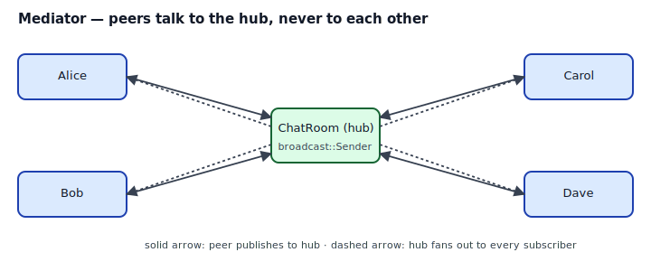
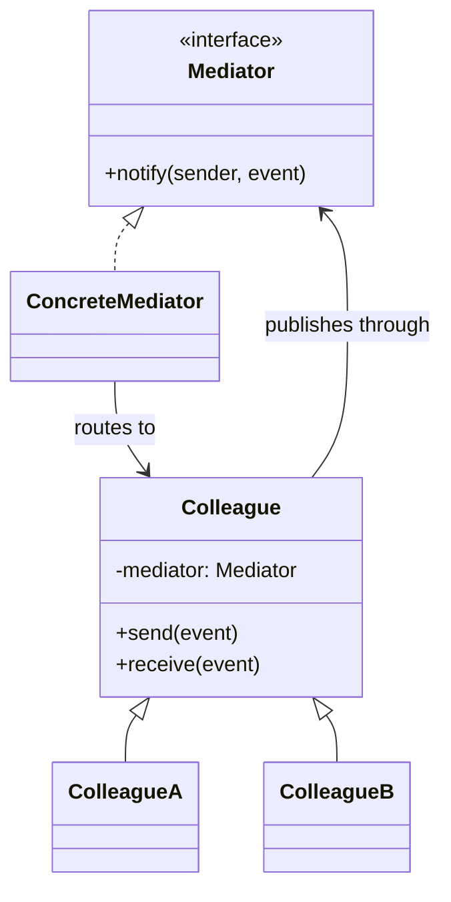
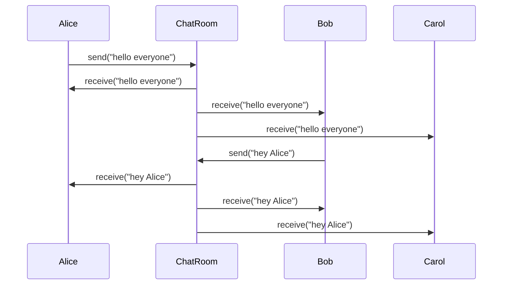

## Intent

Define an object that encapsulates how a set of objects interact. Mediator promotes loose coupling by keeping objects from referring to each other explicitly, and lets you vary their interaction independently.

In Rust, the Mediator is almost always a **channel** — `std::sync::mpsc`, `tokio::sync::broadcast`, or a simple `Vec<Sender<T>>` — and the "object" encapsulating the interaction is the struct that owns the channel ends. Users publish events to the hub; the hub routes them.

## Problem / Motivation

A chat room has many users. Naively, each user would hold references to every other user to broadcast messages. In Rust, that's three kinds of pain at once:

1. **Lifetime gridlock** — a peer-to-peer mesh of `&User` references doesn't satisfy the borrow checker. Every edge claims a borrow; nobody can be mutably borrowed.
2. **`Rc<RefCell<...>>` swamp** — working around lifetimes pushes you into shared interior mutability, and a chat room where every user holds `Rc<RefCell<User>>` pointers to every other user is reentrancy-hazard hell.
3. **Architectural smell** — direct peer references make every feature that touches "who can see whom" change every user's code. The whole point of Mediator is to centralize that routing.



## Classical GoF Form



The classical rendering uses pointer soup: colleagues hold a pointer to the mediator; the mediator holds pointers to every colleague. Rust's version moves routing to a **channel**, which neatly side-steps the lifetime issues.

## Idiomatic Rust Form



Full code: [`code/idiomatic.rs`](./code/idiomatic.rs).

```rust
pub struct ChatRoom {
    subscribers: Vec<Sender<Event>>,
}

impl ChatRoom {
    pub fn join(&mut self) -> Receiver<Event> {
        let (tx, rx) = mpsc::channel();
        self.subscribers.push(tx);
        rx
    }
    pub fn publish(&mut self, ev: Event) {
        self.subscribers.retain(|s| s.send(ev.clone()).is_ok());
    }
}
```

Mechanics:

- **The room owns Senders, users own Receivers.** Ownership flows outward — the room never holds a reference to the user, only a channel endpoint to push events to. Dropped users disappear naturally when their Receiver drops and the Sender's `.send()` returns `Err` (the `.retain` call prunes dead channels).
- **Peers never reference each other.** `User::say` calls `room.publish`; `User::inbox` reads from the user's private Receiver. No user ever names another user in code.
- **Broadcast variants.** For a real chat server, use `tokio::sync::broadcast::channel(capacity)` — one Sender can be cloned by every task; each subscriber gets its own Receiver and can `.subscribe()` for a fresh one mid-session.
- **Structured events over free-form strings.** Send an `Event` enum (`Message`, `UserJoined`, `UserLeft`, `Typing`) so peers can pattern-match; don't stringify events.

### Sync vs async

- **Sync** (`std::sync::mpsc`, `crossbeam_channel`): the example. Use when peers are threads or a single-threaded event loop.
- **Async** (`tokio::sync::mpsc`, `tokio::sync::broadcast`): use when peers are async tasks. `broadcast` is exactly "one Mediator, many subscribers" — your pattern comes out of the tin.
- **Actor frameworks** (`actix`, `ractor`, `kameo`): when the Mediator grows into "many hubs, each owning state and handling typed messages," you've reinvented actors. Use a framework.

## Mediator vs Observer vs Chain of Responsibility

| | Mediator | Observer | Chain of Responsibility |
|---|---|---|---|
| Topology | one hub, many peers | one subject, many watchers | linear pipeline |
| Routing | hub decides | subject broadcasts | each handler decides |
| Coupling | peers ↔ hub only | subject ↔ observers | each to next |
| Typical Rust shape | channel | `Vec<Box<dyn Fn(&E)>>` | `Vec<Box<dyn Handler>>` |

All three centralize communication; pick by the topology.

## Anti-patterns & Rust-specific Caveats

- ⚠️ **Don't implement peer-to-peer references directly.** `User` with `peers: Vec<&User>` fights lifetimes. `User` with `peers: Vec<Rc<RefCell<User>>>` fights reentrancy. The correct fix is *neither*: route through a channel.
- ⚠️ **Don't stringify events.** An `enum Event { Message { from, text }, Joined { user }, Left { user } }` gives peers exhaustive `match`; a String means every peer has to parse.
- ⚠️ **Don't hold a `MutexGuard` across `send()`.** If the mediator has internal state behind a Mutex and a handler acquires it, then publishes through the hub, and another handler reenters — deadlock.
- ⚠️ **Don't silently drop events on backpressure.** When a subscriber's channel is full, `broadcast::error::SendError::Full` is a real signal, not noise. Either size the channel, log the drop, or apply a deliberate drop policy. "It must have worked" isn't one.
- ⚠️ **Don't forget unregistration.** Users joining and never leaving leaks Senders. When a user drops, their Receiver closes; a Sender pushed into `subscribers` finds this and fails — which `.retain` handles in the example. If you don't prune, the Vec grows unbounded.
- ⚠️ **Don't let the Mediator grow beyond routing.** If the hub starts doing authentication, rate limiting, content filtering, and analytics, split those out as separate mediators or middleware layers. The Mediator's job is routing; other concerns compose on top (see [Chain of Responsibility](../chain-of-responsibility/index.md)).
- ⚠️ **Don't make peers hold a `Sender` to the Mediator.** Give them a handle (`ChatRoom` reference or `Arc<ChatRoom>`), and let the hub expose `publish()`. That way you can swap the channel type without changing every peer.

## Compiler-Error Walkthrough

[`code/broken.rs`](./code/broken.rs) tries to wire users peer-to-peer and runs into the borrow checker immediately:

```rust
let mut a = User { name: "A".into(), peers: vec![] };
let mut b = User { name: "B".into(), peers: vec![] };

a.peers.push(&b);
b.peers.push(&a);   // E0502
```

```
error[E0502]: cannot borrow `a` as immutable because it is also borrowed as mutable
  |     a.peers.push(&b);
  |     ----------------- mutable borrow occurs here
  |     b.peers.push(&a);
  |     ^^^^^^^ immutable borrow occurs here
```

Read it: the borrow checker refuses to let two values borrow *each other* when both need to be mutably updated. Every peer-to-peer mesh hits a variant of this. The `Rc<RefCell<_>>` workaround compiles but moves the problem to runtime (borrow panics, reentrancy deadlocks, leaks from reference cycles).

**The lesson is the pattern**: route through a hub so nobody borrows anyone else. Channels give you fan-out with linear ownership — each subscriber owns its Receiver, the room owns the Senders, nobody references peers.

`rustc --explain E0502` covers the aliasing-XOR-mutation rule at the heart of this.

## When to Reach for This Pattern (and When NOT to)

**Use Mediator when:**
- You have many peers that need to coordinate, and the N×N direct-reference mesh is the natural-but-wrong first instinct.
- The routing logic has rules (authorization, filtering, replay, persistence) that deserve to live somewhere.
- Peers can join and leave dynamically; a hub tracks membership.

**Skip Mediator when:**
- There are two peers. Just give them each a reference to the other (if ownership allows) or use a direct channel pair.
- The "peers" are really one publisher and many listeners — that's [Observer](../observer/index.md), closer to a broadcast channel than a full hub.
- There's one peer and one hub doing all the work. That's a function call with extra steps.

## Verdict

**`use-with-caveats`** — the intent is common and the channel-based Rust form is clean. The caveat is resisting the peer-to-peer direct-reference design the GoF diagrams imply. In Rust, routing through a channel-based hub is *the* way to escape the lifetimes-and-reentrancy tangle of mutual references.

## Related Patterns & Next Steps

- [Observer](../observer/index.md) — one subject, many watchers; a Mediator restricted to broadcast is an Observer.
- [Chain of Responsibility](../chain-of-responsibility/index.md) — linear pipeline instead of a hub; swap when routing is sequential.
- [Command](../command/index.md) — events flowing through the hub are often Commands (with undo or replay).
- [Closure as Callback](../../rust-idiomatic/closure-as-callback/index.md) — a hub with `Vec<Box<dyn Fn(&Event)>>` is a Mediator whose peers are closures.
- [Interior Mutability](../../rust-idiomatic/interior-mutability/index.md) — the Mutex/RwLock story for hubs that must hold shared mutable routing state.
