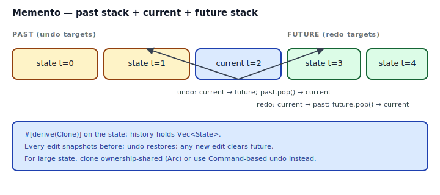
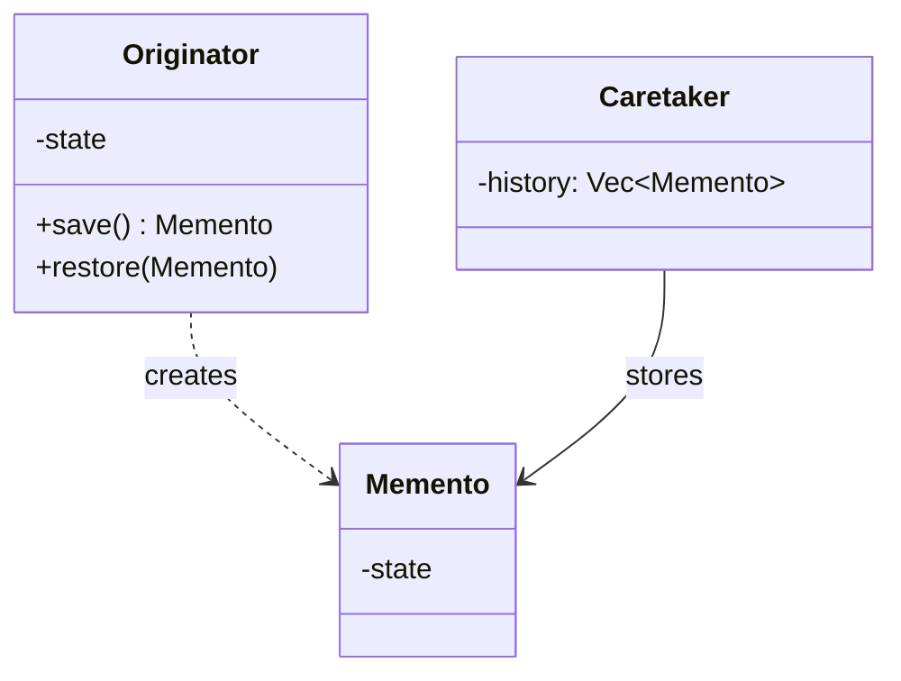

## Intent

Without violating encapsulation, capture and externalize an object's internal state so that the object can be restored to this state later. Memento is the pattern behind undo/redo history, transactional rollback, and save-points.

In Rust, the "memento" is a plain struct that `#[derive(Clone)]` produces for you. The interesting design questions are downstream: who holds the history, how deep does it go, what clears the future stack after a new edit, and when is full-state snapshotting wasteful compared to storing inverse [Commands](../command/index.md)?

## Problem / Motivation

A text editor needs undo/redo. The naive approach — log every keystroke and play them backward — is error-prone for anything more complex than append-only editing. The robust approach is **snapshots**: before each mutation, capture the state; to undo, restore the last snapshot; to redo, pull from a "future" stack.



Two stacks, one current state:

```mermaid
sequenceDiagram
    participant App as Editor
    participant H as History
    App->>H: save(snapshot)
    Note right of H: past += snapshot; future = empty
    App->>App: mutate
    App->>H: save(snapshot)
    App->>H: undo
    H->>H: s = past.pop
    H->>H: future.push(current)
    H-->>App: s
    App->>App: restore(s)
```

## Classical GoF Form



Rust port: the Originator is the `Editor`; the Memento is a cloned `EditorState`; the Caretaker is a `History` struct holding `Vec<EditorState>` — two stacks for past and future.

## Idiomatic Rust Form

Full code: [`code/idiomatic.rs`](./code/idiomatic.rs).

```rust
#[derive(Clone, Debug)]
pub struct EditorState {
    pub text: String,
    pub cursor: usize,
}

pub struct History {
    past: Vec<EditorState>,
    future: Vec<EditorState>,
    max: usize,
}

impl History {
    pub fn save(&mut self, s: EditorState) {
        self.past.push(s);
        self.future.clear();                 // any new edit kills redo
        if self.past.len() > self.max { self.past.remove(0); }
    }
    pub fn undo(&mut self, current: EditorState) -> Option<EditorState> {
        let prev = self.past.pop()?;
        self.future.push(current);
        Some(prev)
    }
    pub fn redo(&mut self, current: EditorState) -> Option<EditorState> {
        let next = self.future.pop()?;
        self.past.push(current);
        Some(next)
    }
}
```

Mechanics worth naming:

- **`#[derive(Clone)]`** on the state does the snapshotting. No custom "save" method, no serialization, no Memento interface.
- **Bounded history.** `max: usize` caps memory. For very large states, `VecDeque` + `pop_front` is cleaner than `Vec::remove(0)`.
- **Clear future on new edits.** The moment a user types after undoing, the redo stack is gone. That's the standard editor UX; omit it and you get "branching" undo, which is a different beast.
- **Ownership flows correctly.** `save(EditorState)` takes the snapshot by value; `undo(current) -> Option<EditorState>` takes the current-state-to-archive by value and returns the target. No references leaving the Editor's internals.
- **Encapsulation via private fields.** `EditorState` can have `pub` fields for the demo, but in real code keep them `pub(crate)` or expose only the methods the Editor needs. That preserves the GoF invariant that mementos are opaque to external code.

### Snapshot vs invertible command

Memento stores the **whole relevant state**. That's fine when:
- The state is small (a config, a cursor, a small Vec).
- Mutations are hard to invert (a complex merge, a reflow, a re-layout).

But for a 100-MB document, snapshotting every keystroke is memory-prohibitive. The alternative is [Command](../command/index.md) with `undo()`: each mutation knows how to reverse itself, and the history stores `Vec<Cmd>` — small objects, not full snapshots.

| Situation | Pattern |
|---|---|
| State is small, mutations complex | **Memento (snapshot)** |
| State is huge, mutations locally invertible | **Command (invertible)** |
| Mixed — large state, some irreversible ops | Hybrid: snapshot at "safe points," Commands between |

### Structural sharing for big state

When the state is large but changes touch only a small fraction, use structural-sharing data structures (`im::Vector`, `Arc<str>` for strings, `rpds`). Clones become refcount bumps; snapshots are O(log n) not O(n). The pattern stays; the `Clone` implementation just gets smarter.

## Anti-patterns & Rust-specific Caveats

- ⚠️ **Don't store `&EditorState` in the history.** References need lifetimes that can't outlive the editor; the history either lives shorter than the editor or makes the editor un-mutable. See [`code/broken.rs`](./code/broken.rs). **Own the snapshot via `Clone`.**
- ⚠️ **Don't skip `#[derive(Clone)]` and hand-roll a `snapshot()` method.** The derive produces the obvious field-by-field clone; writing it by hand is a future-bug waiting for a new field you forget to include.
- ⚠️ **Don't snapshot private invariants.** If `EditorState` contains a `tokio::task::JoinHandle` or a file descriptor, cloning it clones the HANDLE, not the resource — and restoring from an old handle is a bug. Split: keep "rehydratable" state in the snapshot struct; keep handles/connections on the Editor itself and reconstruct on restore.
- ⚠️ **Don't snapshot on every keystroke without coalescing.** Real editors coalesce "typing in a run" into one undo unit. Add an "edit group" concept or debounce the `save()` call; otherwise Ctrl-Z undoes one character at a time, painfully.
- ⚠️ **Don't forget to clear future on new edits** (or document that you intentionally branch). `future.clear()` is a one-line call with outsized UX importance.
- ⚠️ **Don't hold unbounded history.** Snapshots accumulate. Cap with `max_history`, eviction, or structural sharing.
- ⚠️ **Don't leak snapshot types into the public API.** A `pub fn snapshot(&self) -> EditorState` exposes every field to external callers. Prefer `pub fn save_point(&self) -> SavePoint` returning an opaque handle the Editor knows how to restore.
- ⚠️ **Don't rely on snapshots for crash recovery.** In-memory Memento doesn't survive a process restart. For persistence, serialize the snapshot (`serde_json`, `bincode`) to disk at save points.

## Compiler-Error Walkthrough

[`code/broken.rs`](./code/broken.rs) tries to build the history out of references:

```rust
pub struct BorrowedHistory<'a> {
    past: Vec<&'a EditorState>,
}

impl Editor {
    pub fn snapshot_into<'a>(&'a self, h: &mut BorrowedHistory<'a>) {
        h.past.push(&self.state);
    }
    pub fn mutate(&mut self, _new: &str) {
        self.state.text.push_str("x");   // E0502 once snapshots exist
    }
}
```

The moment a snapshot is in the history, the editor can't take `&mut self` to mutate. Every piece of state now has a live `&'a` borrow sitting in the history. E0502:

```
error[E0502]: cannot borrow `*self` as mutable because `self.state` is also
              borrowed as immutable
```

Read it: references and mutation don't coexist. **Snapshots must be owned copies** — that's why `#[derive(Clone)]` is the heart of Rust's Memento. The history is `Vec<EditorState>` (owned values), not `Vec<&EditorState>` (borrows).

### The second mistake

Omitting `#[derive(Clone)]` and calling `.clone()` on the state — E0599, "no method named `clone` found". Fix: add the derive, or think about *why* this state isn't cloneable (handles, sockets, unique resources — see the anti-pattern above).

`rustc --explain E0502` covers the shared/mutable borrow conflict; `rustc --explain E0599` the missing-method diagnostic.

## When to Reach for This Pattern (and When NOT to)

**Use Memento when:**
- State is small enough to clone cheaply.
- Mutations are varied enough that implementing "undo" per mutation is tedious.
- You want straightforward, bug-resistant undo/redo.
- You need save-points — transactional rollback in-memory.

**Use Command-based undo instead when:**
- State is large; snapshots would dominate memory.
- Mutations are inherently invertible (insert ↔ delete, push ↔ pop).
- You want a log of actions for replay, not just undo.

**Skip Memento when:**
- The state never changes, or changes are append-only and forward-only.
- "Undo" isn't a user-visible feature.
- You're considering Memento to "defensively preserve state" — that's usually overengineering. Make the mutations explicit instead.

## Verdict

**`use-with-caveats`** — Memento in Rust is just `#[derive(Clone)]` plus two Vecs. The caveats: cap the history, clear the future on new edits, encapsulate the snapshot type, and for large state prefer [Command](../command/index.md)-based undo. Get those four right and you have a robust undo/redo with almost no code.

## Related Patterns & Next Steps

- [Command](../command/index.md) — the invertible-command alternative to full-state snapshots. Pair with Memento for "checkpoint every N commands" strategies.
- [Prototype](../../gof-creational/prototype/index.md) — Memento shares the `#[derive(Clone)]` mechanism; Prototype uses it to *construct*, Memento to *restore*.
- [State](../state/index.md) — a state-machine's "rollback to previous state" is Memento's simplest case.
- [Interior Mutability](../../rust-idiomatic/interior-mutability/index.md) — history struct with snapshots is sometimes wrapped in `RefCell`/`Mutex` when it lives outside the Editor; pick the primitive carefully.
- [Newtype](../../rust-idiomatic/newtype/index.md) — wrap snapshots in an opaque `SavePoint(EditorState)` so external callers can't inspect internals.
