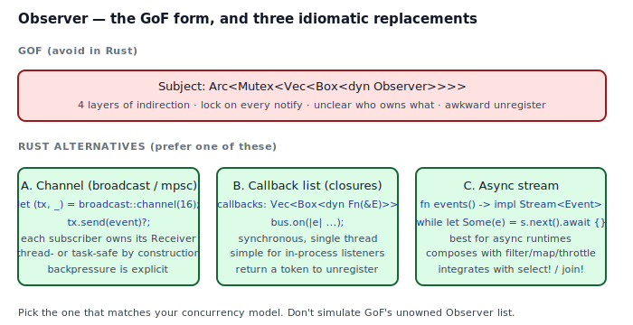
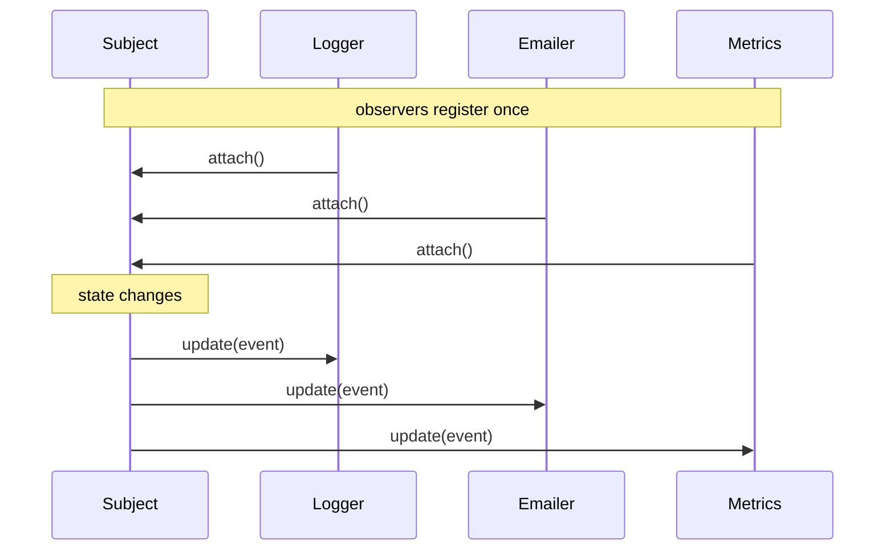
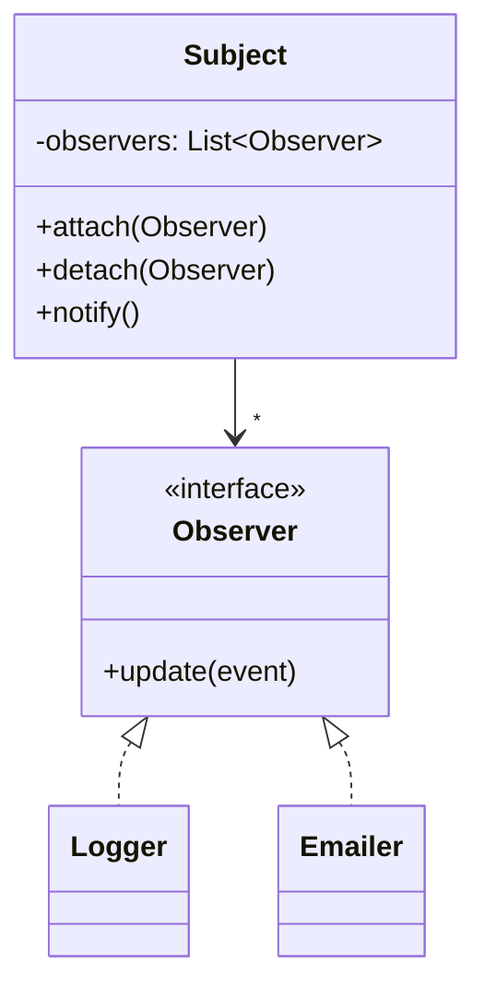
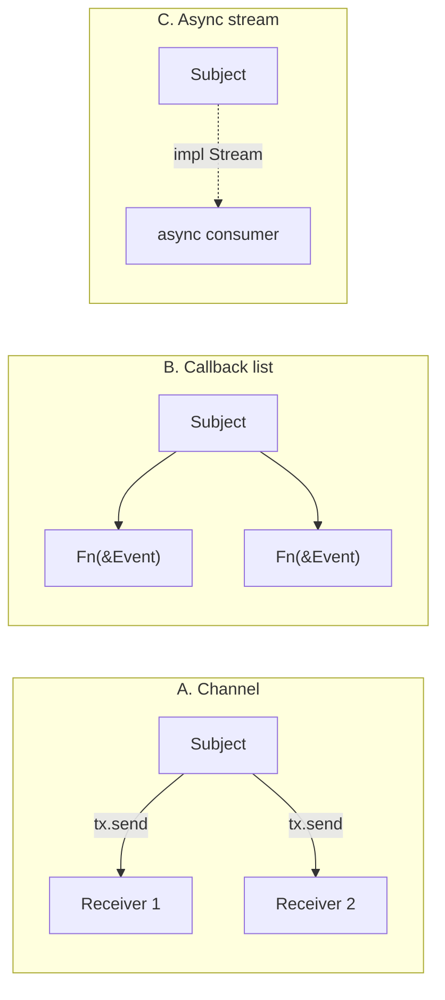

## Intent

Define a one-to-many dependency between objects so that when one object changes state, all its dependents are notified and updated automatically.

In Rust, the **intent** is still valuable — pub/sub is everywhere. The **shape** GoF prescribes (a `Subject` holding raw references to a heterogeneous list of `Observer` interface implementors) fights ownership every step of the way. Rust has three cleaner shapes: channels, callback closures, and async streams.

## Problem / Motivation

A `Subject` has state; many independent `Observer`s care about changes to that state. Neither side should know more about the other than the event shape.





The classical implementation has three open questions that C++ and Java answer implicitly and Rust answers explicitly:

1. **Who owns the observers?** The Subject? The caller? Both (shared)? GoF is silent; in Rust, this is the first question you must answer.
2. **What lifetime do the Observer references have?** Must outlive the Subject, for the entire time they're registered. The borrow checker wants to know, and the honest answer is usually "owned or Arc-shared," not "&'_".
3. **How do observers de-register?** By being dropped? By calling `detach`? By a weak reference being collected? Every answer has cost.

## Classical GoF Form



The direct Rust translation lives in [`code/gof-style.rs`](./code/gof-style.rs). It ends up carrying four layers of indirection — `Arc<Mutex<Vec<Arc<dyn Observer>>>>` — and every `notify()` holds a lock while running observer code. That's a deadlock trap the first time an observer calls back into the Subject.

## Why GoF Translates Poorly to Rust

- **Ownership ambiguity.** C++ and Java let a Subject hold "references" to Observers without saying who deletes them. Rust makes you pick: owned (`Vec<Box<dyn Observer>>`), shared (`Vec<Arc<dyn Observer>>`), or borrowed (`Vec<&dyn Observer>` — which needs a lifetime and almost never works; see `code/broken.rs`).
- **Thread-safety assumptions.** Rust forces `Send + Sync` on anything shared across threads. A Subject meant to be notified from multiple threads grows a `Mutex` / `RwLock` — and now every notify is a lock.
- **Locks around user code.** Running observer code under the Subject's lock is the oldest deadlock in this pattern. The fix is to clone the observer list out, drop the lock, then iterate — paying an allocation per notify for safety.
- **Detachment.** GoF's `detach(Observer)` requires observer identity. In C++ that's a pointer; in Rust, with `Arc<dyn Observer>`, you compare `Arc::ptr_eq(&a, &b)` — fine, but awkward. Handle-based APIs (`SubscriptionId`) are cleaner.
- **Nothing composes.** You cannot easily `filter`, `map`, or `throttle` a GoF-style observer list. You can do all three with a stream or channel.

## Idiomatic Rust Alternatives

Three options cover almost every case. Pick the one that matches your concurrency model.



### A. Channels (`broadcast` / `mpsc`)

`tokio::sync::broadcast::channel(16)` returns a `Sender` and a `Receiver`. Every subscriber `clone()`s the sender or subscribes via `sender.subscribe()` to get its own `Receiver`. The Subject emits by `tx.send(event)`; each subscriber reads on its own task.

Best when subscribers live on different threads/tasks, backpressure matters, and unregistration is natural (drop the Receiver).

### B. Callback list (closures) — the form in `code/idiomatic.rs`

`Vec<Box<dyn Fn(&Event)>>` — or `HashMap<SubscriptionId, Box<dyn Fn(&Event)>>` when you need to unsubscribe. The Subject calls each closure synchronously.

Best when all observers live in-process, synchronous dispatch is acceptable, and there's no async runtime.

Full code: [`code/idiomatic.rs`](./code/idiomatic.rs).

### C. Async streams

`fn events(&self) -> impl Stream<Item = Event>` returns a stream. Consumers loop `while let Some(event) = s.next().await`. Adapters like `filter`, `throttle`, `dedup` become one-liners.

Best for async-first codebases (axum, tokio services) where `select!` and `join!` are natural.

## Anti-patterns & Rust-specific Caveats

- ⚠️ **Don't hold `Vec<&dyn Observer>` on the Subject.** The lifetime that would make this work almost never exists in a long-running program. See `code/broken.rs`.
- ⚠️ **Don't run observer closures inside the Subject's lock.** Clone the observer list out, release the lock, then iterate. Otherwise a reentrant observer deadlocks you.
- ⚠️ **Don't rely on RAII-only unregistration** for `Arc<dyn Observer>`. An observer that stays alive elsewhere in the program keeps its `Arc` count > 0 and will never be GC'd from the list. Provide an explicit `off(SubscriptionId)`.
- ⚠️ **Don't silently drop events when a channel is full.** Decide up front: either block senders (backpressure), return an error, or use a `broadcast::error::RecvError::Lagged` handler. Silent drops are the worst of three options.
- ⚠️ **Don't mix sync observers and an async Subject.** Running a blocking observer callback from an async context stalls the runtime. Either make the observer `async` (streams) or move it to a dedicated thread (channel).
- ⚠️ **Don't marry yourself to `Arc<Mutex<_>>`** the moment the word "observer" appears. Nine times out of ten, a channel is simpler, faster, and safer.

## Compiler-Error Walkthrough

[`code/broken.rs`](./code/broken.rs) tries to store observers as raw references:

```rust
pub struct Subject {
    observers: Vec<&dyn Observer>,   // no lifetime!
}
```

The compiler says:

```
error[E0106]: missing lifetime specifier
  --> broken.rs:17:18
   |
17 |     observers: Vec<&dyn Observer>,
   |                    ^ expected named lifetime parameter
   |
help: consider introducing a named lifetime parameter
   |
15 ~ pub struct Subject<'a> {
16 ~     observers: Vec<&'a dyn Observer>,
```

Take the compiler's suggestion and the trouble spreads: every method signature threads `'a`, every caller has to prove their observer outlives the Subject, and the lifetime almost always wants to be `'static` — at which point you are better off owning the observer outright (`Vec<Box<dyn Observer>>` or `Arc<dyn Observer>`).

**E0106 is the compiler forcing you to answer the ownership question GoF leaves open.** Usually the honest answer is "owned/Arc-shared, not borrowed," which leads to one of the three alternatives above.

`rustc --explain E0106` gives the canonical explanation.

## When to Reach for This Pattern (and When NOT to)

**Use pub/sub in Rust (via channels / callbacks / streams) when:**
- Multiple independent consumers care about the same events.
- You want producers and consumers decoupled across thread or module boundaries.
- The event shape is stable and known at compile time.

**Prefer a channel when:** observers run on their own threads/tasks and backpressure matters.

**Prefer a callback list when:** observers are in-process, synchronous, and registration is short-lived.

**Prefer an async stream when:** you already have a tokio/async runtime and want composable adapters.

**Skip the pattern entirely when:**
- There is exactly one consumer. Just call the function.
- You would be building a full pub/sub to avoid a tidy `fn` call with two closures. That's over-engineering.
- The "events" are really *state* that callers want to query on demand. Expose state + a change token instead.

## Verdict

**`prefer-rust-alternative`** — the GoF class shape (Subject + Observer interface + list) is not the right shape in Rust. Use one of **channels**, **callback closures**, or **async streams** depending on your concurrency model. See [Closure as Callback](../../rust-idiomatic/closure-as-callback/index.md) for the in-depth callback treatment.

## Related Patterns & Next Steps

- [Closure as Callback](../../rust-idiomatic/closure-as-callback/index.md) — the direct Rust-idiomatic replacement.
- [Mediator](../mediator/index.md) — central hub routing messages between peers; channels naturally model this in Rust.
- [Command](../command/index.md) — often combined with Observer to queue actions for later replay.
- [Strategy](../strategy/index.md) — observers *are* strategies parameterized by the event type; the shapes rhyme.
