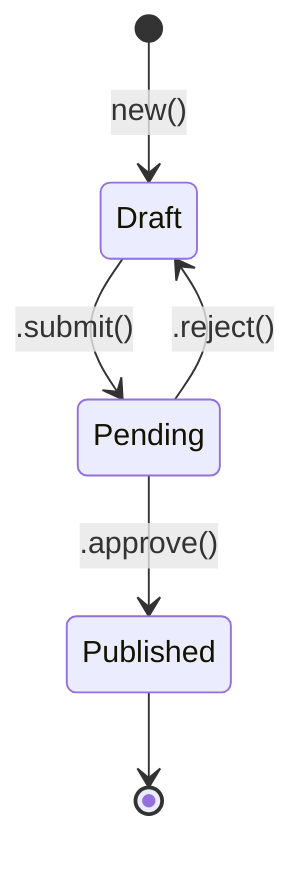
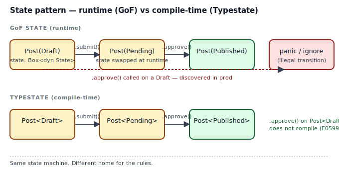
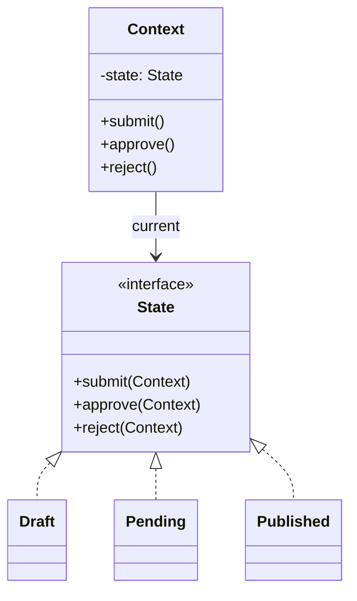

## Intent

Let an object alter its behavior when its internal state changes. The object will appear to change its class.

GoF puts the state machine's rules inside a hierarchy of State classes. Rust has two better places: the value's *type parameter* (Typestate, compile-time) or an *enum variant + match* (runtime but typed).

## Problem / Motivation

A blog post moves through a workflow:



There are exactly three things a caller can do — `submit`, `approve`, `reject` — and only certain transitions make sense from any given state. The pattern asks: **where do those rules live?**



- GoF answer: in a family of classes, each implementing the full `State` interface. Illegal transitions are handled at runtime.
- Rust's enum + `match` answer: in a single `match` per method, with `Result::Err` for illegal transitions.
- Typestate answer: in the **type** of the post itself; illegal transitions do not compile.

## Classical GoF Form



The direct Rust translation lives in [`code/gof-style.rs`](./code/gof-style.rs). Every state implements the full trait (often with `self` returning no-ops for illegal transitions), and the Context uses `Option<Box<dyn State>>` + `.take()` to move the old state out through `&mut self`. It works. It is also strictly worse than the enum form.

## Why GoF Translates Poorly to Rust

- **Dynamic dispatch by default.** `Box<dyn State>` costs a vtable pointer and a heap allocation per transition for no semantic reason. Our states have no payload.
- **Silent illegal transitions.** The GoF `.approve()` on a `Draft` either panics, throws, or silently does nothing. The enum form at least returns `Result::Err`; the typestate form refuses to compile.
- **Ownership friction.** `trait State { fn submit(self: Box<Self>) -> Box<dyn State> }` is the only signature that lets the state *replace itself*. That forces `Option<Box<dyn>>` + `.take()` in the Context. Every classical Rust port of this pattern has that trick; it is a code smell.
- **Open hierarchy.** `trait State` allows downstream code to add states the core workflow never imagined. That flexibility is sometimes what you want, and sometimes it is how bugs ship.

## Idiomatic Rust Form (enum + match)

```mermaid
classDiagram
    class Post {
        +body: String
        +status: Status
        +new(String) Post
        +submit(self) Result~Post, TransitionError~
        +approve(self) Result~Post, TransitionError~
        +reject(self) Result~Post, TransitionError~
    }
    class Status {
        <<enum>>
        Draft
        Pending
        Published
    }
    class TransitionError {
        <<enum>>
        CannotSubmit{from}
        CannotApprove{from}
        CannotReject{from}
    }
    Post --> Status : status
    Post ..> TransitionError : may return
```

Full code: [`code/idiomatic.rs`](./code/idiomatic.rs).

Mechanics worth naming:

- **State is data, not a type.** `Status` is an enum with three unit variants — zero heap, zero vtable, zero pointer chasing.
- **Transitions consume `self`.** Each method takes `self` by value and returns `Result<Self, TransitionError>`. No `Option::take` tricks; the old `Post` is moved, a new one is produced.
- **Illegal transitions are typed errors.** `CannotApprove { from: "Draft" }` names both the attempted operation and the state we were in. Callers use `?` — never `unwrap`.
- **`#[non_exhaustive]`** on `TransitionError` lets us add variants later without breaking downstream `match`es.

### The typestate upgrade

When illegal transitions are a serious bug (financial state machines, crypto protocols, session lifecycles), promote the state from a runtime enum to a **type parameter** so the compiler rejects illegal calls. That's the [Typestate](../../rust-idiomatic/typestate/index.md) pattern — same state machine, different home for the rules.

```rust
// Instead of Post { status: Status }:
let post: Post<Draft>      = Post::new("hi");
let post: Post<Pending>    = post.submit();       // type changes
let post: Post<Published>  = post.approve();      // type changes

// This line does not compile — .approve() is not defined on Post<Draft>.
// let _ = Post::<Draft>::new("oops").approve();
```

See `rust-idiomatic/typestate/code/idiomatic.rs` for the full treatment.

## Anti-patterns & Rust-specific Caveats

- ⚠️ **Don't return `self` unchanged for illegal transitions.** That hides bugs. Return `Result::Err` (enum form) or make the method not exist (typestate form).
- ⚠️ **Don't reach for `Rc<RefCell<Box<dyn State>>>`.** That's the GoF shape fighting Rust in three layers at once. If the enum form is insufficient, the typestate form probably isn't, and it's free.
- ⚠️ **Don't split state across the Context and the state objects.** GoF is ambiguous about who owns what; Rust's ownership model forces the question. Keep all the data on the Context, and let the state carry only the name of what it is.
- ⚠️ **Don't use `panic!` for illegal transitions.** Compiling with `cargo build` should not feel dangerous. Either the transition is a valid runtime outcome (return `Result::Err`) or it is a bug the compiler should prevent (use typestate).

## Compiler-Error Walkthrough

[`code/broken.rs`](./code/broken.rs) attempts the straight-line GoF port without the `Option::take` dance:

```rust
fn submit(&mut self) {
    self.state = self.state.submit();   // E0507
}
```

The compiler says:

```
error[E0507]: cannot move out of `self.state` which is behind a mutable reference
  --> broken.rs:45:22
   |
45 |         self.state = self.state.submit();
   |                      ^^^^^^^^^^ ------- `self.state` moved due to this method call
   |                      |
   |                      move occurs because `self.state` has type `Box<dyn State>`,
   |                      which does not implement the `Copy` trait
note: this function takes ownership of the receiver `self`, which moves `self.state`
```

Read it literally:

- `State::submit` takes `self: Box<Self>`. Calling it *consumes* the Box.
- `self.state` lives inside a `&mut Post`. Moving the Box out would leave `self.state` uninitialized for the rest of the function, which the borrow checker does not allow.
- The classical fix is `Option::take()` — replace the Box with `None`, call `submit`, replace `None` with the new Box. See [`code/gof-style.rs`](./code/gof-style.rs).
- The better fix is to stop trying to do the GoF pattern and use the enum form in [`code/idiomatic.rs`](./code/idiomatic.rs), where transitions consume `Post` and return a new `Post`.

`rustc --explain E0507` gives the canonical explanation.

## When to Reach for This Pattern (and When NOT to)

**Use the enum form when:**
- The state set is closed and you control it.
- Every method is valid in every state, or returning `Result::Err` for illegal calls is acceptable.
- You want exhaustive `match` to force you to handle new states when they're added.

**Use Typestate when:**
- Illegal transitions are a correctness bug you cannot tolerate at runtime.
- The state graph is small (≤6 nodes).
- Callers compose the transitions themselves — `.open().write().close()` — and "forgot to open" is a bug you want stopped at `cargo check`.

**Skip the GoF form entirely when:**
- You can use either of the above. Which, in Rust, is almost always.

**Use `Box<dyn State>` only when:**
- States carry genuinely different data (not just a name) and callers add new states at runtime. This is rare in practice.

## Verdict

**`prefer-rust-alternative`** — use [Typestate](../../rust-idiomatic/typestate/index.md) for compile-time guarantees, or an enum + `match` when runtime state is unavoidable. The GoF State pattern's class hierarchy buys you nothing in Rust and costs you ownership friction, a heap allocation per transition, and silent bugs.

## Related Patterns & Next Steps

- [Typestate](../../rust-idiomatic/typestate/index.md) — the compile-time upgrade of this pattern.
- [Strategy](../strategy/index.md) — related, but swaps *behavior* rather than *state*. In Rust, closures or generic parameters usually do this job.
- [Builder](../../gof-creational/builder/index.md) — the typestate builder is a specialization of this same idea: certain methods only exist in certain states.
