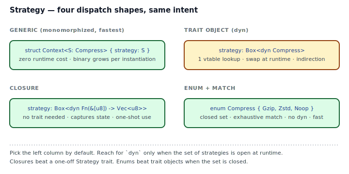
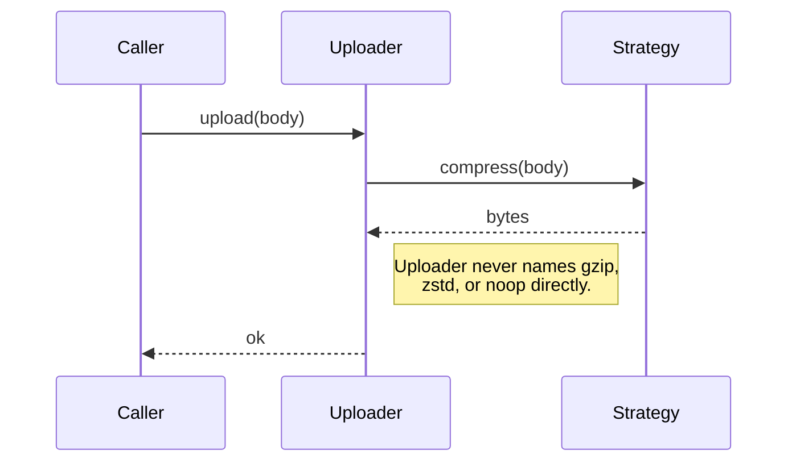
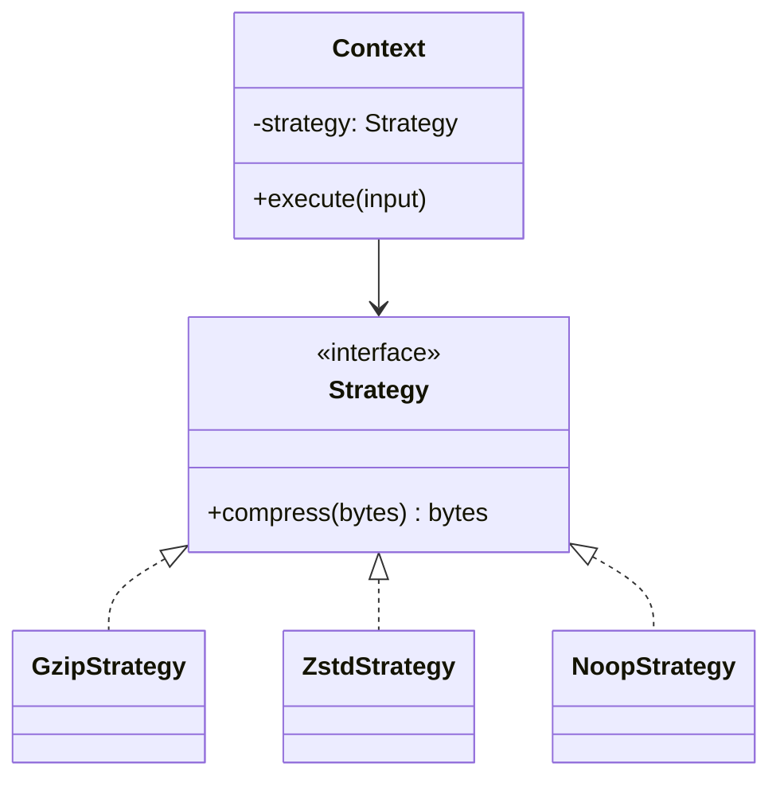
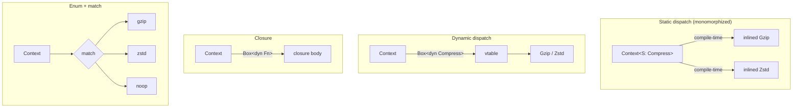

## Intent

Define a family of algorithms, encapsulate each one, and make them interchangeable. Strategy lets the algorithm vary independently of the clients that use it.

Strategy is the GoF pattern that translates to Rust with the least friction. The only real question is *which* of the four idiomatic shapes to use.

## Problem / Motivation

An `Uploader` needs to compress its payload. Several algorithms are candidates — gzip, zstd, noop — and we don't want the call site to know which is picked. Classic Strategy: extract the algorithm into its own abstraction so callers parameterize, rather than branch.





## Classical GoF Form



The direct Rust translation — trait + `Box<dyn Strategy>` — works fine. See [`code/gof-style.rs`](./code/gof-style.rs). This is the right shape *when the set of strategies is open at runtime* (plugins, user-configured, loaded from a config file).

## Why GoF Translates Well to Rust (for once)

Strategy is a rare GoF pattern where the mechanical translation is honest idiomatic Rust. There is no shared mutable state, no ambiguous ownership, no abstract-class inheritance to simulate. A trait is exactly right for "family of algorithms behind a common interface."

The only question is *which form of dispatch*, and Rust gives you four options.

## Idiomatic Rust Forms



Full code: [`code/idiomatic.rs`](./code/idiomatic.rs). Each of the four forms costs and buys different things:

### A. Generic parameter `<S: Compress>` — **the default**

```rust
pub fn upload_static<S: Compress>(strategy: &S, body: &[u8]) { ... }
```

- **Fastest.** Monomorphized at compile time: `rustc` generates a specialized copy of `upload_static` per concrete `S`. The trait method calls inline into the call site.
- **Binary grows.** One copy of `upload_static` per strategy type. Usually negligible; matters for code size on embedded.
- **Strategy fixed at instantiation.** You cannot swap a generic strategy at runtime — the type is part of the compiled signature. See [`code/broken.rs`](./code/broken.rs) for the compile error.

Use this when you have one or two call sites per strategy type and no need to swap at runtime.

### B. Trait object `Box<dyn Compress>`

```rust
pub struct Uploader { strategy: Box<dyn Compress> }
```

- **One pointer dereference + one vtable lookup per call.** Usually unmeasurable, occasionally measurable in hot paths.
- **Strategy swappable at runtime.** `set_strategy(Box::new(ZstdStrategy))` replaces it.
- **Object-safety rules apply.** The trait cannot have `fn m<T>(...)` generic methods, cannot return `Self`, and cannot have `self: Self` (only `&self`, `&mut self`, or `Box<Self>`).

Use this when the strategy set is genuinely open (loaded from config, user-supplied, plugin) or when you want one `Uploader` type regardless of strategy.

### C. Closure

```rust
pub fn upload_with(compress: impl Fn(&[u8]) -> Vec<u8>, body: &[u8]) { ... }
```

- **No trait needed.** The `Fn` family (`Fn`, `FnMut`, `FnOnce`) *is* the abstraction.
- **Captures context.** The closure can close over local state the caller cares about — tags, keys, config — without those needing to be on a Strategy struct.
- **One-shot by default.** `FnOnce` for single use, `FnMut` for repeated calls with mutable capture, `Fn` for idempotent.

Use this for one-off strategies, especially when you'd define a Strategy trait used by exactly one call site. `Vec::sort_by(|a, b| ...)` is Strategy inline.

### D. Enum + `match` — **when the set is closed**

```rust
pub enum CompressionKind { Gzip, Zstd, Noop }

impl CompressionKind {
    pub fn compress(&self, input: &[u8]) -> Vec<u8> {
        match self { Self::Gzip => ..., Self::Zstd => ..., Self::Noop => ... }
    }
}
```

- **No heap, no vtable, no indirection.** The variant tag is a single `u8`.
- **Exhaustive `match` forces you** to handle every new variant when you add one. That is a feature.
- **Cannot be extended downstream.** Which is sometimes exactly what you want — a closed set of compression kinds you control.

Use this when the strategy set is finite, known to you, and unlikely to change. Pairs beautifully with [Sealed Trait](../../rust-idiomatic/sealed-trait/index.md) or [Newtype](../../rust-idiomatic/newtype/index.md) for disciplined variants.

## Decision Guide

| Situation | Shape |
|---|---|
| Closed set of strategies, you own the code | **Enum + match** |
| One call site per strategy, static known at compile time | **Generic parameter** |
| Strategy set is open (plugins, config-driven) | **`Box<dyn Trait>`** |
| One-shot, captures local state | **Closure** |

If in doubt: start with an enum. Promote to a generic parameter if the strategy set needs to be open to new concrete types. Promote to `dyn` only if runtime swapping is required.

## Anti-patterns & Rust-specific Caveats

- ⚠️ **Don't reach for `Box<dyn Trait>` first.** It's the most flexible shape and the slowest. If the set is closed, use an enum; if one call site uses one strategy, use a generic.
- ⚠️ **Don't define a Strategy trait with one method** that you use at exactly one call site. A closure is the Strategy; a trait is ceremony.
- ⚠️ **Don't try to swap a generic strategy at runtime.** See [`code/broken.rs`](./code/broken.rs). If you need runtime swapping, use `dyn` or an enum. A generic parameter is *fixed* at instantiation.
- ⚠️ **Don't forget object safety.** `Box<dyn Strategy>` requires the trait to be object-safe. Methods that return `Self` or have generic parameters break it. Hide those behind private helper traits or supertraits when needed.
- ⚠️ **Don't embed `dyn Trait` by value.** `strategy: dyn Compress` as a struct field does not compile — trait objects are unsized. Always `Box<dyn>`, `Arc<dyn>`, or `&dyn` with a lifetime.
- ⚠️ **Don't mix dispatch shapes in one API** without a reason. If your public API takes `Box<dyn Strategy>`, don't later add `fn with_strategy<S: Strategy>(...)` unless the extra complexity earns its keep.

## Compiler-Error Walkthrough

[`code/broken.rs`](./code/broken.rs) shows two instructive failures.

**Mistake 1: unsized `dyn` in a struct field.**

```rust
pub struct UploaderBad1 { strategy: dyn Compress }
```

```
error[E0277]: the size for values of type `(dyn Compress + 'static)`
              cannot be known at compilation time
  |
  |     strategy: dyn Compress,
  |               ^^^^^^^^^^^ doesn't have a size known at compile-time
help: the trait `Sized` is not implemented for `(dyn Compress + 'static)`
```

The fix is a pointer-sized wrapper: `Box<dyn Compress>`, `Arc<dyn Compress>`, or `&dyn Compress` with a lifetime.

**Mistake 2: reassigning a generic strategy to a different type.**

```rust
impl<S: Compress> UploaderGeneric<S> {
    pub fn set_strategy<T: Compress>(&mut self, new: T) {
        self.strategy = new;   // E0308
    }
}
```

```
error[E0308]: mismatched types
   expected type parameter `S`
      found type parameter `T`
```

`S` is fixed the moment `UploaderGeneric<GzipStrategy>` is constructed. Assigning a `T` that might differ is impossible — the struct type would need to change. **E0308 is the compiler reminding you that static dispatch is static**: if you need to swap at runtime, switch to `Box<dyn Compress>` or an enum.

## When to Reach for This Pattern (and When NOT to)

**Use Strategy when:**
- Multiple algorithms achieve the same effect and callers shouldn't care which.
- You want to A/B test implementations without branching in the caller.
- The algorithm has its own invariants or state and deserves a home.

**Skip Strategy when:**
- There is one algorithm and you're abstracting because "one day we might have two." (YAGNI. You won't.)
- The "strategy" is really just a flag that changes one line of code. Use an `if` or an enum.
- The call site is generic over the input type already; add a trait bound on the input instead of a separate Strategy.

## Verdict

**`use`** — Strategy is idiomatic Rust under any of four shapes. The only skill is picking the right dispatch style for the situation. When in doubt, start with an enum; promote to generic or `dyn` only when the pattern forces it.

## Related Patterns & Next Steps

- [Closure as Callback](../../rust-idiomatic/closure-as-callback/index.md) — the Fn-family treatment that Strategy-as-closure depends on.
- [Iterator as Strategy](../../rust-idiomatic/iterator-as-strategy/index.md) — iterator adapters *are* strategies parameterized by step function.
- [Sealed Trait](../../rust-idiomatic/sealed-trait/index.md) — enforce a closed strategy set even for a `dyn` trait.
- [Template Method](../template-method/index.md) — the inverse: skeleton fixed, steps swappable. In Rust, a trait with default methods often replaces it.
- [State](../state/index.md) — same class shape, different semantics: State changes with time; Strategy varies at the call site.
