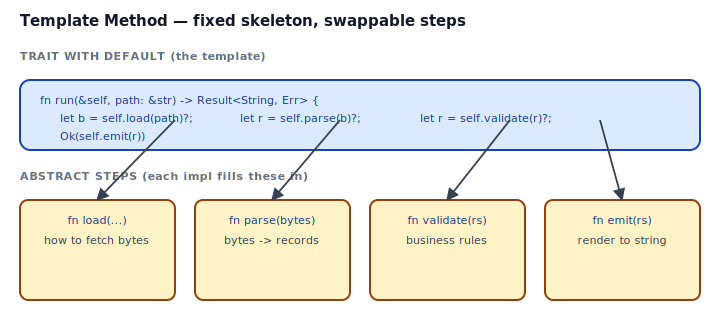
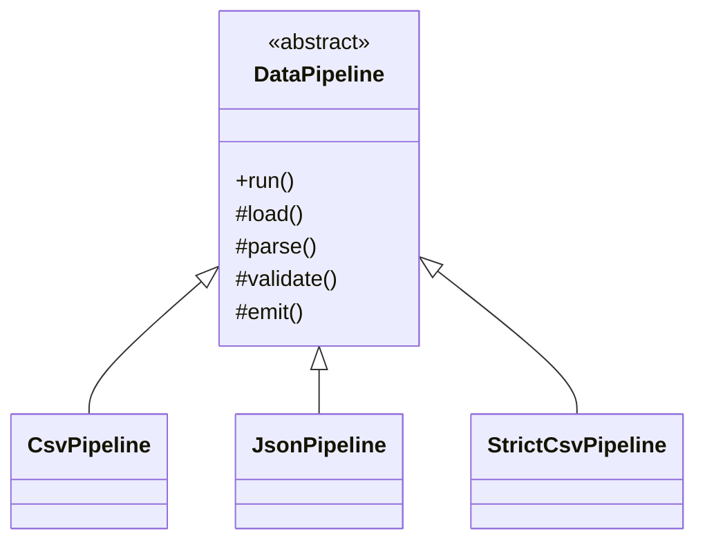
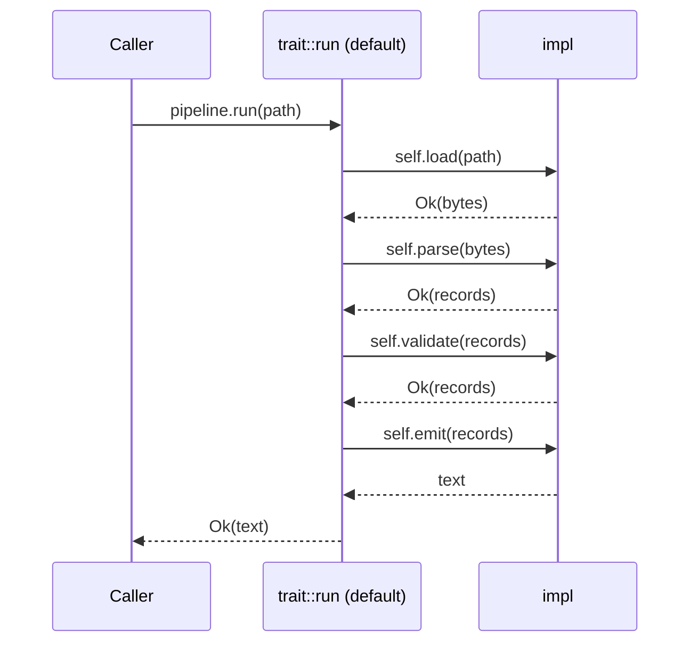

## Intent

Define the skeleton of an algorithm, deferring some steps to subclasses. Template Method lets subclasses redefine certain steps of an algorithm without changing the algorithm's structure.

In Rust, "skeleton with hooks" is a **trait with a default method** that calls abstract trait methods. Implementors fill in the abstract steps; callers invoke the default method and get the whole skeleton for free. It's one of the GoF patterns that maps directly, and it's also often over-applied — a function with closure parameters is frequently the cleaner choice.

## Problem / Motivation

You have a four-step data pipeline:

1. **Load** bytes from disk.
2. **Parse** them into records.
3. **Validate** the records.
4. **Emit** a formatted string.

Three variants ship: CSV, JSON, TOML. Each differs only in steps 1/2/4; step 3 is "no-op by default, strict only for some". The skeleton — the order of steps — never changes.



## Classical GoF Form



The Rust translation is a trait with a **default method** (`run`) that calls the other trait methods:

```rust
pub trait DataPipeline {
    fn run(&self, path: &str) -> Result<String, PipelineError> {
        let bytes    = self.load(path)?;
        let records  = self.parse(&bytes)?;
        let records  = self.validate(records)?;
        Ok(self.emit(&records))
    }
    fn load(&self, path: &str) -> Result<Vec<u8>, PipelineError>;
    fn parse(&self, bytes: &[u8]) -> Result<Vec<Record>, PipelineError>;
    fn emit(&self, records: &[Record]) -> String;
    fn validate(&self, records: Vec<Record>) -> Result<Vec<Record>, PipelineError> {
        Ok(records)    // default: permissive
    }
}
```

Full code: [`code/idiomatic.rs`](./code/idiomatic.rs).

## Idiomatic Rust Form



Two styles:

### A. Trait with default method — the direct translation

Use when:
- The "skeleton" is really about polymorphism — callers hold a `&dyn DataPipeline` or a `Box<dyn DataPipeline>` and don't care which concrete pipeline they've got.
- There are multiple hooks (three or more abstract steps) and grouping them into a trait improves clarity.
- You want impls to be named types callers can refer to.

### B. Function + closure hooks — often lighter

```rust
pub fn run_with<Load, Parse, Val, Emit>(
    path: &str,
    load: Load, parse: Parse, validate: Val, emit: Emit,
) -> Result<String, PipelineError>
where
    Load:  Fn(&str) -> Result<Vec<u8>, PipelineError>,
    Parse: Fn(&[u8]) -> Result<Vec<Record>, PipelineError>,
    Val:   Fn(Vec<Record>) -> Result<Vec<Record>, PipelineError>,
    Emit:  Fn(&[Record]) -> String,
{ ... }
```

Use when:
- There's one skeleton and callers pass in per-step logic inline.
- You don't need to name the "pipeline" or carry state.
- The steps are independent, stateless closures.

Rule of thumb: if you'd pick "Strategy" over a trait hierarchy, you probably want Form B. See [Strategy](../strategy/index.md) and [Closure as Callback](../../rust-idiomatic/closure-as-callback/index.md).

## Anti-patterns & Rust-specific Caveats

- ⚠️ **Don't break old impls by adding a required method.** Once a trait has ten downstream impls, adding `fn checksum(...) -> u32;` without a default body is a breaking change everywhere. Always add new methods with a default implementation, or introduce a new subtrait for the additional behavior.
- ⚠️ **Don't inline the skeleton as the default body of every method.** A default method that calls `self.other()` is fine; a default method that tries to *be* `other` in a specific way is a sign the trait wants to be split.
- ⚠️ **Don't make the default `run()` irrelevant.** If every impl overrides `run()`, the template is a fiction — just remove it and let each impl have its own `run()` method.
- ⚠️ **Don't put generic methods in a trait you'll dyn-dispatch.** `fn emit<T: ToString>(&self, t: T)` on a trait kills object-safety. If you need `Box<dyn DataPipeline>`, keep all methods concrete. If you genuinely need generics, introduce a supertrait that adds them.
- ⚠️ **Don't double-override.** If `StrictCsvPipeline` delegates three methods to `CsvPipeline.load/parse/emit`, you're re-implementing a copy of the class. Either extract the common logic (free functions over `&[u8]`) or use composition (`strict.inner: CsvPipeline`).
- ⚠️ **Don't put business rules in default methods without a feature flag.** Default methods run for every impl; a "new default" subtly changes behavior for every downstream. If the rule is opt-in, make it so — a separate trait method or a feature flag.
- ⚠️ **Don't stack template methods.** `run()` calling `run_inner()` calling `run_innermost()` is a design mistake — you've turned one template into three. Keep templates flat: the default body orchestrates concrete hooks, nothing else.

## Compiler-Error Walkthrough

[`code/broken.rs`](./code/broken.rs) illustrates two common mistakes.

### Mistake 1: adding a required method to a trait with existing impls

```rust
pub trait DataPipeline {
    fn run(&self) -> String { ... }
    fn load(&self) -> Vec<u8>;
    fn emit(&self, bytes: &[u8]) -> String;
    fn checksum(&self, bytes: &[u8]) -> u32;   // NEW — no default
}

impl DataPipeline for CsvPipeline { /* load/emit only */ }
```

```
error[E0046]: not all trait items implemented, missing: `checksum`
  |
  | impl DataPipeline for CsvPipeline {
  | ^^^^^^^^^^^^^^^^^^^^^^^^^^^^^^^^^ missing `checksum` in implementation
  |
help: implement the missing item: `fn checksum(&self, bytes: &[u8]) -> u32 { todo!() }`
```

Read it: adding a method without a default body is breaking. **Fix: provide a default body** (`fn checksum(&self, bytes: &[u8]) -> u32 { 0 }`) so existing impls continue to compile, then document the default and let users opt into meaningful implementations.

### Mistake 2: generic method on a trait used as `dyn`

```rust
pub trait Sink {
    fn emit<T: ToString>(&self, item: T);
}
pub fn make() -> Box<dyn Sink> { ... }
```

```
error[E0038]: the trait `Sink` cannot be made into an object
  |
  |     fn emit<T: ToString>(&self, item: T);
  |        ---- ...because method `emit` has generic type parameters
```

Read it: object-safety rules forbid generic methods on dyn-compatible traits. **Fix: restrict generic methods to a non-object-safe subtrait**, or replace `T: ToString` with `dyn ToString`:

```rust
pub trait Sink {
    fn emit(&self, item: &dyn ToString);
}
```

`rustc --explain E0046` and `rustc --explain E0038` cover both.

## When to Reach for This Pattern (and When NOT to)

**Use Template Method (trait with default) when:**
- Multiple impls share most of an algorithm and differ in a few well-named steps.
- Callers hold a trait object and the skeleton is part of the public surface.
- The abstract steps are stable — you won't need to add a required method later.

**Use Template Method (function + closures) when:**
- The skeleton is stateless and callers supply steps inline.
- There's one skeleton, no need for a named type.
- You'd otherwise define a trait with a single impl. YAGNI applies.

**Skip Template Method when:**
- There's only one concrete algorithm. You don't have a template yet.
- The "template" is really just three function calls in order that don't need a trait wrapping them.
- The steps differ enough that forcing them into a common skeleton tortures the design. Separate algorithms may be the honest answer.

## Verdict

**`use-with-caveats`** — Template Method maps to Rust traits with default methods, and the translation is clean. The caveats are about *when*: reach for a trait only when there are genuine impls to polymorphize over, default-method hooks for stable steps, and remember that a generic function with closure hooks is often the lighter, better answer.

## Related Patterns & Next Steps

- [Strategy](../strategy/index.md) — Strategy varies one algorithm; Template Method fixes the algorithm and varies its steps. The two are often composed.
- [Closure as Callback](../../rust-idiomatic/closure-as-callback/index.md) — when you'd reach for Template Method with one impl, you probably want closures instead.
- [Builder](../../gof-creational/builder/index.md) — a builder's `.build()` is a small template method; the per-field setters are its hooks.
- [Facade](../../gof-structural/facade/index.md) — a facade often *is* a template method at the top of a subsystem call tree.
- [Factory Method](../../gof-creational/factory-method/index.md) — sibling pattern. Factory Method picks *what* to construct; Template Method fixes *how* to use the thing constructed.
