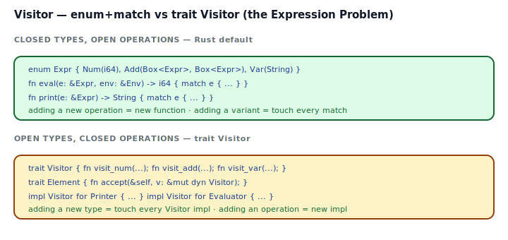
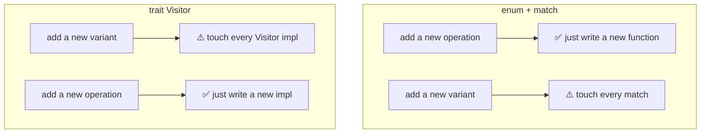
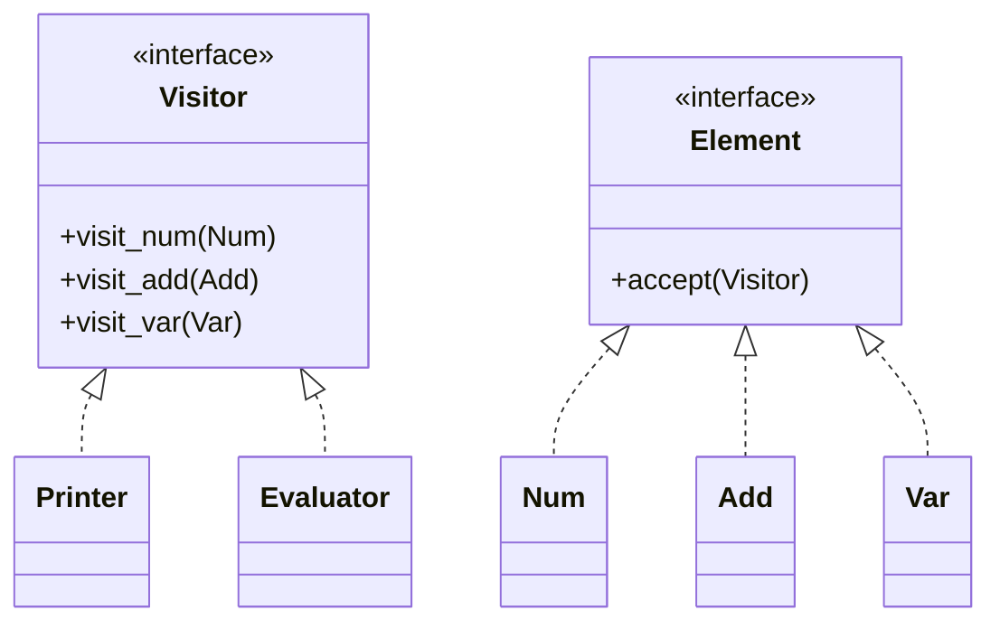

## Intent

Represent an operation to be performed on the elements of an object structure. Visitor lets you define a new operation without changing the classes of the elements on which it operates.

In Rust, "operation over a tree of variants" has an almost-free primitive: `match`. For closed variant sets (the common case), you do not need a Visitor hierarchy — `match` *is* the Visitor, the compiler enforces exhaustiveness, and adding a new operation is just adding a new function. Reach for the trait-based GoF Visitor only when the element hierarchy is *open* and downstream crates need to add new operations over types they don't own.

## Problem / Motivation

You have a tree of expression nodes — `Num`, `Var`, `Add`. You want several operations over it: `eval`, `print`, `fold_constants`, `count_nodes`. You also expect the operation set to grow (later: `optimize`, `typecheck`, `pretty_print_with_colors`, …). The variant set, meanwhile, is stable — your DSL has the three node kinds and that's probably it.

This is the **Expression Problem**: adding new *types* is cheap one way, adding new *operations* is cheap the other. Pick the side that matches what you'll add more often.





Rust's default (and usually correct) choice is the enum form: operations come and go more often than variants, and the compiler's exhaustive-match check makes a new variant cheap to add *once* by listing every place that must be updated.

## Classical GoF Form



Rust port in [`code/gof-style.rs`](./code/gof-style.rs). Each element type has an `accept(&self, v: &mut dyn Visitor)` that calls the matching `visit_X` on the visitor — classic **double dispatch**: the concrete element type + the concrete visitor type together select the method that runs.

It works. It also makes `Element` and `Visitor` both trait objects, forces `Box<dyn Element>` everywhere, and requires you to touch every `impl Visitor` when you add a new element kind. In Rust, that last cost is usually not worth paying.

## Idiomatic Rust Form

Full code: [`code/idiomatic.rs`](./code/idiomatic.rs).

```rust
pub enum Expr {
    Num(i64),
    Var(String),
    Add(Box<Expr>, Box<Expr>),
}

pub fn eval(e: &Expr, env: &HashMap<String, i64>) -> i64 {
    match e {
        Expr::Num(n) => *n,
        Expr::Var(name) => *env.get(name).unwrap_or(&0),
        Expr::Add(l, r) => eval(l, env) + eval(r, env),
    }
}

pub fn print(e: &Expr) -> String { match e { ... } }
pub fn fold_constants(e: &Expr) -> Expr { match e { ... } }
```

- **Every operation is a function.** `eval`, `print`, `fold_constants`, `count_nodes` — four functions, four files if you like. Adding `optimize` is a fifth function. The element type doesn't change.
- **Exhaustive `match` is the compiler's refactor assistant.** Add a variant, every match with no `_` arm errors, the compiler lists the operations you forgot. That's the safety Visitor is supposed to provide — you get it for free.
- **Generic walker**: `walk(e, &mut |node| { ... })` takes a closure, so you can write ad-hoc traversals without defining a Visitor trait. See also [Closure as Callback](../../rust-idiomatic/closure-as-callback/index.md).

### When Visitor (the trait form) earns its keep

Use the GoF trait form when **downstream crates need to add new operations** over an open element hierarchy. Example: a plugin-friendly AST library where users register new passes (`struct LintPass; impl Visitor for LintPass`) without touching the core. The trait is the extension point; `match` can't be one.

Concretely:

- `syn` (the Rust-in-Rust parser) exposes a `Visit` trait so downstream macros can walk token streams with custom logic.
- `rustc`'s HIR uses a mix: internal visitors for the compiler's passes, but variants are closed.

Most application code is not in this situation.

## Anti-patterns & Rust-specific Caveats

- ⚠️ **Don't use `_` in a `match` that should be exhaustive.** A wildcard arm silences the compiler when a variant is added — exactly the refactor signal you wanted. Reserve `_` for cases where the wildcard behavior is genuinely correct (e.g., "ignore unknown options").
- ⚠️ **Don't reach for the trait Visitor by default.** In Rust, `match` *is* Visitor for closed enums. The trait form costs boxing, vtables, and more code — pay it when downstream extensibility is real, not hypothetical.
- ⚠️ **Don't double-dispatch through `&mut dyn Visitor` when a closure would do.** A generic walker that takes `impl FnMut(&Expr)` works for 90% of "run this per node" cases without the trait dance.
- ⚠️ **Don't store references in the Visitor across calls.** The borrow checker tracks visitor mutation across accept calls; caching `&Expr` on the visitor while recursing triggers E0499. Either restructure to push/pop through an owned stack, or collect the data into the visitor by value.
- ⚠️ **Don't make the Visitor responsible for traversal order.** A clean Visitor visits; a traversal function walks. Mixing them produces a visitor that can't be reused across pre-order/post-order/depth-first. Separate the two: `fn walk_post<V: Visitor>(&Expr, v: &mut V)`.
- ⚠️ **Don't build a `Vec<Box<dyn Visitor>>` of visitors you run in order.** Sequencing visitors is fine, but if they share state, you're re-implementing Middleware / [Chain of Responsibility](../chain-of-responsibility/index.md). Reach for that pattern instead.
- ⚠️ **Don't use Visitor to dodge Rust's exhaustiveness check.** If you introduce a trait just so you don't have to update every `match` when adding a variant, you've hidden the problem, not solved it. The new variant still doesn't do anything useful in the old operations.

## Compiler-Error Walkthrough

[`code/broken.rs`](./code/broken.rs) shows the most useful compile error in the `match`-as-Visitor workflow:

```rust
pub fn eval(e: &Expr) -> i64 {
    match e {
        Expr::Num(n) => *n,
        // No Var arm, no wildcard
    }
}
```

```
error[E0004]: non-exhaustive patterns: `Var(_)` not covered
  |     match e {
  |           ^ pattern `Var(_)` not covered
  |
note: `Expr` defined here
  |     pub enum Expr {
  |              ---- variant not covered
  |         Var(String),
  |         ^^^
help: ensure that all possible cases are being handled
```

Read it: **the compiler refuses to ship code that would silently do nothing (or panic) on a variant it knows about.** This is the whole safety argument for the enum form. Adding `Expr::Mul` later produces the same error at every call site of `eval`, `print`, `fold_constants`, etc., with a list of which functions to update.

### Contrast with the trait Visitor

With the GoF form, adding `struct Mul(Box<dyn Element>, Box<dyn Element>)` gives you E0046 on every existing `impl Visitor` — "not all trait items implemented, missing: `visit_mul`". Same safety, different shape. Both approaches force you to handle every combination of operation × variant; the difference is which axis is closed.

`rustc --explain E0004` covers exhaustive-match requirements; `rustc --explain E0046` covers missing trait items.

## When to Reach for This Pattern (and When NOT to)

**Use the enum+match form (the Rust-default "Visitor") when:**
- You own the element types (AST, DSL, domain model, protocol messages).
- Variants are stable; operations grow.
- You want the compiler to find every operation that needs updating when a variant is added.

**Use the trait Visitor form when:**
- The element hierarchy is *open* — downstream crates add new element kinds.
- Operations are closed; you know the set of traversals up front.
- You're writing a library like `syn` where extension is the whole point.

**Skip Visitor entirely when:**
- You need exactly one operation. It's just a function.
- The element "hierarchy" is a single struct. There's nothing to visit.
- A fold / reduce via `Iterator` does the job. See [Iterator as Strategy](../../rust-idiomatic/iterator-as-strategy/index.md).

## Verdict

**`use-with-caveats`** — the intent is real and Rust's `match` on a closed enum is the cleanest implementation of it in any mainstream language. Reserve the trait-based GoF form for the genuinely open-hierarchy case, which most application code doesn't have.

## Related Patterns & Next Steps

- [Composite](../../gof-structural/composite/index.md) — Visitor is how you fold over a Composite. In Rust that's `match` on the enum variants.
- [Iterator](../iterator/index.md) — the iterator-yielding-leaves alternative: flatten the tree and operate on the stream, no visitor needed.
- [Iterator as Strategy](../../rust-idiomatic/iterator-as-strategy/index.md) — every `.map(f)` / `.fold(z, f)` is a Visitor parameterized by the step function.
- [Strategy](../strategy/index.md) — a Visitor is Strategy-shaped across types; closures fill the same role with less ceremony.
- [Closure as Callback](../../rust-idiomatic/closure-as-callback/index.md) — a `walk(&expr, &mut |n| ...)` traversal is a Visitor whose "method" is a closure.
