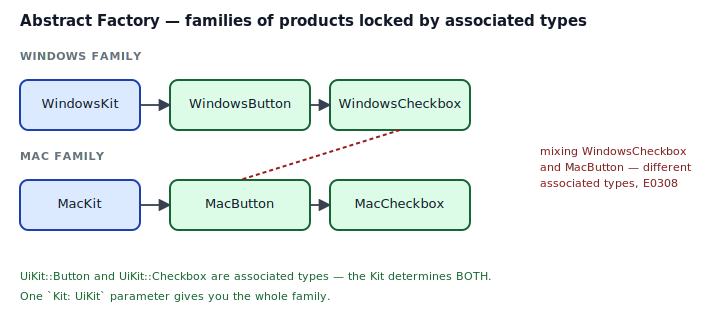
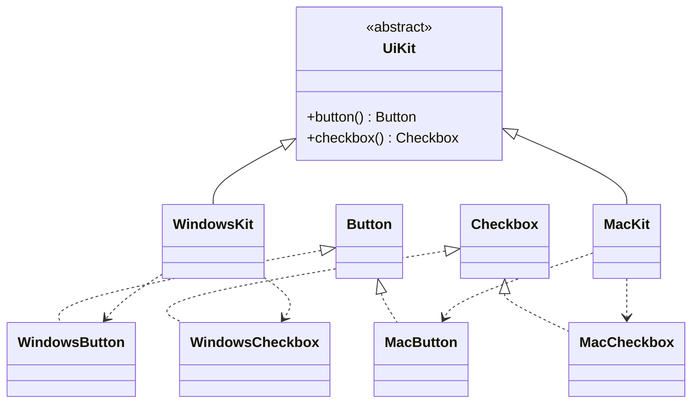
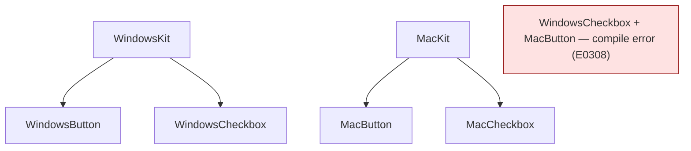

## Intent

Provide an interface for creating *families* of related or dependent objects without specifying their concrete classes. The key word is *families*: a Windows button paired with a Windows checkbox, not a Windows button paired with a Mac checkbox.

In Rust the cleanest shape is a **trait with multiple associated types**, each bound to its own product trait. Sealed so downstream can't ship rogue kits that violate your family invariants. The result is a pattern that looks heavier than Factory Method for a reason: it enforces *cross-product* consistency at compile time.

## Problem / Motivation

You're building a cross-platform UI. Buttons on Windows look like `[ OK ]`; on macOS they look like `( OK )`. Checkboxes differ too. A form needs *one* button and *one* checkbox — from the same family. Mixing a `WindowsCheckbox` with a `MacButton` would be a visual disaster and a shipping bug.

Factory Method ([see that pattern](../factory-method/index.md)) solves the "which concrete product" choice for *one* product at a time. Abstract Factory solves it for a whole family at once.



## Classical GoF Form



## Why a Direct Port is Awkward in Rust

The classical class hierarchy maps to Rust as a `trait UiKit { fn button(&self) -> Box<dyn Button>; fn checkbox(&self) -> Box<dyn Checkbox>; }`. That works. It also:

- Returns `Box<dyn Button>` everywhere — vtable-heavy, heap-allocated per call, and anonymizes which family you're in.
- Throws away the compiler's ability to *reject* `WindowsButton` + `MacCheckbox` at compile time — both are `Box<dyn Button>` and `Box<dyn Checkbox>`.
- Requires downstream callers to know about the kit hierarchy to get static dispatch back.

The idiomatic Rust form keeps the family tie in the *type system* via associated types.

## Idiomatic Rust Form

Full code: [`code/idiomatic.rs`](./code/idiomatic.rs).

```rust
pub trait UiKit {
    type Button: Button;
    type Checkbox: Checkbox;

    fn button(&self) -> Self::Button;
    fn checkbox(&self) -> Self::Checkbox;
}

pub struct WindowsKit;
impl UiKit for WindowsKit {
    type Button = WindowsButton;
    type Checkbox = WindowsCheckbox;
    fn button(&self) -> WindowsButton { WindowsButton }
    fn checkbox(&self) -> WindowsCheckbox { WindowsCheckbox }
}

pub fn render_form<K: UiKit>(kit: &K) -> String {
    let b = kit.button();     // K::Button
    let c = kit.checkbox();   // K::Checkbox — locked to same K
    ...
}
```



### The consistency guarantee

`render_form<K: UiKit>(kit: &K)` takes one kit. Every product it creates is `K::Button` or `K::Checkbox`. The only way to get a `MacButton` into the same call is to call `render_form(&MacKit)` — with a *different* `K`. The compiler refuses any attempt to mix.

This is the key feature Factory Method doesn't give you: family-level consistency as a type invariant.

### Sealing

Unless you genuinely want downstream crates to ship their own `UiKit` impls, seal the trait (see [Sealed Trait](../../rust-idiomatic/sealed-trait/index.md)):

```rust
mod private { pub trait Sealed {} }
pub trait UiKit: private::Sealed { ... }
impl private::Sealed for WindowsKit {}
impl private::Sealed for MacKit {}
```

Now only your crate can add platforms. Every consumer can still use `<K: UiKit>` as a bound.

### When to avoid associated types and just use a struct-of-factories

If the products don't form a coherent "family" (they're just several unrelated factories you happen to ship together), don't contort them into one trait. A plain `struct PlatformKit { button: Box<dyn Fn() -> Box<dyn Button>>, checkbox: Box<dyn Fn() -> Box<dyn Checkbox>> }` or a struct of concrete factory types is fine. Abstract Factory earns its keep only when *the family invariant is a requirement*.

## Anti-patterns & Rust-specific Caveats

- ⚠️ **Don't default to `Box<dyn Trait>` returns.** It throws away the family-consistency guarantee. Use associated types bound by product traits.
- ⚠️ **Don't leave the factory trait public without sealing it.** Anyone can ship `impl UiKit for RogueKit { type Button = WindowsButton; type Checkbox = MacCheckbox; ... }` and cross-contaminate families.
- ⚠️ **Don't confuse Abstract Factory with Factory Method.** Factory Method decides which *single* concrete type to build; Abstract Factory decides a whole *family*. If you only have one product type, you want Factory Method.
- ⚠️ **Don't over-apply.** If the "families" are really just one parameterization of a single product (e.g., `Button<Color>`), phantom types or a generic struct reads better. See [Phantom Types](../../rust-idiomatic/phantom-types/index.md).
- ⚠️ **Don't forget the `fn kit(kind: Platform) -> Box<dyn UiKit>` footgun.** A trait with associated types is **not** object-safe. You can't have `Box<dyn UiKit>`. If you need runtime choice of family, wrap the whole kit in an enum (`enum AnyKit { Win(WindowsKit), Mac(MacKit) }`) and implement `UiKit` on the enum via inner-match.
- ⚠️ **Don't make products depend on the kit.** `WindowsButton` should be a plain type, not a `WindowsButton<K: UiKit>`. The family invariant lives in the kit; products should be independent of whoever produced them.
- ⚠️ **Don't ship kits without a default.** If 90% of users want the platform kit inferred from the OS, provide `fn current_kit() -> Box<dyn ...>` — using the enum-wrapping trick above — so only the 10% who need explicit control pay the parameterization tax.

## Compiler-Error Walkthrough

[`code/broken.rs`](./code/broken.rs) constructs a `WindowsButton` and a `MacCheckbox` and tries to treat them as one kit's pair:

```rust
let wb: WindowsButton = WindowsKit.button();
let mc: MacCheckbox   = MacKit.checkbox();

// Expected: WindowsCheckbox (the Checkbox type of WindowsKit)
// Found:    MacCheckbox
let _pair: (<WindowsKit as UiKit>::Button,
            <WindowsKit as UiKit>::Checkbox) = (wb, mc);
```

```
error[E0308]: mismatched types
  |
  |                                                   = (wb, mc);
  |                                                           ^^ expected
  |                                                              `WindowsCheckbox`,
  |                                                              found `MacCheckbox`
```

Read it: the associated types bind the whole family. Any code path that says "I want this kit's pair" gets rejected by the compiler the moment a different kit's type slips in. **E0308 is the pattern's entire value proposition** — family mismatches at compile time rather than visually in production.

### The other useful error

Try `Box<dyn UiKit>`:

```
error[E0038]: the trait `UiKit` cannot be made into an object
  |
  |     type Button: Button;
  |          ------ ...because it has associated type `Button`
```

Associated types break object-safety. That's usually fine — Abstract Factory's whole point is static dispatch on the family. If you need runtime choice, wrap the kits in an enum and implement `UiKit` on the enum with inner-match.

`rustc --explain E0308` and `rustc --explain E0038` cover both.

## When to Reach for This Pattern (and When NOT to)

**Use Abstract Factory when:**
- You have genuine product families whose cross-pairings must be rejected at the type level.
- There are three or more related products per family, and you want one parameter to commit to the whole set.
- The set of families is closed to your crate (seal the trait).

**Skip Abstract Factory when:**
- There's only one product type. Use [Factory Method](../factory-method/index.md).
- The "families" are really just configuration (a `Theme` struct with color + font + radius fields). A plain struct is clearer.
- You want runtime choice of family. The trait's associated types aren't dyn-compatible; wrap kits in an enum instead.
- You're tempted to ship it "for extensibility". YAGNI applies to trait hierarchies too.

## Verdict

**`prefer-rust-alternative`** — Abstract Factory works in Rust, and the associated-types form is legitimately elegant, but reach for it only when cross-product consistency is a non-negotiable invariant. For most "several things that ship together" cases, a [Sealed Trait](../../rust-idiomatic/sealed-trait/index.md) with plain factory methods (or a struct of factory closures) is simpler.

## Related Patterns & Next Steps

- [Factory Method](../factory-method/index.md) — the single-product case. Abstract Factory is Factory Method repeated for a whole family.
- [Sealed Trait](../../rust-idiomatic/sealed-trait/index.md) — the seal that prevents downstream crates from shipping rogue kits.
- [Phantom Types](../../rust-idiomatic/phantom-types/index.md) — when the "family" is really a tag, a phantom parameter on a generic struct reads cleaner than a trait + associated types.
- [Builder](../builder/index.md) — a builder that returns a whole kit is a combined pattern worth considering.
- [Bridge](../../gof-structural/bridge/index.md) — sibling structural pattern: Bridge decouples an *abstraction* from an *implementation* at architectural scale; Abstract Factory decouples clients from concrete families.
