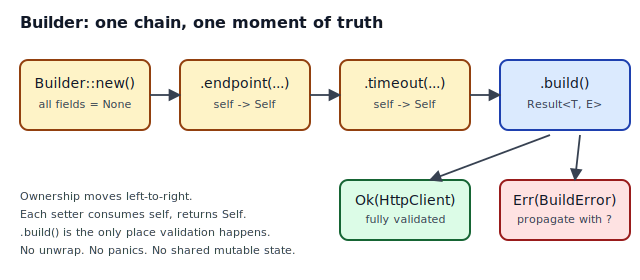
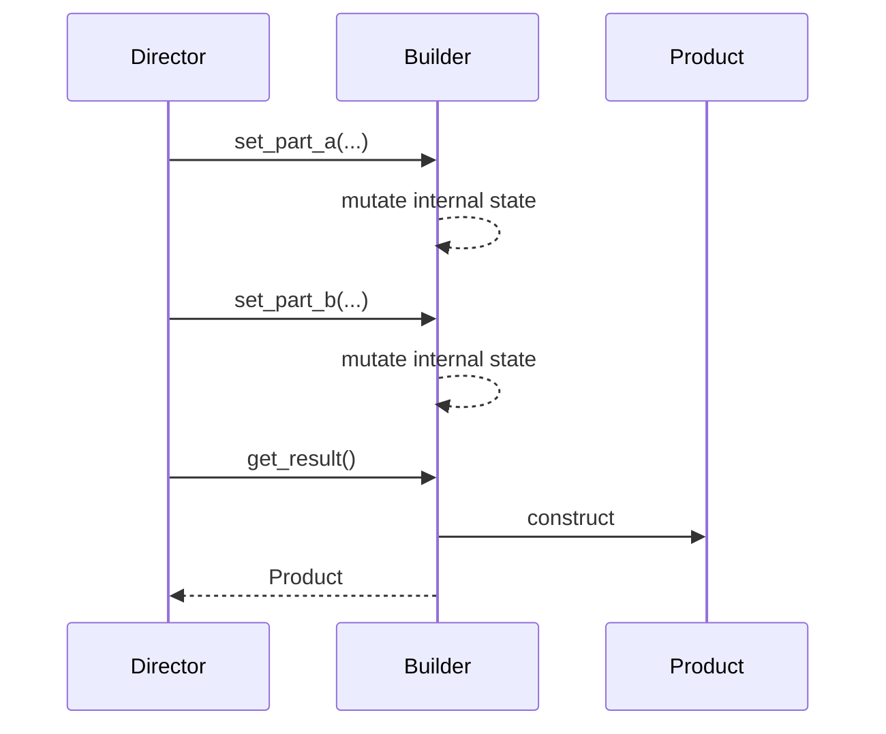
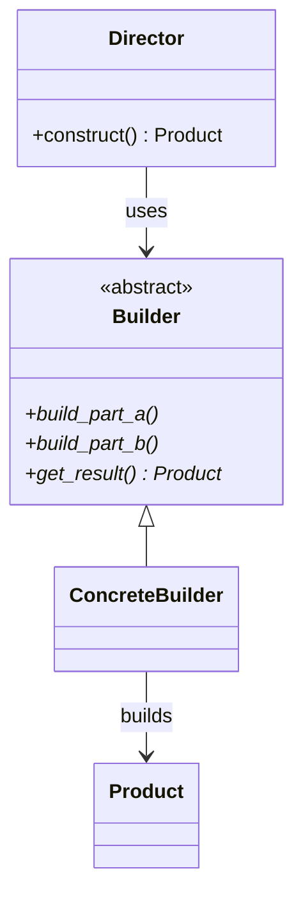
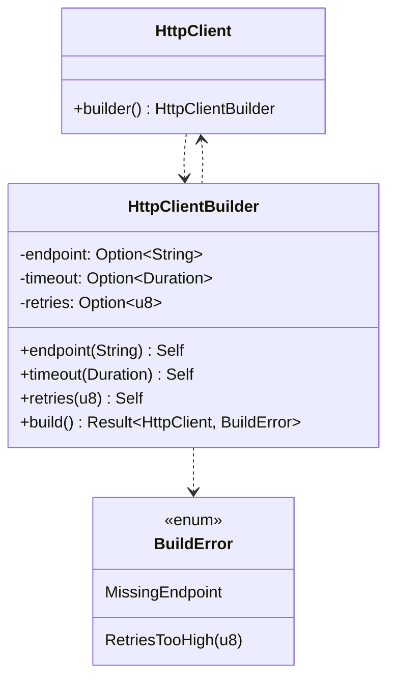

## Intent

Separate the construction of a complex object from its representation, so the same construction process can produce different representations — *and in Rust, so the type system guarantees you don't forget a required field or end up in an invalid state.*

## Problem / Motivation

A constructor with six optional arguments is unreadable. Worse, a constructor that allows any combination of those arguments cannot enforce that incompatible combinations are rejected at the type level. The Builder pattern introduces a separate object whose job is to accumulate configuration and then, at one moment of truth, produce a valid instance.



In the classical GoF presentation, a *Director* drives an abstract *Builder* through a sequence of `build_part_*` calls, then asks for the result. The abstract Builder holds mutable state between calls.



## Classical GoF Form

See [`diagrams/class.mmd`](./diagrams/class.mmd) rendered inline in the site, or the raw Mermaid:



The direct translation to Rust lives in [`code/gof-style.rs`](./code/gof-style.rs). It compiles, but it pays a steep price: `Rc<RefCell<_>>` to share the builder between a Director and the call site, `dyn HttpClientBuilder` for the abstract-class analogue, and `.expect()` calls in `get_result()` because the pattern's contract is "the caller remembered to set everything." That is a **runtime** contract — Rust offers a compile-time one.

## Why GoF Translates Poorly to Rust

- **Shared mutable state.** `set_part_a(&self, ...)` with mutation requires interior mutability. `Rc<RefCell<Builder>>` works but is strictly worse than moving ownership through the chain.
- **Abstract classes.** Rust has no inheritance. Modeling "abstract Builder with concrete subclasses" forces `dyn Trait`, and for a one-shot construction that's pure overhead.
- **Runtime-enforced completeness.** GoF assumes the Director called every setter. A missing field becomes a runtime panic. Rust can do better: `Result<Product, BuildError>`, or a *typestate* builder where `.build()` only exists once every required field has been set.

## Idiomatic Rust Form



Full code: [`code/idiomatic.rs`](./code/idiomatic.rs). [**Open in Rust Playground →**](https://play.rust-lang.org/?version=stable&mode=debug&edition=2021)

Key points in the idiomatic form:

- Each setter takes `self` by value and returns `Self`. The chain is *ownership transfer*, not mutation through shared references.
- `HttpClientBuilder` carries `#[must_use]`, so ignoring a chain is a compiler warning.
- `build()` returns `Result<HttpClient, BuildError>`. Callers use `?` — never `unwrap`.
- `BuildError` is `#[non_exhaustive]`, so adding variants later is not a breaking change.
- Optional fields get sensible defaults in `build()`; only truly required fields produce `MissingX` variants.

### The consuming-self vs `&mut self` choice

Both are valid. Pick based on whether callers need to keep the builder around:

| | Consuming `self` | `&mut self` |
|---|---|---|
| Signature | `fn timeout(self, …) -> Self` | `fn timeout(&mut self, …) -> &mut Self` |
| Can save builder mid-chain? | No — it moves each call | Yes |
| Can call `.build()` twice? | No (E0382) | Yes, if `build(&self)` clones out |
| Common in | `std::process::Command`-style one-shot APIs | Long-lived config objects |

Default to consuming `self`. Switch to `&mut self` only if callers demonstrably need to reuse the builder.

## Anti-patterns & Rust-specific Caveats

- ⚠️ **Don't panic on missing fields.** `self.endpoint.expect("endpoint was not set")` in `build()` is a runtime trap. Return `Err(BuildError::MissingEndpoint)` instead, or use the **typestate builder** variant (see [Related Patterns](#related-patterns--next-steps)) to make `.build()` unreachable until every required field is set — a *compile-time* guarantee.
- ⚠️ **Don't clone fields out of the builder.** If a setter takes `String`, store `String`. Don't take `&str` and `.to_owned()` in every setter — accept `impl Into<String>` once and let the caller pick.
- ⚠️ **Don't wrap the builder in `Rc<RefCell<T>>`.** That's the GoF form fighting Rust. If you reach for interior mutability in a one-shot builder, your design is wrong.
- ⚠️ **Don't forget `#[must_use]`.** A fluent chain whose result is dropped is almost always a bug — the compiler should say so.
- ⚠️ **Don't return `&self` from `build()`.** `build()` must consume or clone — otherwise the freshly constructed object borrows from the builder and can't outlive it.

## Compiler-Error Walkthrough

The broken form in [`code/broken.rs`](./code/broken.rs) calls `.build()` on a consuming builder twice:

```rust
let client_a = builder.build();   // moves `builder`
let client_b = builder.build();   // E0382: use of moved value
```

The compiler produces:

```
error[E0382]: use of moved value: `builder`
  --> broken.rs:47:20
   |
42 |     let builder = HttpClientBuilder::default()
   |         ------- move occurs because `builder` has type `HttpClientBuilder`,
   |                 which does not implement the `Copy` trait
...
45 |     let client_a = builder.build();
   |                            ------- `builder` moved due to this method call
46 |
47 |     let client_b = builder.build();
   |                    ^^^^^^^ value used here after move
   |
note: `HttpClientBuilder::build` takes ownership of the receiver `self`,
      which moves `builder`
```

Read it literally: `build` takes `self`, so the first call moves the value. The second call sees a moved binding. **E0382 is Rust protecting you** from accidentally "finishing" a builder twice and getting two half-configured clients.

### Fixes, ranked

1. **Only call `.build()` once.** The usual fix. Save `client_a` and use it.
2. **Clone before building** if you genuinely want two clients from the same config: `let client_b = builder.clone().build()` — after deriving `Clone` on the builder.
3. **Switch to `&mut self` setters and a `fn build(&self) -> …` that clones fields out** if this pattern is ubiquitous for your type. But question whether it should be.

`rustc --explain E0382` in your terminal gives the canonical explanation.

## When to Reach for This Pattern (and When NOT to)

**Use Builder when:**
- The type has three or more optional configuration fields.
- Some fields are required and some aren't.
- Validation must happen as a whole (e.g., "`retries > 10` is invalid") rather than per-field.
- You want the call site to read fluently: `HttpClient::builder().endpoint(…).timeout(…).build()?`.

**Skip Builder when:**
- The type has one or two fields. A plain `new(a: A, b: B)` is clearer.
- All fields are required and have no validation. Just write a constructor.
- You're tempted to split construction across two call sites. Don't — that's what Builder prevents, not what it enables.
- The type is an enum. Use variants or `From`/`Into` instead.

## Verdict

**`use-with-caveats`** — Rust's builder is genuinely useful, but the idiomatic form (consuming `self`, typed `BuildError`, `#[must_use]`) is quite different from the GoF description. When you need compile-time guarantees that every required field was set, promote this to a **typestate builder** (Track B).

## Related Patterns & Next Steps

- [Typestate](../../rust-idiomatic/typestate/index.md) — make `.build()` unreachable until every required field is set. The compile-time upgrade of this pattern.
- [Builder with Consuming `self`](../../rust-idiomatic/builder-with-consuming-self/index.md) — deeper treatment of the consuming-vs-mutable-reference tradeoff.
- [Abstract Factory](../abstract-factory/index.md) — for *families* of builders, not a single type.
- [Newtype](../../rust-idiomatic/newtype/index.md) — combine with Builder to validate individual fields (e.g., `struct EndpointUrl(String)` with a private constructor).
