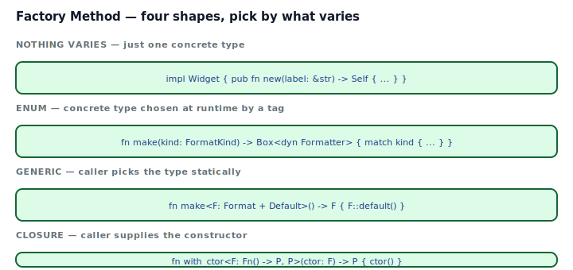
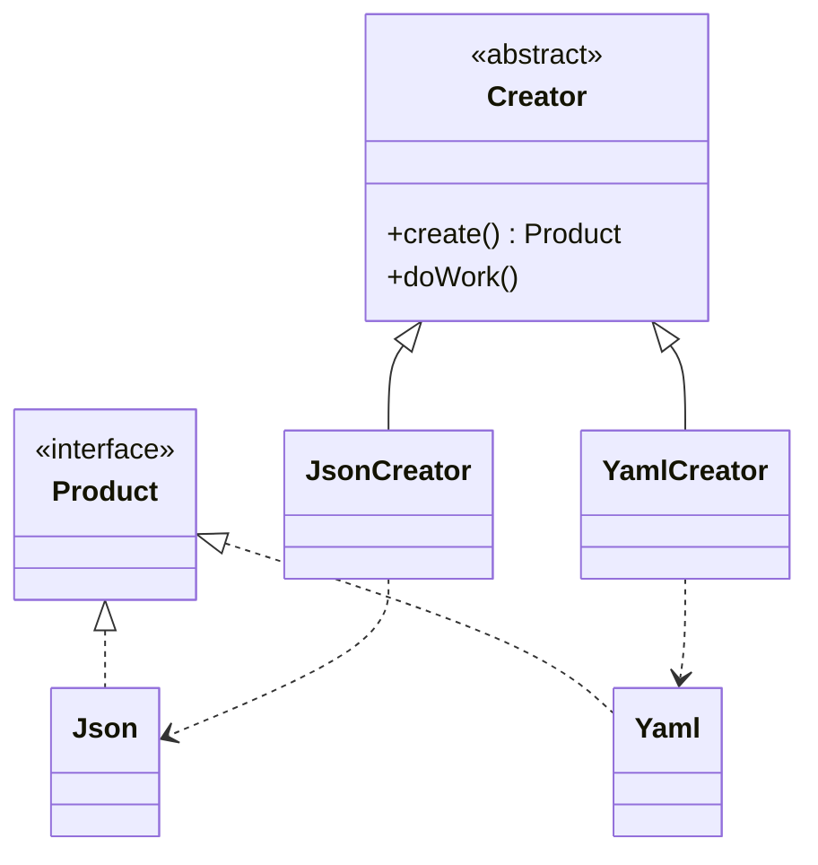
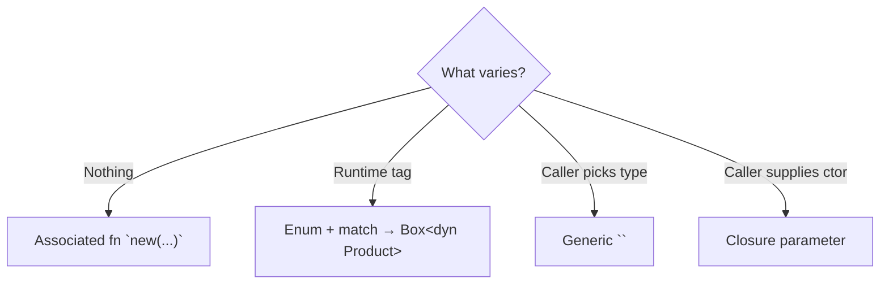

## Intent

Define an interface for creating an object, but let subclasses — or in Rust, callers / matches / generics — decide which class to instantiate. Factory Method lets the decision of *which* concrete type to build live somewhere other than the call site that needs it.

Rust doesn't have subclasses, so "subclass chooses" becomes one of four shapes: a plain `new()`, an enum + match, a generic parameter, or a closure the caller supplies.

## Problem / Motivation

A reporting pipeline wants to emit `Json`, `Yaml`, or `Toml` depending on the user's output flag. Three questions decide the Rust shape:

1. **Does the choice happen at compile time?** Use a **generic parameter**.
2. **Does the choice happen at runtime, from a closed set?** Use an **enum** + `Box<dyn Trait>`.
3. **Does the caller supply the constructor itself?** Use a **closure**.



The classical GoF shape — an abstract `Creator` class with subclasses that each `override create()` — maps to Rust as a trait with an associated type. It works; it's almost never the right first choice.

## Classical GoF Form



Rust port in [`code/gof-style.rs`](./code/gof-style.rs) — `trait Creator { type Product: Formatter; fn create(&self) -> Self::Product; ... }`. It compiles, it works. But the `Creator` hierarchy is usually redundant in Rust: traits + impls already give you the polymorphism without the extra class.

## Idiomatic Rust Forms



Full code: [`code/idiomatic.rs`](./code/idiomatic.rs).

### A. Enum-tag dispatch — runtime choice from a closed set

```rust
pub enum FormatKind { Json, Yaml, Toml }

pub fn make_formatter(kind: FormatKind) -> Box<dyn Formatter> {
    match kind {
        FormatKind::Json => Box::new(Json),
        FormatKind::Yaml => Box::new(Yaml),
        FormatKind::Toml => Box::new(Toml),
    }
}
```

The common Rust reading of "factory method". A function, an enum of tags, a `Box<dyn Trait>` return, `match` to pick. Closed set, vtable dispatch per call, zero runtime branching after the initial `make_formatter`.

### B. Generic parameter — compile-time choice

```rust
pub fn make_static<F: Formatter + Default>() -> F { F::default() }

let f: Yaml = make_static();
```

When the caller names the concrete type, static dispatch is free. The whole `make_static::<Yaml>` body is monomorphized and inlined. Binary grows per instantiation, but each instantiation costs zero.

### C. Closure constructor — caller supplies the builder

```rust
pub fn with_ctor<P, F: Fn() -> P>(ctor: F) -> P { ctor() }

let j = with_ctor(|| Json);
```

When the construction is trivial and the "factory" just calls it. This is where the pattern *disappears* into [Closure as Callback](../../rust-idiomatic/closure-as-callback/index.md) — the closure *is* the factory.

### D. Plain `new()` — no pattern at all

If nothing varies, don't pretend it does. `Widget::new(label)` is not a factory method; it's a constructor. Don't add an enum and a dispatch function "just in case."

## Decision Guide

| Situation | Shape |
|---|---|
| One concrete type today and tomorrow | **`Widget::new`** — don't over-abstract |
| Runtime choice from a closed, owned set | **Enum + `Box<dyn Trait>`** |
| Caller names the type at compile time | **Generic `<P: Trait>`** |
| Caller supplies the builder inline | **Closure parameter** |
| Plugins / downstream types | **Trait with `fn create(&self)`** (gof-style) |

If you're unsure, walk top-to-bottom. The higher row wins when applicable.

## Anti-patterns & Rust-specific Caveats

- ⚠️ **Don't return `impl Trait` from a function that produces two concrete types.** `impl Trait` is a single opaque type. `fn make(k: Kind) -> impl Formatter` that returns `Json` in one arm and `Yaml` in another is E0308. Use `Box<dyn Formatter>` or an enum wrapping both.
- ⚠️ **Don't build the GoF Creator hierarchy by default.** In Rust, `impl Json::new()` and `impl Yaml::new()` are already "factory methods." The classical `trait Creator { type Product; ... }` pays its way only when downstream code plugs in new creators. For closed sets, skip it.
- ⚠️ **Don't confuse Factory Method with Abstract Factory.** Factory Method creates one kind of product; [Abstract Factory](../abstract-factory/index.md) creates a *family* of related products that work together.
- ⚠️ **Don't swap a generic parameter for `dyn` just to allow runtime choice "later."** Premature dynamic dispatch costs vtable lookups on every call. Enum + match is usually cheaper and expresses the closed set honestly.
- ⚠️ **Don't make your factory method panic.** `make(kind)` that `.unwrap()`s internally is a time bomb. Return `Result<Box<dyn Formatter>, UnknownKind>` when the tag might be unsupported; surface the error.
- ⚠️ **Don't put "object-safe-unsafe" traits behind `Box<dyn>`.** A trait with an associated type or a generic method is not object-safe; `Box<dyn Creator>` fails with E0038. Either keep it generic, or restructure the trait to be object-safe.
- ⚠️ **Don't use Factory Method as a "future-proofing" pattern.** If there's one implementation and no realistic plan for a second, just write `Widget::new()`. Abstracting early usually picks the wrong abstraction.

## Compiler-Error Walkthrough

[`code/broken.rs`](./code/broken.rs) returns different concrete types from an `impl Trait` function:

```rust
pub fn bad_factory(kind: Kind) -> impl Formatter {
    match kind {
        Kind::Json => Json,
        Kind::Yaml => Yaml,
    }
}
```

```
error[E0308]: `match` arms have incompatible types
  |
  |     match kind {
  |  _____-
  | |       Kind::Json => Json,
  | |                     ---- this is found to be of type `Json`
  | |       Kind::Yaml => Yaml,
  | |                     ^^^^ expected `Json`, found `Yaml`
  | |_____-
  |       `match` arms have incompatible types
```

Read it: `impl Trait` return types are a single concrete opaque type chosen at the function's definition site. A `match` that yields two different types cannot be unified behind one `impl Trait`. The fix is `Box<dyn Formatter>` (runtime dispatch) or an enum wrapping `Json | Yaml` (if you want static dispatch on a closed set):

```rust
// Runtime:
pub fn factory(kind: Kind) -> Box<dyn Formatter> {
    match kind {
        Kind::Json => Box::new(Json),
        Kind::Yaml => Box::new(Yaml),
    }
}

// Static, closed set:
pub enum AnyFormatter { Json(Json), Yaml(Yaml) }
impl Formatter for AnyFormatter {
    fn extension(&self) -> &'static str {
        match self { Self::Json(_) => "json", Self::Yaml(_) => "yaml" }
    }
}
```

### The second mistake in `broken.rs`

`Box<dyn Creator>` where `Creator` has an associated type fails with E0038 — the trait isn't object-safe because the compiler can't know the associated type at vtable call time. Either use generics, or hide the associated type behind a non-object-safe supertrait + an object-safe subtrait.

`rustc --explain E0308` and `rustc --explain E0038` cover both.

## When to Reach for This Pattern (and When NOT to)

**Use a factory (in one of its Rust shapes) when:**
- The concrete product type is chosen at runtime from a closed set of options.
- You want to hide construction details (caching, pooling, validation) behind a function name.
- You need to return different concrete types from the same API call.

**Skip Factory Method when:**
- Only one concrete type exists. Just write a constructor.
- The pattern is a "factory of factories of products." That's [Abstract Factory](../abstract-factory/index.md), and it's usually wrong in Rust; consider a sealed trait or a struct of creators instead.
- You'd be adding a GoF `Creator` hierarchy for "flexibility." Rust traits plus enums already give you that.

## Verdict

**`use-with-caveats`** — the intent (centralize construction, swap implementations) is real, but the GoF shape is overkill. The idiomatic Rust factory is usually a plain function returning `Box<dyn Trait>` or a generic `<P: Trait>`. Reach for the classical trait-based Creator hierarchy only when downstream plugins need to add their own producers.

## Related Patterns & Next Steps

- [Abstract Factory](../abstract-factory/index.md) — sibling: creates a *family* of related products rather than one. Often better expressed as a sealed trait with multiple associated types.
- [Builder](../builder/index.md) — when construction has many optional parameters, a builder reads better than a factory with a long argument list.
- [Strategy](../../gof-behavioral/strategy/index.md) — a factory that returns `Box<dyn Strategy>` is a Strategy-factory; the two patterns often appear together.
- [Closure as Callback](../../rust-idiomatic/closure-as-callback/index.md) — "factory" and "closure constructor" are the same pattern at different abstraction levels.
- [Sealed Trait](../../rust-idiomatic/sealed-trait/index.md) — seal your product trait so downstream can't sneak in new Products your factory doesn't handle.
