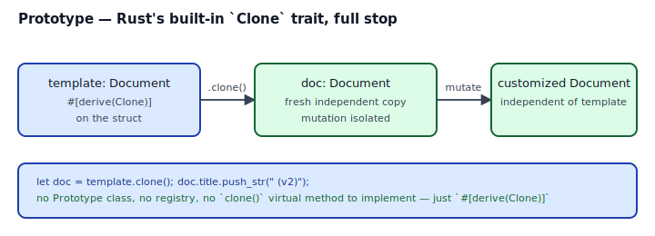
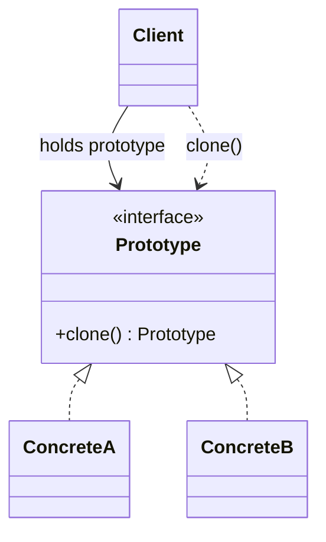

## Intent

Specify the kinds of objects to create using a prototypical instance, and create new objects by copying this prototype.

In Rust, this pattern is *the standard library*. `#[derive(Clone)]` on a struct gives you the whole pattern in nine characters. There is no custom `Prototype` trait to design, no `clone()` virtual method to implement — `Clone::clone(&self) -> Self` is the whole contract.

The "interesting" questions are not about *how* to clone but about *when*:

- Should this type be `Clone` at all, or should duplication require a deliberate ceremony?
- When should clones be cheap (`Rc<T>` / `Arc<T>`) vs. deep (`Vec<T>`, `String`)?
- If the type is *expensive* to clone, should construction use [Builder](../builder/index.md) instead of "take this prototype and tweak it"?

## Problem / Motivation

Classical GoF use case: an "object graph" with many similar instances (game sprites, UI widgets, document templates). Rather than reconstruct each instance from scratch, keep one prototype and copy it.

```rust
#[derive(Clone)]
pub struct Document {
    pub title: String,
    pub tags: Vec<String>,
    pub body: String,
}

let template = Document { title: "Untitled".into(), ... };
let mut doc = template.clone();
doc.title = "Project Alpha".into();
```

That's the whole pattern.



## Classical GoF Form



Rust port: a `Prototype` trait with `clone_box() -> Box<dyn Prototype>` (because `dyn Clone` itself isn't object-safe). [`code/gof-style.rs`](./code/gof-style.rs) shows it — 20 lines of ceremony that `#[derive(Clone)]` makes obsolete.

## Why the Rust Native Form Wins

- **`Clone` is built into the language.** The trait exists; the derive exists; every standard container (`Vec`, `HashMap`, `String`) implements it. Nothing to invent.
- **Clone depth is explicit.** `String` deep-copies its bytes; `Rc<T>` and `Arc<T>` bump a refcount (shallow, cheap); `&T` is Copy with no clone at all. The type signature tells you the cost.
- **Opting out is meaningful.** A type that deliberately does *not* implement `Clone` (secrets, file handles, unique IDs) communicates an invariant. The absence of `Clone` is a design statement Prototype doesn't have the vocabulary for.
- **`Copy` is the compiler's blessing on cheap clones.** Primitive types (`u64`, `bool`, `char`) and small `#[derive(Copy, Clone)]` POD types can be duplicated implicitly. You get the pattern for free without typing `.clone()`.

## Idiomatic Rust Form

Full code: [`code/idiomatic.rs`](./code/idiomatic.rs). The "Prototype" is just `.clone()`. The *wrapper* — a `Template` struct that owns a private prototype and spawns copies — is the only piece with any design to it:

```rust
pub struct Template { base: Document }

impl Template {
    pub fn new(base: Document) -> Self { Self { base } }
    pub fn instance(&self) -> Document { self.base.clone() }
    pub fn instance_with_title(&self, t: impl Into<String>) -> Document {
        let mut d = self.base.clone();
        d.title = t.into();
        d
    }
}
```

This is a [Newtype](../../rust-idiomatic/newtype/index.md) around an immutable prototype. The wrapper prevents callers from mutating the template; the `instance*` methods clone it. Three lines of non-trivial code.

### When to opt *out* of `Clone`

Some types should not be trivially duplicated:

- **Secrets.** Cloning a `SecretKey` is a security anti-pattern. Opt out.
- **Unique handles.** A `FileDescriptor(i32)` that owns an OS resource can't meaningfully be "cloned"; `dup()` is a specific operation, not a free one.
- **Resource guards.** A `Mutex` cannot be cloned — the `MutexGuard` owns the lock. Opt out.

For these, remove `Clone` and instead expose a deliberate `fn duplicate(&self) -> Result<Self, Error>` (or similar) that makes the operation explicit and fallible.

### When to use `Rc<T>` / `Arc<T>` instead of deep clone

If the "prototype" is genuinely immutable after construction and callers only need a *reference* to it, `Rc<Document>` / `Arc<Document>` gives you shared ownership with cheap `.clone()` (which bumps a refcount, not the whole document). See [Interior Mutability](../../rust-idiomatic/interior-mutability/index.md) for the full story on shared ownership primitives.

## Anti-patterns & Rust-specific Caveats

- ⚠️ **Don't implement a custom `Prototype` trait.** `Clone` already exists. Anything you'd put in `trait Prototype` is either already in `Clone` or redundant.
- ⚠️ **Don't `#[derive(Clone)]` on types that shouldn't be cloned.** Secrets, file handles, unique IDs — omit `Clone`. The absence of the derive is a security and design statement.
- ⚠️ **Don't implement `Clone` manually if the derive works.** The derive produces the obvious field-by-field clone. Manual impls are for cases with invariants beyond "every field cloned" — and those cases should question whether `Clone` is even the right trait.
- ⚠️ **Don't try to put `Box<dyn Clone>`** or `Vec<Box<dyn Clone>>`. `Clone::clone` returns `Self`, which makes the trait non-object-safe. Workarounds: either use the `dyn_clone` crate, or swap the trait for a closure (`Box<dyn Fn() -> Box<dyn Thing>>`) which is first-class cloneable.
- ⚠️ **Don't clone to avoid lifetimes.** If `let copy = source.clone()` is only there because you couldn't convince the borrow checker that `&source` lives long enough, consider whether the lifetime annotation is wrong. Clones hide ownership bugs more often than they fix them.
- ⚠️ **Don't use Prototype as "factory with configuration".** That's a [Builder](../builder/index.md). Cloning a template and tweaking is fine for one or two fields; for many, build with `Builder`.
- ⚠️ **Don't forget `Clone` costs what it clones.** Cloning a `Vec<String>` allocates a new vector AND new strings for every element. Profile before deciding clones are "cheap."

## Compiler-Error Walkthrough

[`code/broken.rs`](./code/broken.rs) attempts to `.clone()` a type that doesn't derive `Clone`:

```rust
pub struct Secret { pub bytes: Vec<u8> }  // no derive

pub fn duplicate_secret(s: &Secret) -> Secret {
    s.clone()
}
```

```
error[E0599]: no method named `clone` found for reference `&Secret` in the current scope
  |
  |     s.clone()
  |       ^^^^^ method not found in `&Secret`
  |
help: the following trait defines an item named `clone`, perhaps you need to
      implement it: `Clone`
```

Read it: `Clone` is not implemented on `Secret`. **The compiler is telling you this is intentional** — by not deriving `Clone`, the type's author said "this should not be duplicated." Don't suppress the error with `#[derive(Clone)]` without thinking about whether cloning is actually what you want.

### The second mistake: `Box<dyn Clone>`

```rust
pub trait Shape: Clone { fn area(&self) -> f64; }
pub fn pick_shape() -> Box<dyn Shape> { ... }
```

```
error[E0038]: the trait `Shape` cannot be made into an object
  |
  | pub trait Shape: Clone {
  |                  ----- this trait cannot be made into an object...
```

Read it: `Clone::clone(&self) -> Self` references `Self`, which violates object safety. The `Self` return type requires the concrete type at call time, but a trait object has erased that type. **E0038 is the object-safety rules protecting you.**

### Workarounds

- **Drop the Clone supertrait** and accept that `Box<dyn Shape>` can't be cloned. Most of the time, this is fine — callers clone the concrete type, not the trait object.
- **Use the `dyn_clone` crate** (`dyn_clone::DynClone` supertrait + `clone_box` method) if you genuinely need clone-through-trait-object.
- **Replace the "shape" trait with a closure**: `Box<dyn Fn() -> Box<dyn Shape>>` is cloneable because `Fn` is object-safe and `Box` itself is `Clone` when the inner type is.

`rustc --explain E0599` and `rustc --explain E0038` cover both errors.

## When to Reach for This Pattern (and When NOT to)

**Use `Clone` (Rust's Prototype) when:**
- You want a cheap way to produce many similar instances from a base.
- The type's fields are themselves reasonable to clone (primitives, strings, small collections).
- The duplication semantics are "make me another independent instance that shares no state."

**Use `Rc<T>` / `Arc<T>` instead when:**
- Instances don't need to be independent — they can share the underlying data.
- Cloning the value would be expensive (big Vec, long String, nested tree).

**Use [Builder](../builder/index.md) instead when:**
- "Prototype + tweak" has five or more tweaks. Builder reads better.
- Construction is fallible (`Result<Doc, BuildError>`). Clone is infallible.

**Opt out of `Clone` entirely when:**
- Duplication would be semantically wrong (secrets, unique resources, handles).
- The absence is the documentation.

## Verdict

**`prefer-rust-alternative`** — the GoF pattern has been absorbed into the language. Use `#[derive(Clone)]` (and `Copy` for POD types). Reach for [Newtype](../../rust-idiomatic/newtype/index.md) + a template struct if you need to control *who* can clone and *when*. The GoF class hierarchy is never the right shape in Rust.

## Related Patterns & Next Steps

- [Newtype](../../rust-idiomatic/newtype/index.md) — wrap a prototype in a newtype to control visibility of the template.
- [Builder](../builder/index.md) — when "clone + tweak" grows past a few tweaks, Builder is cleaner.
- [Interior Mutability](../../rust-idiomatic/interior-mutability/index.md) — `Rc<T>` / `Arc<T>` as shared-ownership alternatives to deep cloning.
- [From / Into Conversions](../../rust-idiomatic/from-into-conversions/index.md) — `From<Template>` producing a Document is another way to express the prototype-to-instance relationship.
- [Factory Method](../factory-method/index.md) — a factory that returns `Self::Product` where `Product: Clone` is Prototype + Factory Method in one type.
