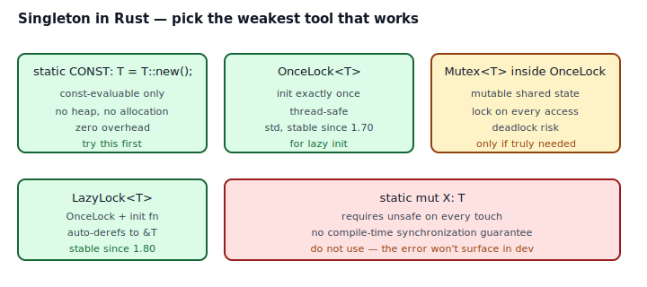
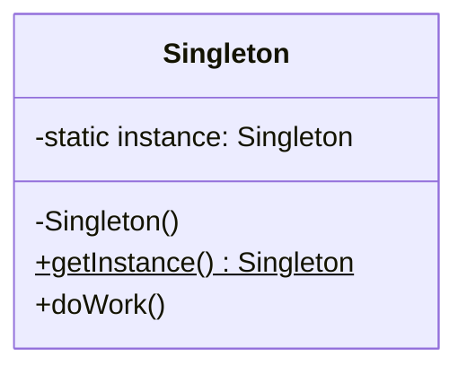

## Intent

Ensure a class has only one instance, and provide a global point of access to it.

The GoF version conflates two ideas: "one instance" and "globally reachable". Rust teases them apart. If the value is read-only and computable at compile time, it's a `const`. If it's read-only but computed at runtime, it's an `OnceLock<T>` or `LazyLock<T>`. If it's *mutable*, that's shared mutable state and you should question whether you really want that before proceeding.

## Problem / Motivation

Many programs want exactly one of something — a logger, a configuration object, a tracing subscriber, a process-wide metric registry. The GoF answer is: make the constructor private, hold the instance in a `static` field, expose `getInstance()`.



In Java and C++ this gave rise to famously dangerous code — "double-checked locking", partially-constructed instances, memory-order bugs. The Rust standard library gives you `OnceLock<T>` which does it correctly in ~4 lines and is stable since Rust 1.70.

## Classical GoF Form



See [`code/gof-style.rs`](./code/gof-style.rs) for the direct Rust translation. It's five lines of interesting code — module-private constructor, `OnceLock<Self>`, `get_or_init(...)`. Thread-safe by construction, no `unsafe`, no external crate.

## Why GoF Translates Adequately (But With Caveats)

The GoF shape works, but you get more natural Rust idioms by starting smaller:

1. **`const`** — if the singleton value is compile-time-evaluable, a `const` is strictly better than a `Singleton`. No heap, no init order concerns, no `get_instance()` call.
2. **`static` with a literal expression** — runtime storage, but no lazy init needed.
3. **`OnceLock<T>`** — lazy init exactly once, thread-safe. This is the GoF translation.
4. **`LazyLock<T>`** — `OnceLock<T>` + an init closure, with auto-deref to `&T`. Stable since 1.80.
5. **`OnceLock<Mutex<T>>`** — mutable shared singleton. Use only if necessary.

The **question** Rust makes you answer that GoF doesn't: "is the value mutable?" If yes, you're committing to global mutable state — the thing every pattern book warns against. If no, then `get_or_init` is the whole story.

## Idiomatic Rust Forms

```mermaid
sequenceDiagram
    autonumber
    participant T1 as Thread A
    participant T2 as Thread B
    participant Lock as OnceLock&lt;Config&gt;

    T1->>Lock: get_or_init(|| load_config())
    Note right of Lock: state: Uninit → Init(cfg)
    T1->>Lock: load_config() runs
    Lock-->>T1: &cfg

    T2->>Lock: get_or_init(|| load_config())
    Note right of T2: closure is NOT called — already init
    Lock-->>T2: &cfg
```

Full code: [`code/idiomatic.rs`](./code/idiomatic.rs).

### Form 1 — `const` (preferred)

```rust
pub const MAX_RETRIES: u32 = 3;
pub const APP_NAME: &str = "rust-patterns";
```

Use whenever the value is a compile-time literal, a tuple of literals, or buildable from `const fn`. Zero runtime cost, no lazy init, no synchronization.

### Form 2 — `static` with literal expression

```rust
pub static BUILD_CHANNEL: &str = "stable";
```

A `static` occupies runtime storage but requires the initializer to be a constant expression. Useful for read-only values that can't live in `const` because of their type (e.g., `&str` with interior data, a `AtomicU64::new(0)`).

### Form 3 — `OnceLock<T>`

```rust
fn config() -> &'static Config {
    static CONFIG: OnceLock<Config> = OnceLock::new();
    CONFIG.get_or_init(|| {
        Config { database_url: "...".into(), port: 8080 }
    })
}
```

This is the GoF translation. Exactly one initialization, race-free. The closure runs on the first caller; every subsequent caller gets the cached `&Config`.

### Form 4 — `LazyLock<T>`

```rust
pub static MESSAGES: LazyLock<Vec<&'static str>> = LazyLock::new(|| {
    vec!["hello", "world"]
});

// call site
for m in MESSAGES.iter() { ... }
```

`LazyLock` bundles an `OnceLock` with its init closure. Auto-derefs to `&T`, which makes the call site feel like accessing a regular static.

### Form 5 — `OnceLock<Mutex<T>>` (mutable, only when needed)

```rust
fn metrics() -> &'static Mutex<u64> {
    static COUNTER: OnceLock<Mutex<u64>> = OnceLock::new();
    COUNTER.get_or_init(|| Mutex::new(0))
}

// call site
*metrics().lock().expect("poisoned") += 1;
```

This *is* shared mutable state. It's testable with difficulty, it serializes every caller through one lock, and it tends to grow contention as the program scales. Use when you genuinely need process-wide mutable state (metrics counters, tracing config). Don't use it as a convenient replacement for dependency injection.

## Anti-patterns & Rust-specific Caveats

- ⚠️ **Don't use `static mut`.** Since the 2024 edition, touching a `static mut` is unsafe, and for good reason: no synchronization, no thread safety, no reasoning about concurrent access. See [`code/broken.rs`](./code/broken.rs). The replacement is `OnceLock<Mutex<T>>` or one of the atomic types.
- ⚠️ **Don't reach for `lazy_static!` or `once_cell::sync::Lazy` unless you need 1.70-pre compat.** Both have been superseded by `std::sync::OnceLock` (1.70) and `std::sync::LazyLock` (1.80). Two fewer dependencies.
- ⚠️ **Don't make the singleton mutable "just in case."** A mutable singleton is global mutable state. It makes testing harder, parallel tests impossible without effort, and reasoning about ordering painful. Thread the value explicitly if you can.
- ⚠️ **Don't use Singleton to smuggle dependency injection.** `get_logger()` anywhere in the code is *lazier* than accepting a `&Logger` parameter but it makes every function implicitly depend on that global. Prefer explicit arguments; reserve Singleton for the literal "there is only one of this in the process" cases.
- ⚠️ **Don't expect `Drop` to run on a `static`.** Statics live for the entire program; Rust does not drop them at exit. If your singleton owns an OS resource, the resource is cleaned up by the OS, not your `Drop` impl.
- ⚠️ **Don't `unwrap()` a poisoned `Mutex` without thinking.** `.lock()` on a mutex whose holder panicked returns `Err(PoisonError)`. For truly process-wide state like a counter, `expect("poisoned")` is often acceptable (the program is already in trouble). For anything recoverable, handle `PoisonError::into_inner()` explicitly.
- ⚠️ **Don't expose the `OnceLock` itself** in a public API. Keep it behind an accessor function (`config() -> &'static Config`). That way you can swap the implementation later (to `LazyLock`, to dependency injection, to a test double) without touching call sites.

## Compiler-Error Walkthrough

[`code/broken.rs`](./code/broken.rs) tries to touch a `static mut` without the `unsafe` keyword:

```rust
static mut COUNTER: u64 = 0;

pub fn bump_no_unsafe() {
    COUNTER += 1;   // E0133 on 2024 edition
}
```

The compiler says:

```
error[E0133]: use of mutable static is unsafe and requires unsafe function or block
  |
  |     COUNTER += 1;
  |     ^^^^^^^ use of mutable static
  |
  = note: mutable statics can be mutated by multiple threads: aliasing
          violations or data races will cause undefined behavior
```

Read it literally: "mutable statics can be mutated by multiple threads." The language is telling you to pick a safe primitive that *handles* concurrent access: `OnceLock<Mutex<T>>`, `AtomicU64`, or similar. Wrapping the line in `unsafe { }` silences the compiler but does not make the code safe — a race between two threads on `COUNTER += 1` is still undefined behavior.

**E0133 is the compiler refusing to let you build a thread-unsafe singleton silently.** The idiomatic reply is to swap `static mut` for `OnceLock` + a synchronization primitive. `rustc --explain E0133` gives the canonical explanation.

## When to Reach for This Pattern (and When NOT to)

**Use Singleton (in one of its Rust forms) when:**
- There is exactly one of the thing at the OS level — one stdout, one process-wide tracing subscriber, one registered panic hook.
- The value is expensive to construct and must be computed at most once.
- The value is read-only (configuration, feature flags) and has no reason to be thread-local.

**Skip Singleton when:**
- "One per process" is a convenience rather than a requirement. Use dependency injection.
- Your tests need to swap implementations. Globals are hostile to parallel tests.
- The object's lifetime is shorter than the program. A lazy static that should be freed partway through is a sign you have a lifecycle, not a singleton.
- You think you want `static mut`. You want `OnceLock<Mutex<T>>` or an atomic.

## Verdict

**`use-with-caveats`** — Singleton is a real Rust pattern (`std::io::stdout()`, `std::env`, the process-wide panic hook), but reach for the *weakest* form that works: `const` > `static` > `OnceLock` > `LazyLock` > `OnceLock<Mutex<_>>`. Every step up that ladder costs you something.

## Related Patterns & Next Steps

- [Interior Mutability](../../rust-idiomatic/interior-mutability/index.md) — if a singleton must be mutable, this is the pattern that names the tradeoffs of `Cell`/`RefCell`/`Mutex`/`RwLock`.
- [Newtype](../../rust-idiomatic/newtype/index.md) — wrap your singleton in a newtype so downstream code can't construct additional instances by accident.
- [Sealed Trait](../../rust-idiomatic/sealed-trait/index.md) — if a singleton exposes a trait, sealing prevents rogue impls.
- [Builder](./../builder/index.md) — often the *construction* of a singleton's value deserves a Builder; `OnceLock` + `Builder::build()?` is a natural pair.
- [RAII & Drop](../../rust-idiomatic/raii-and-drop/index.md) — singletons don't get Drop; plan for process-exit cleanup accordingly.
