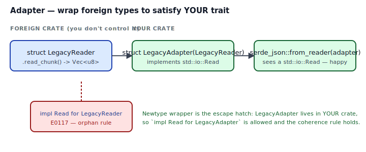
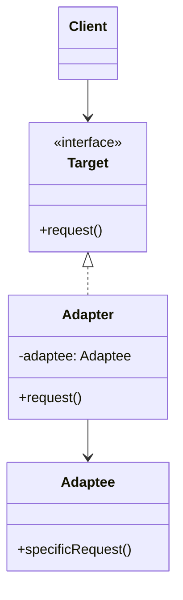
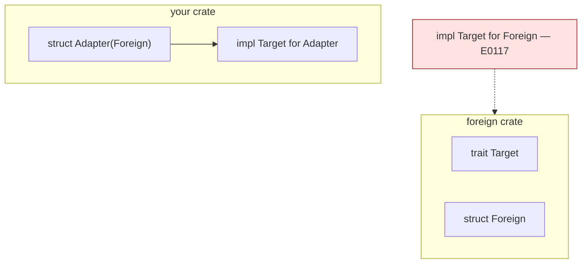

## Intent

Convert the interface of a class into another interface clients expect. Adapter lets classes work together that couldn't otherwise because of incompatible interfaces.

In Rust, "incompatible interfaces" almost always means "the foreign type doesn't implement the trait I need." The Rust idiom is a small newtype wrapper in your crate that delegates to the foreign type and implements the target trait.

## Problem / Motivation

You're using `serde_json::from_reader(reader)`, which expects any `R: std::io::Read`. You have a `LegacyReader` from a vendor crate that exposes `.read_chunk() -> Vec<u8>` but does not implement `Read`. You *could* refactor the vendor crate — except you can't, you don't own it.

What's worse, you can't even write `impl Read for LegacyReader` in your own crate. The **orphan rule** (E0117) forbids implementations where both the trait and the type come from foreign crates — otherwise two crates could each define a conflicting impl and there'd be no way to decide which wins.



The pattern: a tiny wrapper you own.

```rust
pub struct LegacyAdapter { inner: LegacyReader, leftover: Vec<u8> }
impl Read for LegacyAdapter { /* delegate to inner + leftover */ }
```

Now `LegacyAdapter` is *your* type, so `impl Read for LegacyAdapter` is allowed.

## Classical GoF Form



The direct Rust translation is [`code/idiomatic.rs`](./code/idiomatic.rs) — the GoF shape *is* the Rust shape for this pattern. The only Rust-specific twist is the orphan rule forcing the wrapper to exist.

## Why GoF Translates Well to Rust

Unlike State or Observer, Adapter's class hierarchy maps naturally:

- **The Target is a trait** — Rust's traits are what GoF calls "interfaces."
- **The Adaptee is the foreign struct** — Rust has no inheritance issues to navigate.
- **The Adapter is a newtype** — zero runtime cost, one method delegation per trait method.

Rust adds one wrinkle (the orphan rule) and one benefit (the adapter can be `#[repr(transparent)]` if it wraps a single field, giving zero-overhead layout equivalence).

## Idiomatic Rust Form



Full code: [`code/idiomatic.rs`](./code/idiomatic.rs). The recipe:

1. Define `pub struct LegacyAdapter { inner: LegacyReader, ... }` — a newtype (or a struct with extra adapter state, such as the `leftover: Vec<u8>` in the example for partial-chunk reads).
2. `impl From<LegacyReader> for LegacyAdapter` so callers can `reader.into()` to wrap.
3. `impl Read for LegacyAdapter` — the body delegates to `self.inner.read_chunk()` and maps the data into the shape `Read::read` expects.

That's the whole pattern. The call site never sees `LegacyReader`:

```rust
let mut adapter: LegacyAdapter = legacy_reader.into();
serde_json::from_reader(&mut adapter)?;
```

### Variations

- **Two-way adapter.** Expose *both* directions — `impl Target for Adapter` and `impl Adaptee for Adapter` (by delegating). Useful when callers sometimes need the raw interface.
- **`#[repr(transparent)]`.** If the adapter wraps exactly one field, `#[repr(transparent)] pub struct Adapter(LegacyReader)` guarantees the adapter has the same memory layout as `LegacyReader`. Lets you cast `&LegacyReader` to `&Adapter` with unsafe if you absolutely need it — but usually you don't, so don't.
- **Blanket impl over a helper trait.** If you need to adapt *every* type in a foreign family, define a helper trait (`trait PullChunks { fn next_chunk(...); }`) and `impl<T: PullChunks> Read for Adapter<T>`. One adapter for many adaptees.
- **Async adapters.** Same shape, but the target trait is `AsyncRead`/`Stream` and the adapter body calls `.await`. No new ideas.

## Anti-patterns & Rust-specific Caveats

- ⚠️ **Don't fight the orphan rule.** `impl Read for LegacyReader` does not compile in your crate and should not. The correct move is a wrapper. The alternative is filing an upstream PR so *they* ship the impl.
- ⚠️ **Don't forget `From<Adaptee> for Adapter`.** Without it, callers write `LegacyAdapter { inner: reader, leftover: vec![] }` at every call site and leak construction details. With it, `reader.into()` is one token.
- ⚠️ **Don't write an adapter for every tiny shape mismatch.** If the only difference is a field name, a free function often does: `fn to_target(foreign: &Foreign) -> Target`. Reach for an adapter when the transformation is stateful or the trait-object story matters.
- ⚠️ **Don't combine Adapter with `Deref` carelessly.** `impl Deref<Target = Foreign> for LegacyAdapter` makes *all* of Foreign's methods visible on the adapter. That usually defeats the point of the pattern — which is to present a *new* interface. Prefer `fn into_inner(self) -> Foreign` and `fn inner(&self) -> &Foreign` as explicit escape hatches.
- ⚠️ **Don't adapt something that's already adapted.** `BufReader<BufReader<File>>` is legal; doing the same with hand-rolled adapters usually isn't useful. If chaining adapters is natural, you're probably doing [Decorator](../decorator/index.md), not Adapter.
- ⚠️ **Don't ship an adapter that silently drops errors.** `fn read(&mut self, buf: &mut [u8]) -> io::Result<usize>` — return a real error from the adapter when the foreign call fails, not `Ok(0)`. `Ok(0)` means EOF, and conflating EOF with error will confuse every caller.
- ⚠️ **Don't skip testing the adapter.** Adapters are where bugs hide: off-by-one chunk boundaries, encoding edge cases, EOF semantics. A 5-line test per adapter pays for itself.

## Compiler-Error Walkthrough

[`code/broken.rs`](./code/broken.rs) tries to implement `std::io::Read` (a foreign trait) on a foreign struct:

```rust
impl Read for foreign_reader::LegacyReader { ... }
```

The compiler says:

```
error[E0117]: only traits defined in the current crate can be implemented
              for types defined outside of the crate
  |
  |     impl Read for foreign_reader::LegacyReader {
  |     ^^^^^--------^^^^^^^^^^^^^^^^^^^^^^^^^^^^^
  |     |    |
  |     |    `LegacyReader` is not defined in the current crate
  |     impl doesn't use only types from inside the current crate
  |
note: define and implement a trait or new type instead
```

Read it: **coherence**. If two crates could each `impl Read for LegacyReader`, the compiler could not decide which one wins. The orphan rule breaks the ambiguity by demanding at least one side of the impl come from your crate.

### Two fixes, ranked

1. **Wrap in a newtype** — the Adapter pattern. Your crate owns the wrapper, so the impl is allowed. See `code/idiomatic.rs`.
2. **Upstream the impl.** If the foreign crate logically should implement Read, PR it. Orphan rule gives upstream crates leverage; use it.

`rustc --explain E0117` covers orphan rule and coherence in detail.

## When to Reach for This Pattern (and When NOT to)

**Use Adapter when:**
- You want to use a foreign type where a trait you care about is required, and you cannot add the impl upstream.
- The transformation between Adaptee and Target is stateful (buffering, format translation) rather than a one-shot conversion.
- You have many call sites that currently do the ad-hoc conversion inline.

**Skip Adapter when:**
- A `fn` with a descriptive name does the conversion and that's all that's needed.
- You control the foreign type. Add the impl there.
- `From`/`Into`/`TryFrom` already express the conversion and you don't need to satisfy a specific third-party trait.
- You're about to chain adapters. That's [Decorator](../decorator/index.md) — a related but distinct pattern.

## Verdict

**`use`** — Adapter is the GoF pattern with the cleanest Rust translation. The orphan rule even provides a compiler-enforced reason to write it: without the wrapper, you literally can't implement the trait. The mechanism and the language align.

## Related Patterns & Next Steps

- [Decorator](../decorator/index.md) — same shape (wrapper around an inner), different intent (add behavior rather than change interface). `BufReader<File>` is Decorator; `LegacyAdapter` is Adapter.
- [Facade](../facade/index.md) — Adapter reshapes *one* interface; Facade hides *several*.
- [Newtype](../../rust-idiomatic/newtype/index.md) — the language-level primitive Adapter is built on. Every Adapter is a Newtype with an `impl Trait`.
- [From / Into Conversions](../../rust-idiomatic/from-into-conversions/index.md) — when the "adapter" is a pure value-to-value transform, the From/Into traits are the right tool.
- [Bridge](../bridge/index.md) — Adapter changes the interface for one type; Bridge decouples abstraction from implementation for an entire family.
