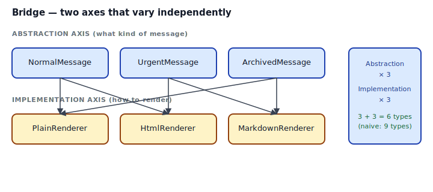
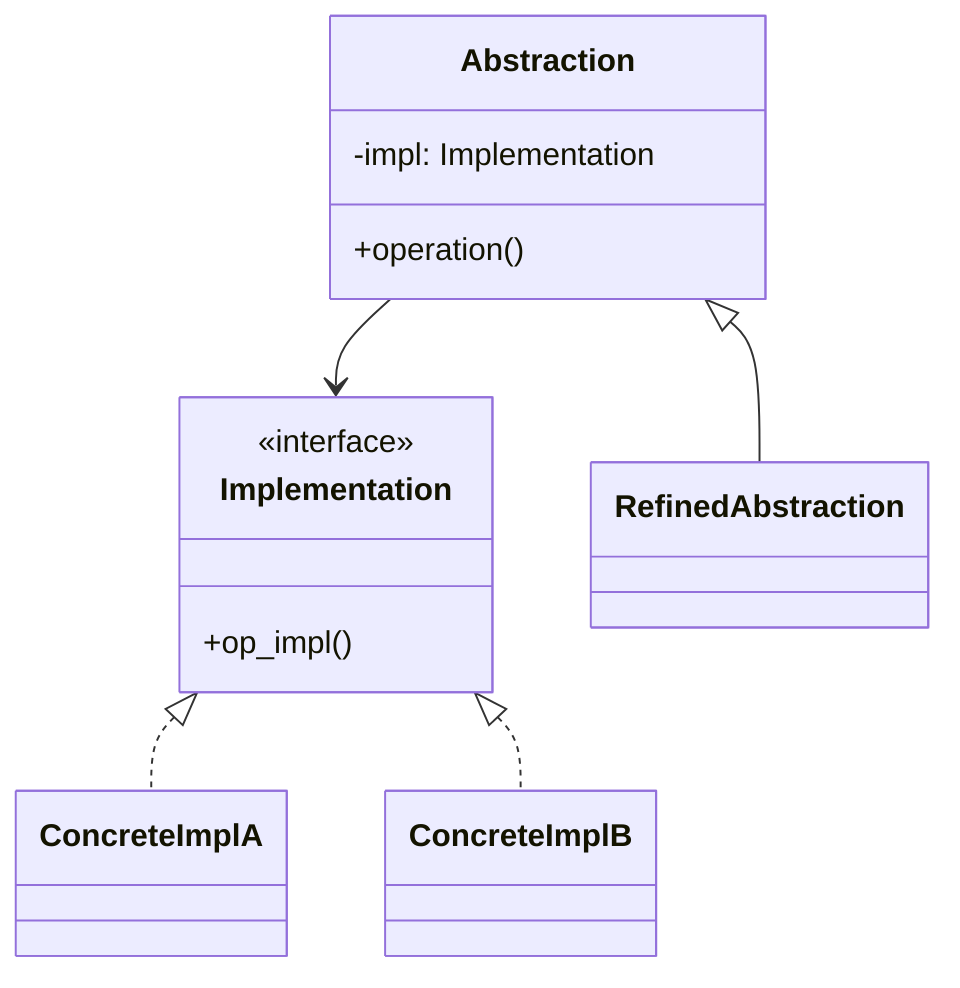
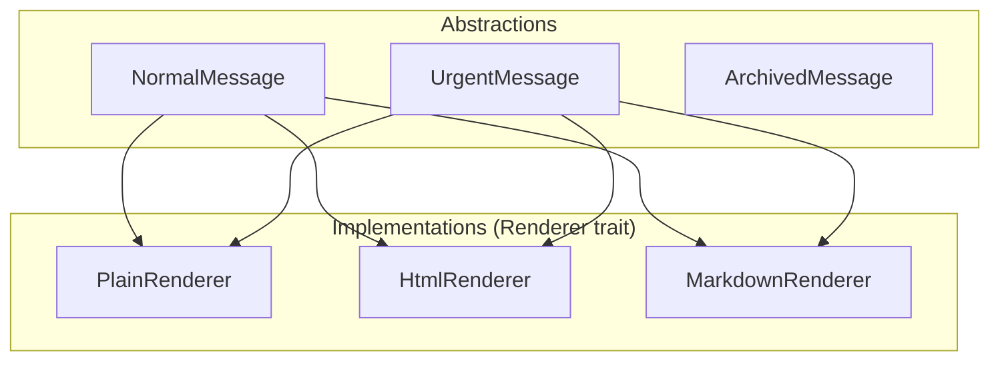

## Intent

Decouple an abstraction from its implementation so that the two can vary independently.

Bridge is the *architectural* form of [Strategy](../../gof-behavioral/strategy/index.md): Strategy picks one algorithm; Bridge lets an entire abstraction hierarchy and an entire implementation hierarchy evolve on separate axes. You end up with `A × I` functionality for `A + I` code, not `A × I` code.

## Problem / Motivation

You're building a messaging module with three kinds of messages — `NormalMessage`, `UrgentMessage`, `ArchivedMessage` — each renderable in three formats: `Plain`, `HTML`, `Markdown`. A naive implementation creates nine types:

```text
NormalMessagePlain   NormalMessageHtml   NormalMessageMarkdown
UrgentMessagePlain   UrgentMessageHtml   UrgentMessageMarkdown
ArchivedMessagePlain ArchivedMessageHtml ArchivedMessageMarkdown
```

Adding a new renderer (`Json`) is three new types; adding a new message kind is another three. Linear growth on both axes multiplies into quadratic growth of types. That's the combinatorial trap Bridge exists to avoid.



The Rust form: make the implementation axis a trait (`Renderer`), make each abstraction generic over it (`UrgentMessage<R: Renderer>`). Now `UrgentMessage<HtmlRenderer>` and `NormalMessage<MarkdownRenderer>` and all seven other combinations exist *without* you writing them — the compiler monomorphizes on demand.

## Classical GoF Form



The Rust translation maps directly: `Abstraction` becomes a struct generic over `R: Implementation`; `RefinedAbstraction` is another struct with the same generic parameter; the two implementation concretions are `impl Implementation for X` blocks.

## Idiomatic Rust Form



Full code: [`code/idiomatic.rs`](./code/idiomatic.rs).

```rust
pub trait Renderer {
    fn heading(&self, t: &str) -> String;
    fn line(&self, t: &str) -> String;
    fn urgent_prefix(&self) -> &'static str { "" }
}

pub struct UrgentMessage<R: Renderer> {
    pub title: String,
    pub body: Vec<String>,
    pub renderer: R,
}

impl<R: Renderer> UrgentMessage<R> { pub fn render(&self) -> String { ... } }
```

- **Generic parameter** ties each abstraction to a specific renderer type. Monomorphized, zero vtable.
- **Default method (`urgent_prefix`)** lets renderers opt in to the urgent styling without forcing every `Renderer` impl to implement it.
- **Adding a renderer** means one new `impl Renderer for NewRenderer`. All three message types can use it.
- **Adding a message type** means one new `struct MessageKind<R: Renderer>`. Works with every renderer.

### Static vs dynamic bridge

The example uses a generic parameter — static dispatch, zero overhead. The alternative is a trait object:

```rust
pub struct UrgentMessage {
    pub title: String,
    pub body: Vec<String>,
    pub renderer: Box<dyn Renderer>,
}
```

Use the generic form when the renderer is chosen at compile time (which is usually). Use the `Box<dyn>` form when the renderer is chosen at runtime (config-driven, content-type negotiation). Both are valid Bridge implementations.

## Bridge vs Strategy

They're structurally similar. The difference is scale:

- **Strategy**: the *algorithm* varies. One function's behavior is parameterized by a closure or trait.
- **Bridge**: the *whole abstraction* varies. A hierarchy of abstractions is parameterized by a hierarchy of implementations.

If you only have one `Message` and swap its renderer, you have Strategy. If you have several `Message` kinds that all delegate to a renderer, you have Bridge.

## Anti-patterns & Rust-specific Caveats

- ⚠️ **Don't inline `dyn Renderer` in a struct field.** Trait objects are unsized; use `Box<dyn Renderer>` or a generic parameter. See [`code/broken.rs`](./code/broken.rs).
- ⚠️ **Don't hardcode the renderer type** in the abstraction struct. That's not a Bridge; that's just composition. Bridge requires the implementation axis to be *parameterized*.
- ⚠️ **Don't apply Bridge when you have one abstraction and one implementation.** Wait until you have two of either. The pattern earns its keep on the second variant, not the first.
- ⚠️ **Don't forget default methods for opt-in behavior.** `urgent_prefix` has a default `""` — renderers that don't care skip it. Required methods everywhere forces every impl to implement things they don't use.
- ⚠️ **Don't mix Bridge with Abstract Factory unthinkingly.** If you find yourself writing `fn bridge_pair<A: Abstraction, R: Renderer>() -> (A, R)` to enforce "compatible pairs", you want [Abstract Factory](../../gof-creational/abstract-factory/index.md)'s associated types, not Bridge's generic parameter.
- ⚠️ **Don't use Bridge as indirection for its own sake.** If the two "axes" are really one conceptual thing that you're over-abstracting, collapse them. The pattern is for genuine orthogonality.
- ⚠️ **Don't create `Vec<DifferentRenderers>` without boxing.** Each concrete renderer is a different type; collecting them needs `Vec<Box<dyn Renderer>>`. See `code/broken.rs`.

## Compiler-Error Walkthrough

[`code/broken.rs`](./code/broken.rs) stores `dyn Renderer` inline:

```rust
pub struct Message {
    pub renderer: dyn Renderer,
}
```

```
error[E0277]: the size for values of type `(dyn Renderer + 'static)`
              cannot be known at compilation time
  |
  |     pub renderer: dyn Renderer,
  |                   ^^^^^^^^^^^^ doesn't have a size known at compile-time
```

Read it: `dyn Renderer` is unsized. Two fixes:

- `Message<R: Renderer>` with `renderer: R` — **generic parameter, static dispatch, zero overhead**.
- `Message { renderer: Box<dyn Renderer> }` — **trait object, one allocation, vtable per call**.

The generic form is the default; the boxed form is for runtime selection.

### Other useful errors

- `Vec<Plain, Html>` with mixed concrete types triggers E0308 (mismatched types). Fix: `Vec<Box<dyn Renderer>>`.
- Trait objects with generic methods or `Self` returns trigger E0038 (not object-safe). Bridge's Implementation trait should be object-safe if you want the `Box<dyn>` form.

`rustc --explain E0277` covers sized bounds; `rustc --explain E0308` covers mismatched types.

## When to Reach for This Pattern (and When NOT to)

**Use Bridge when:**
- You have two orthogonal axes of variation and the product of concrete types is a combinatorial explosion.
- Both axes grow over time and you want adding to either to be cheap.
- The abstraction hierarchy and the implementation hierarchy are genuinely independent — no implementation needs to know the abstraction's specific kind.

**Skip Bridge when:**
- You have one abstraction and one implementation, or a stable 2×2 grid where all four cases are handwritten and likely to stay that way.
- The "implementation" is really just one method — use [Strategy](../../gof-behavioral/strategy/index.md) with a closure or trait.
- The axes aren't actually orthogonal. If `UrgentMessage` needs to know about HTML specifically, you have coupled axes and Bridge won't save you.

## Verdict

**`use-with-caveats`** — Bridge is legitimate in Rust, and the generic-parameter form is lightweight. The caveat is: don't apply it to "hypothetical future axes". Wait until the second axis has two variants in production, then introduce the generic parameter as a refactor.

## Related Patterns & Next Steps

- [Strategy](../../gof-behavioral/strategy/index.md) — per-method parameterization; Bridge is per-hierarchy.
- [Adapter](../adapter/index.md) — an adapter wraps one type to fit one interface; a bridge connects two parallel hierarchies.
- [Abstract Factory](../../gof-creational/abstract-factory/index.md) — when the abstraction/implementation pairs must be consistent (not any abstraction + any implementation), switch to Abstract Factory's associated types.
- [Decorator](../decorator/index.md) — decorators stack up one axis; bridges span two axes.
- [Typestate](../../rust-idiomatic/typestate/index.md) — when one axis of "variation" is really a state machine, typestate collapses it into the type system.
