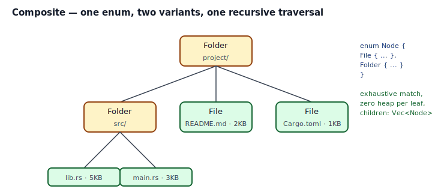
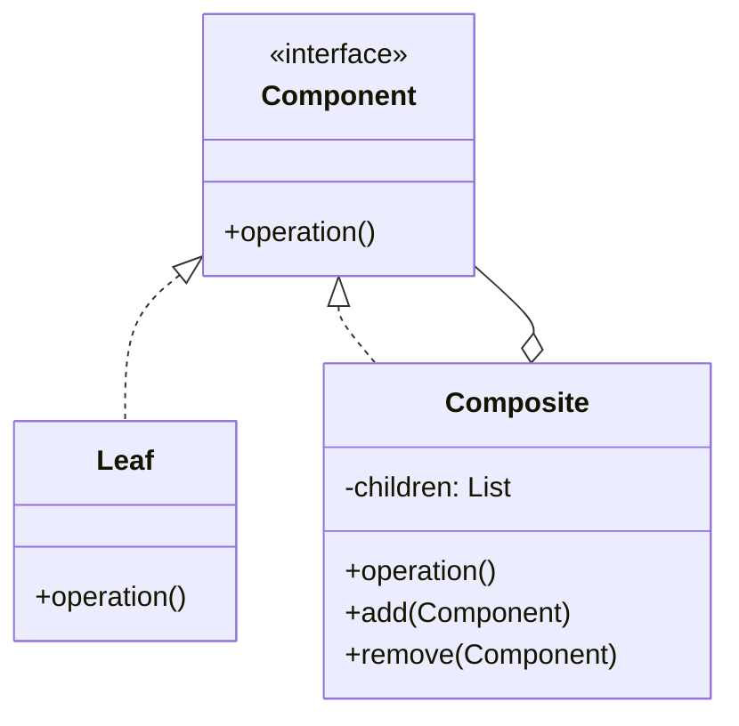

## Intent

Compose objects into tree structures to represent part-whole hierarchies. Composite lets clients treat individual objects and compositions of objects uniformly.

In Rust, Composite is one of the cleanest GoF translations: the recursive type *is* the pattern. `enum Node { File { ... }, Folder { children: Vec<Node> } }` — two variants, one `match`, exhaustive by construction.

## Problem / Motivation

A filesystem. A scene graph. A syntax tree. An HTML DOM. Any tree where internal nodes contain children of the same kind as themselves, and algorithms over the tree shouldn't need to branch differently on leaf vs. container at every step.

The classical C++/Java rendering is a `Node` abstract class, a `Leaf` subclass, a `Composite` subclass with a `Vec<Node*>` child list, and methods overridden on both. Rust's answer is shorter:



```rust
enum Node {
    File   { name: String, bytes: u64 },
    Folder { name: String, children: Vec<Node> },
}
```

Traversal becomes:

```mermaid
flowchart TD
    Call[".total_size(&root)"]
    Call --> Match{match node}
    Match -->|File { bytes }| Leaf[bytes]
    Match -->|Folder { children }| Rec["children.iter().map(total_size).sum()"]
    Rec --> Call
```

## Classical GoF Form



The direct Rust translation would be a `trait Node { fn size(&self) -> u64 }` plus `struct File` and `struct Folder { children: Vec<Box<dyn Node>> }`. That shape works and is the right choice when *downstream* code adds new Node variants at runtime. For closed variant sets (the common case), the enum form is shorter, faster, and exhaustive.

## Idiomatic Rust Form

Full code: [`code/idiomatic.rs`](./code/idiomatic.rs).

### Recursive type: why you need `Vec<Node>` (not `Node`)

Rust must know the size of every type at compile time. A variant that embedded `Self` directly would be infinitely recursive — `Node` contains a `Node` which contains a `Node`... The fix is *indirection*: `Vec<Node>` (heap-allocated, one pointer-sized pair of fields), `Box<Node>`, or `Rc<Node>`. `Vec<Node>` is the idiomatic choice for a container with any number of children.

### Writing a traversal

Every algorithm follows the same shape: `match` on the variant, recurse on the container arm:

```rust
pub fn total_size(&self) -> u64 {
    match self {
        Self::File { bytes, .. } => *bytes,
        Self::Folder { children, .. } => children.iter().map(Self::total_size).sum(),
    }
}
```

Exhaustive `match` forces you to handle both variants. Adding `enum Node { ..., Symlink { target: String } }` later breaks every `match` in the codebase at *compile time* — exactly the signal you want.

### Generic visitors

For algorithms that just need to visit every leaf (compute stats, render HTML, emit lines), expose a visitor with a closure:

```rust
pub fn walk_files(&self, f: &mut impl FnMut(&str, u64)) {
    match self {
        Self::File { name, bytes }    => f(name, *bytes),
        Self::Folder { children, .. } => {
            for c in children { c.walk_files(f); }
        }
    }
}
```

Callers supply the per-leaf logic inline — no Visitor hierarchy, no double-dispatch. See also [Closure as Callback](../../rust-idiomatic/closure-as-callback/index.md).

### When to switch to `trait + Box<dyn Node>`

Use the trait-object form when:

- **Downstream plugins add new node kinds.** Enum variants are closed to your crate; a trait lets anyone impl it.
- **The variants carry *very* different data** and enum size becomes a concern (the enum's size is the largest variant's size; if one variant is 1 KB and another is 16 bytes, you're paying 1 KB per leaf).
- **You need trait-object dispatch** for some other reason (serialization, reflection, dyn-compatibility with another ecosystem).

Otherwise: enum wins.

## Anti-patterns & Rust-specific Caveats

- ⚠️ **Don't write a recursive enum without indirection.** `enum Node { Folder { child: Node } }` triggers E0072. Use `Box<Node>` for "exactly one child" or `Vec<Node>` for "zero or more". If you forget which, the compiler's error message suggests the fix.
- ⚠️ **Don't inline `dyn Trait` in a struct field.** `Vec<dyn Node>` is E0277 — trait objects are unsized. Use `Vec<Box<dyn Node>>` or stay with the enum form.
- ⚠️ **Don't use `Rc<Node>` unless you have genuine sharing.** If you just need a tree, `Box<Node>` or `Vec<Node>` is cheaper. `Rc` adds reference counting overhead and, for cyclic graphs, needs `Weak` to avoid leaks. A tree isn't cyclic.
- ⚠️ **Don't mutate children through `&self`.** The enum's children live in `Vec<Node>`, which requires `&mut self` (or interior mutability) to modify. If mutation is core to your use case, reshape the tree (rebuild, don't mutate) or accept the `&mut self` signatures.
- ⚠️ **Don't roll a Visitor hierarchy over an enum.** You're already doing it — `match self` *is* the visitor. Reach for the GoF Visitor pattern only when the tree is open (trait-based) and downstream needs to add new *operations* without touching the variants.
- ⚠️ **Don't lose context across recursion.** When a traversal needs per-node context (path so far, depth), thread it through arguments, not a struct field: `fn print(&self, depth: usize)`. Avoids interior mutability and keeps the traversal pure.
- ⚠️ **Don't over-box.** `Vec<Box<Node>>` allocates twice per child (one for the Vec slot, one for the Box). Unless variants differ wildly in size, `Vec<Node>` stores the children inline in contiguous memory.

## Compiler-Error Walkthrough

[`code/broken.rs`](./code/broken.rs) writes a recursive enum without indirection:

```rust
pub enum Node {
    File { name: String, bytes: u64 },
    Folder { name: String, child: Node },   // E0072
}
```

```
error[E0072]: recursive type `Node` has infinite size
  |
  |     pub enum Node {
  |     ^^^^^^^^^^^^^
  |         Folder { name: String, child: Node },
  |                                       ---- recursive without indirection
  |
help: insert some indirection (e.g., a `Box`, `Rc`, or `&`) to break the cycle
  |
  |         Folder { name: String, child: Box<Node> },
  |                                       ++++    +
```

Read it: `Node` would be `sizeof(File_variant) | sizeof(Folder_variant)`, and the Folder variant contains a `Node` which contains a `Node`... infinite. The compiler's help text is the literal fix — `Box<Node>` (one child) or `Vec<Node>` (many) adds one pointer of indirection and terminates the recursion at runtime.

### The second mistake

`Vec<dyn NodeT>` as a field triggers E0277: trait objects are unsized. `Vec<Box<dyn NodeT>>` is the fix.

`rustc --explain E0072` covers recursive-type sizing; `rustc --explain E0277` covers the sized-bound story.

## When to Reach for This Pattern (and When NOT to)

**Use Composite when:**
- You have a part-whole hierarchy — tree, expression tree, scene graph, DOM, filesystem.
- Algorithms over the tree should treat leaves and containers uniformly.
- The variant set is closed (enum form) or open to downstream (trait + `Box<dyn>`).

**Skip Composite when:**
- The data is flat (a `Vec<T>`, a `HashMap<K, V>`) — no tree, no pattern.
- You have one kind of node and the "composite-ness" is really just a list. A `Vec<Item>` is already that.
- You'd be building a Composite "because it's a pattern." The question is whether the domain has nested structure; most of the time the honest answer is no.

## Verdict

**`use`** — Composite maps to Rust's recursive enums with no friction. If your domain has trees, reach for the pattern. Start with an enum; promote to `trait + Box<dyn Node>` only if the variant set needs to be open to downstream.

## Related Patterns & Next Steps

- [Iterator](../../gof-behavioral/iterator/index.md) — a Composite's traversal is almost always also an iterator: implement `Iterator` that yields every leaf in order.
- [Visitor](../visitor/index.md) — for open-variant composites, Visitor separates operations from the structure. For enum-based composites, `match` already does Visitor's job.
- [Decorator](../decorator/index.md) — a decorator wraps a single value; a composite wraps a variable number.
- [Closure as Callback](../../rust-idiomatic/closure-as-callback/index.md) — the idiomatic way to pass per-leaf logic into a traversal is a closure.
- [Newtype](../../rust-idiomatic/newtype/index.md) — wrap a `Vec<Node>` in a newtype (`pub struct Tree(Node)`) to attach domain methods without exposing the raw enum at the API boundary.
