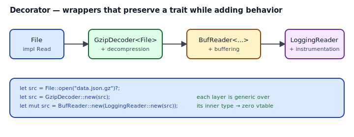
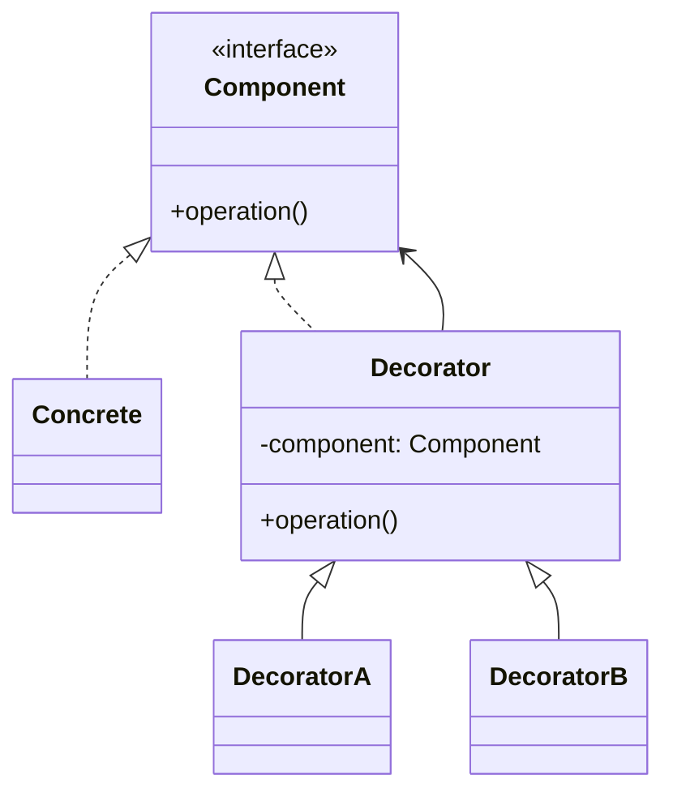

## Intent

Attach additional responsibilities to an object dynamically. Decorators provide a flexible alternative to subclassing for extending functionality.

Rust's `std::io::{BufReader, BufWriter, LineWriter}` are the canonical Decorator stack. So are iterator adapters (`.map`, `.filter`, `.take`) — they wrap an inner iterator, add behavior, and preserve the `Iterator` trait. Master the shape once and it recurs everywhere in the standard library.

## Problem / Motivation

You have a `File` that implements `Read`. You want to read it with:

- **Buffering** — batch underlying reads to avoid syscall overhead.
- **Decompression** — the file is gzipped.
- **Logging** — print each chunk's byte count.
- **Instrumentation** — measure total time spent reading.

Inheritance would say: make `GzippedBufferedLoggingFile`. That's absurd. The Decorator pattern says: each capability is a wrapper that takes any `Read` and produces another `Read`. Compose them in order.



```rust
let src = File::open("data.json.gz")?;
let src = GzipDecoder::new(src);
let src = BufReader::new(src);
let mut src = LoggingReader::new(src);   // Read all the way down
```

Each wrapper is *generic over its inner type*. The stack is monomorphized at compile time. No vtable, no heap, no inheritance — just a tower of structs that preserve the `Read` trait at every level.

## Classical GoF Form



The direct Rust translation — trait + `Box<dyn Component>` wrapper — works but pays vtable per call. The idiomatic Rust form is *generic* wrapping: `struct Decorator<C: Component> { inner: C }`. Same pattern, zero overhead.

## Idiomatic Rust Form

Full code: [`code/idiomatic.rs`](./code/idiomatic.rs).

### A. Generic wrapper — the default

```rust
pub struct LoggingReader<R: Read> {
    inner: R,
    total: usize,
}

impl<R: Read> Read for LoggingReader<R> {
    fn read(&mut self, buf: &mut [u8]) -> io::Result<usize> {
        let n = self.inner.read(buf)?;
        self.total += n;
        Ok(n)
    }
}
```

Properties:

- **Monomorphized**. `LoggingReader<File>` and `LoggingReader<BufReader<File>>` are distinct compiled types. The trait call `self.inner.read(...)` is inlined.
- **Zero-cost**. No vtable, no heap. A stacked decorator chain is often compiled into a single tight loop.
- **Composes**. `LoggingReader<BufReader<GzipDecoder<File>>>` is a valid, named type.

### B. Trait-object wrapper — runtime composition

```rust
pub struct TimedReader {
    inner: Box<dyn Read>,
    ...
}
```

Use when the inner type is selected at runtime (e.g., "`cat`/`gzip`/`zstd` based on file extension"). The cost is one vtable dispatch per call — usually negligible, occasionally measurable.

### The Drop-reporting trick

A decorator that reports a summary (`bytes_read`, `duration`, `checksum`) at scope exit is a natural fit for `impl Drop`. `TimedReader` in the example prints timing from `Drop::drop`, which runs on both `Ok` and `Err` paths. This is [RAII & Drop](../../rust-idiomatic/raii-and-drop/index.md) applied to instrumentation.

## Decorator vs Adapter

Same shape — a wrapper around an inner value — but the **intent** differs:

| | Adapter | Decorator |
|---|---|---|
| Inner trait | Different from outer | Same as outer |
| Purpose | Make X usable as Y | Add behavior while keeping X the X it already was |
| Example | `LegacyAdapter: Read` wrapping `LegacyReader` | `BufReader<R>` wrapping any `R: Read` |

If the wrapper's trait equals the inner's trait, you have a Decorator. If it differs, you have an [Adapter](../adapter/index.md).

## Anti-patterns & Rust-specific Caveats

- ⚠️ **Don't reach for `Box<dyn Trait>` first.** Generic wrapping is cheaper and more flexible. `Box<dyn>` is for runtime composition only.
- ⚠️ **Don't drop `io::Result` from the inner `.read()` call.** `self.inner.read(buf)` alone (without `?`) returns a `Result` you'd then have to handle, and silently ignoring it produces `Ok(0)` downstream — which means EOF to callers. This is a classic decorator bug; clippy + `cargo test` catch it.
- ⚠️ **Don't store `dyn Trait` inline.** `inner: dyn Read` is unsized — E0277. It must live behind `Box`, `&`, or `Arc`. See [`code/broken.rs`](./code/broken.rs).
- ⚠️ **Don't decorate asymmetrically.** If you intercept `read()` but not `read_to_end()` (which has a default impl delegating to `read`), the decorator can behave surprisingly on buffered calls. When in doubt, only override what's strictly necessary and test with concrete consumers.
- ⚠️ **Don't chain decorators in the wrong order.** `BufReader<GzipDecoder<File>>` buffers decompressed output (usually what you want). `GzipDecoder<BufReader<File>>` decompresses buffered input (also valid, but changes where the buffer sits). Think through the data flow at each layer.
- ⚠️ **Don't confuse Decorator with inheritance.** In Rust there's no "override parent's method"; every decorator is a *different type*. The composition is by inclusion, not by subclassing. That's a feature — the layers are inspectable, testable in isolation, and reorderable.
- ⚠️ **Don't decorate for hypothetical features.** If you have one reader today, use it directly. Introduce `BufReader` when you've measured the syscall cost. Introduce `LoggingReader` when you need to debug. YAGNI applies to decorators too.

## Compiler-Error Walkthrough

[`code/broken.rs`](./code/broken.rs) tries to store an unsized trait object inline:

```rust
pub struct BadLogger {
    inner: dyn Read,   // unsized
}
```

```
error[E0277]: the size for values of type `(dyn std::io::Read + 'static)`
              cannot be known at compilation time
  |
  |     inner: dyn Read,
  |            ^^^^^^^^ doesn't have a size known at compile-time
  |
help: the trait `Sized` is not implemented for `(dyn Read + 'static)`
```

Read it: trait objects are dynamically sized. They have to live behind a pointer. Two legitimate fixes:

```rust
// Generic — fastest, binary grows per instantiation
pub struct Logger<R: Read> { inner: R }

// Boxed — single binary shape, vtable per call
pub struct Logger { inner: Box<dyn Read> }
```

### The subtler mistake in `code/broken.rs`

`NoOpDecorator::read` drops the result of the inner call:

```rust
fn read(&mut self, buf: &mut [u8]) -> io::Result<usize> {
    self.inner.read(buf);   // warning: unused Result
    Ok(0)                   // logical bug: EOF every time
}
```

The compiler warns; `cargo clippy -- -D warnings` (which the project mandates) rejects it. Even without clippy, the logical bug is: returning `Ok(0)` tells callers the stream ended. The fix is trivial — forward the return value properly, with `?` to propagate errors:

```rust
fn read(&mut self, buf: &mut [u8]) -> io::Result<usize> {
    let n = self.inner.read(buf)?;
    Ok(n)
}
```

`rustc --explain E0277` covers the sized-bound story.

## When to Reach for This Pattern (and When NOT to)

**Use Decorator when:**
- You need to add orthogonal capabilities (buffering, encryption, logging) to something that already implements the trait you care about.
- The layers *should* be independently testable and reorderable.
- The composition is static and known at compile time — use the generic form.
- The composition varies per run or per input — use `Box<dyn Trait>` + trait-object decorators.

**Skip Decorator when:**
- The added behavior genuinely changes the interface. That's [Adapter](../adapter/index.md).
- You have one wrapper and no intention of layering more. A plain struct with the extra logic inline might read better.
- You're about to build a four-deep decorator stack because "maybe someday we'll add caching and timing." Decorate when needed; don't pre-decorate.

## Verdict

**`use-with-caveats`** — Decorator is idiomatic Rust whenever generic wrapping is appropriate; the standard library's `std::io` and `std::iter` stacks prove it. The caveats are: default to generics (not `Box<dyn>`), forward Results faithfully, and be honest about ordering. Get those three right and every other Decorator in your codebase is 20 lines.

## Related Patterns & Next Steps

- [Adapter](../adapter/index.md) — sibling shape with different intent. Same wrapper, different outer trait.
- [Strategy](../../gof-behavioral/strategy/index.md) — decorator and strategy are often combined: a decorator *is* a wrapper whose behavior is a strategy passed in.
- [Iterator](../../gof-behavioral/iterator/index.md) — every `.map(f)`, `.filter(p)`, `.take(n)` is a Decorator on `Iterator`. The combinators are decorators.
- [RAII & Drop](../../rust-idiomatic/raii-and-drop/index.md) — decorators with end-of-scope reporting (`TimedReader`) are a natural fit for `impl Drop`.
- [Facade](../facade/index.md) — a facade is a flat wrapper that hides subsystems; a decorator is a stackable wrapper that preserves the interface.
