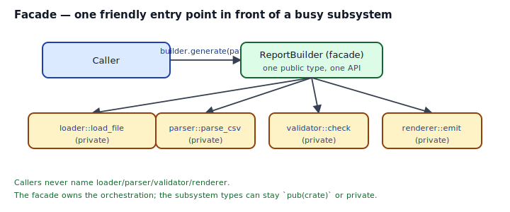
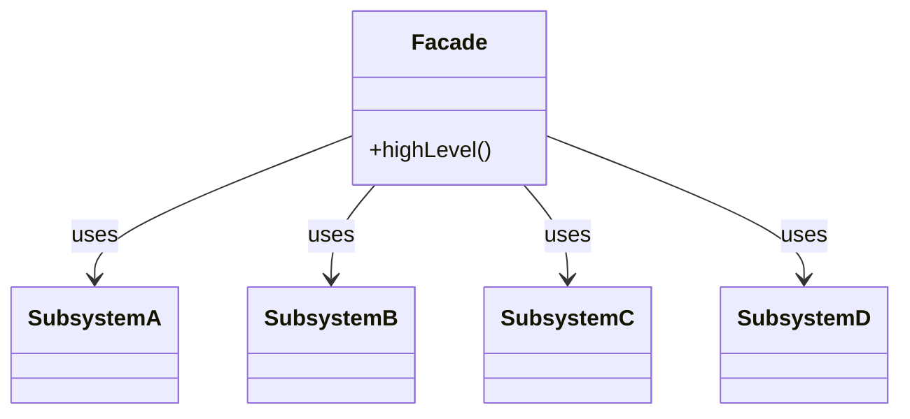
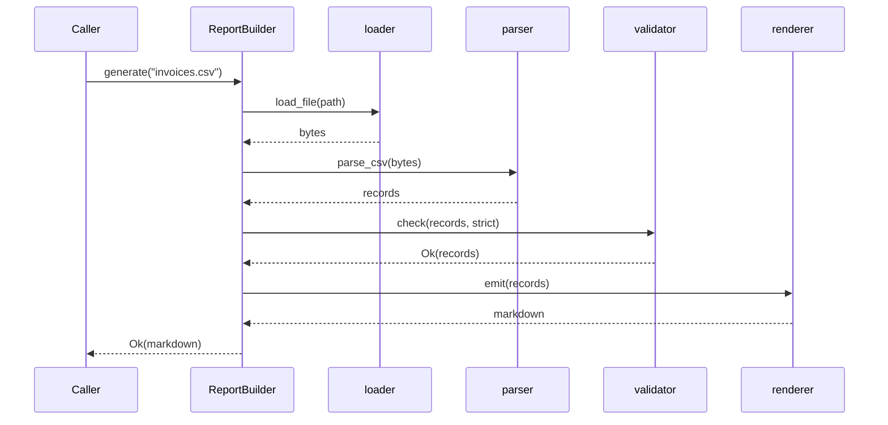

## Intent

Provide a unified, high-level interface to a set of interfaces in a subsystem. Facade defines a single, coherent entry point that's easier to use than the full subsystem — callers interact with one type, the subsystem's internals stay private.

Facade is the simplest structural pattern and one of the easiest to get right in Rust. `std::fs::read_to_string(path)` is a facade over `File::open` + `Read::read_to_string` + error mapping; `std::thread::spawn` is a facade over the builder. Your own crate's public API is usually a set of facades.

## Problem / Motivation

Your crate processes invoices. The pipeline is:

1. **Load** bytes from disk.
2. **Parse** them as CSV.
3. **Validate** the records.
4. **Render** them as a markdown report.

Each step is its own module with its own types (`loader::File`, `parser::Record`, `validator::Verdict`, `renderer::Output`). Callers want one function: `ReportBuilder::new().generate("invoices.csv")`. They should not have to import four modules, chain four `?`s, and learn four error types.



The Facade is the one public type. Everything else can be `pub(crate)` or private. Callers can't depend on subsystem details they shouldn't — because they can't name them.

## Classical GoF Form



Direct translation to Rust is idiomatic. The only adjustments are: subsystem types should be `pub(crate)` or private (not `pub`), and the facade should return typed errors rather than subsystem-specific ones.

## Idiomatic Rust Form



Full code: [`code/idiomatic.rs`](./code/idiomatic.rs).

The recipe:

1. **One public type** (`ReportBuilder`) with a small, focused API: `new`, a few configuration setters, one `generate(...)` that orchestrates.
2. **Private helper modules** — `loader`, `parser`, `validator`, `renderer`. Types inside them are `pub(crate)` or private; their names never appear in the public signature.
3. **One typed error enum** for the whole facade (`ReportError`), exposing the subsystem's failure modes as variants. Subsystems map their errors into it via `From` impls or `.map_err(...)?`.
4. **A builder-y touch** for configuration. `ReportBuilder::new().strict(true).generate(...)` reads well. See also [Builder](../../gof-creational/builder/index.md).

### Why not just re-export the subsystem types?

Because then the subsystem IS the API, and the abstraction is leaked. Every subsystem change — adding a field, renaming a variant, swapping a parser library — becomes a breaking change for downstream. The facade's job is to absorb those changes.

## Anti-patterns & Rust-specific Caveats

- ⚠️ **Don't expose subsystem types through the facade's signatures.** If `pub fn fetch(&self) -> inner::Record { ... }` returns a private-module type, rustc refuses to compile it (E0446). The compiler is telling you the abstraction leaks.
- ⚠️ **Don't panic inside a facade.** A facade's whole purpose is to present a clean, predictable API. `.unwrap()` on a recoverable error breaks the contract — callers now have to catch panics to use your "clean" API. Return `Result` from every fallible method.
- ⚠️ **Don't turn a facade into a god object.** If `ReportBuilder::generate` grows three optional parameters and eleven variants, the facade has become the subsystem. Split the variants into multiple typed facades, or back off to sub-facades (e.g., `ReportBuilder::pdf()`, `ReportBuilder::csv_summary()`).
- ⚠️ **Don't forget `#[non_exhaustive]` on the error enum.** Adding subsystem failure modes later should not be a breaking change. `ReportError` variants that are likely to grow should allow downstream `match` to keep compiling.
- ⚠️ **Don't expose "escape hatches" casually.** A facade with a `pub fn raw_parser(&self) -> &Parser` re-couples callers to the subsystem. If you truly need an escape hatch, name it (`pub fn into_internal_parts(self) -> ...`) and document it as unstable.
- ⚠️ **Don't make the facade hold the only copy of state.** If subsystems need to exchange context, thread a `Context` struct through function calls. A facade that's really a mutable global is a Singleton in disguise — see [Singleton](../../gof-creational/singleton/index.md) for why you probably don't want that.
- ⚠️ **Don't confuse Facade with Adapter.** A facade simplifies *your own* set of types; an [Adapter](../adapter/index.md) makes a *foreign* type fit *your* trait. Both wrap, different intent.

## Compiler-Error Walkthrough

[`code/broken.rs`](./code/broken.rs) returns a private-module type from a `pub` method:

```rust
mod inner {
    pub(super) struct Record { pub id: u64 }
}

pub struct Facade;
impl Facade {
    pub fn fetch(&self) -> inner::Record { inner::load() }
}
```

```
error[E0446]: private type `inner::Record` in public interface
  |
  |     pub fn fetch(&self) -> inner::Record {
  |     ^^^^^^^^^^^^^^^^^^^^^^^^^^^^^^^^^^^^ can't leak private type
  |
note: type defined here
  |         pub(super) struct Record {
```

Read it: *visibility must be at least as permissive as the signatures that expose it.* A public function returning a `pub(super)` type would let downstream callers receive a value of a type they cannot name — which either breaks the abstraction or forces them to call methods on an unnamed type using trait bounds they can't describe. The compiler refuses.

### Two fixes, ranked

1. **Don't return the subsystem type.** Map it into a facade-owned type: `pub struct Invoice { pub id: u64 }` in the facade module, constructed from `inner::Record`. This is the real Facade pattern.
2. **Make the subsystem type `pub`.** Sometimes the right answer (e.g., when the "subsystem" is actually part of the public API). But now you've given up the abstraction boundary.

`rustc --explain E0446` covers visibility-in-signatures in full.

## When to Reach for This Pattern (and When NOT to)

**Build a Facade when:**
- Your crate has multiple internal modules that cooperate to produce one user-visible outcome.
- You want to reserve the right to refactor the subsystem without breaking downstream callers.
- The API surface is five+ distinct operations that callers always use together.
- You want to hide optional dependencies (e.g., pick the parser at build time behind a feature flag) behind a stable caller-facing shape.

**Skip a Facade when:**
- The crate has one type and one method. That type *is* the interface; a wrapper adds nothing.
- Your "facade" just re-exports a bunch of subsystem functions with the same names. That's not a facade, that's a prelude module.
- You'd be building a facade to future-proof hypothetical code. YAGNI.

## Verdict

**`use`** — Facade is one of the cleanest GoF → Rust translations. Small public type, private modules, typed error, one orchestrated method. Almost every crate's root public API is a facade; when you publish, yours should be too.

## Related Patterns & Next Steps

- [Adapter](../adapter/index.md) — changes an interface to fit a trait; Facade hides an interface that's too complex.
- [Builder](../../gof-creational/builder/index.md) — facades often *are* builders: `ReportBuilder::new().strict(true).generate(...)`.
- [Decorator](../decorator/index.md) — a facade wraps a subsystem "flat"; a decorator wraps a value while preserving its trait.
- [Error-as-Values](../../rust-idiomatic/error-as-values/index.md) — the facade's single typed error is a canonical use of this pattern.
- [Newtype](../../rust-idiomatic/newtype/index.md) — subsystem outputs often get newtyped on the way through the facade so the public API uses named types rather than raw primitives.
