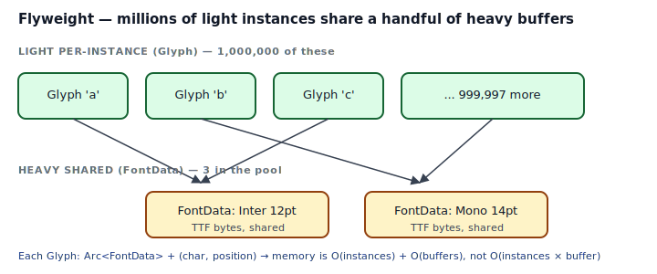
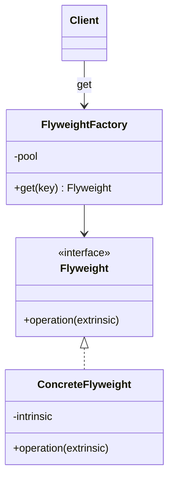
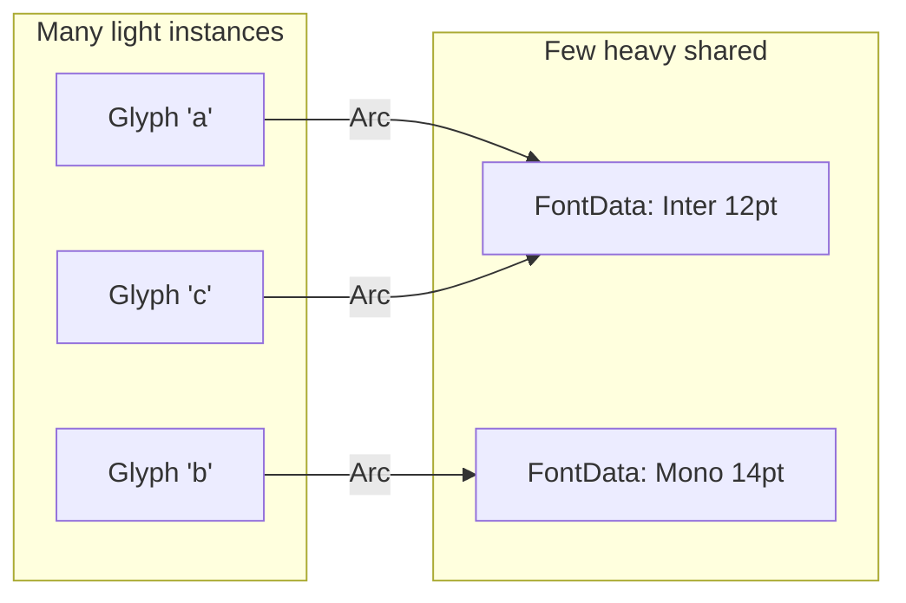

## Intent

Use sharing to support large numbers of fine-grained objects efficiently. Flyweight splits an object's state into two parts:

- **Intrinsic state** — the heavy, immutable, shareable part. One copy in a pool, reused everywhere.
- **Extrinsic state** — the light, per-instance part. Duplicated at every call site, but small.

In Rust, `Arc<T>` is the built-in Flyweight — `clone()` bumps a refcount, never duplicates the payload. A simple pool (`HashMap<Key, Arc<T>>`) on top of it completes the pattern: unique heavy values are allocated once and handed out as `Arc` clones to everyone who needs them.

## Problem / Motivation

Imagine a text renderer handling a page of a million glyphs. Each glyph has a character, position, and a font. If each `Glyph` holds its own copy of a 1 MB TTF buffer, memory explodes: 1,000,000 glyphs × 1 MB = 1 TB. If instead each glyph holds an `Arc<FontData>` pointing at one of three shared buffers, memory collapses: 3 × 1 MB + 1,000,000 × (small struct) ≈ 30 MB.



## Classical GoF Form



The GoF rendering emphasizes: a factory with a pool returns interned flyweights; clients compose them with extrinsic per-call data. In Rust, the "flyweight interface" is usually not a trait — it's just `Arc<T>`. The pool is a `HashMap`.

## Idiomatic Rust Form



Full code: [`code/idiomatic.rs`](./code/idiomatic.rs).

```rust
pub struct FontData { name: String, size: u16, payload: Vec<u8> }

pub struct FontPool {
    inner: Mutex<HashMap<(String, u16), Arc<FontData>>>,
}

impl FontPool {
    pub fn get(&self, name: &str, size: u16) -> Arc<FontData> {
        let mut map = self.inner.lock().unwrap();
        if let Some(f) = map.get(&(name.into(), size)) {
            return Arc::clone(f);
        }
        let f = Arc::new(FontData::new(name, size));
        map.insert((name.into(), size), Arc::clone(&f));
        f
    }
}

pub struct Glyph {
    pub ch: char,
    pub x: u16,
    pub y: u16,
    pub font: Arc<FontData>,     // one pointer, never the full buffer
}
```

The `FontPool::get` method is the whole pattern:

1. Check the pool by the intrinsic key (`name`, `size`).
2. On hit: return `Arc::clone` — cheap refcount bump.
3. On miss: allocate the heavy value once, cache the Arc, return a clone.

Callers get an `Arc<FontData>`. Every subsequent `.clone()` on that Arc is a single atomic increment.

### Strings and `Arc<str>`

Rust's `String` is a heavy owned buffer. If many structs hold copies of the same `String` (e.g., a class name, a user-agent, a URL), use `Arc<str>` instead:

```rust
pub struct Request {
    pub url: Arc<str>,       // instead of String
    pub user_agent: Arc<str>,
}
```

`Arc<str>` is 16 bytes (ptr + len); cloning it is one atomic increment. Thousands of Request instances sharing the same user-agent allocate the string exactly once. Crates like `compact_str`, `string-cache`, `lasso`, and `interner` specialize this further.

### When to intern

- **Many instances, few distinct values.** Glyphs, tokens in a lexer, CSS class names, symbol tables, identifiers in a compiler.
- **Values are expensive to construct or compare.** Once interned, equality is pointer equality on the Arc.
- **The set of distinct values is bounded** or grows slowly. Unbounded interning is just a memory leak with extra steps.

## Flyweight vs Singleton vs Arc

Three related-but-distinct patterns:

| | Singleton | Flyweight | `Arc<T>` |
|---|---|---|---|
| Instance count | exactly one | many per shape | many with one payload |
| Intent | global access | memory sharing | cheap clone |
| Rust form | `OnceLock<T>` | `HashMap<K, Arc<T>>` | `Arc<T>` |

`Arc<T>` is the primitive; Flyweight layers a pool on top to dedupe values by a key.

## Anti-patterns & Rust-specific Caveats

- ⚠️ **Don't store the heavy payload by value** in your per-instance struct. That defeats the whole pattern — every instance gets its own copy. See [`code/broken.rs`](./code/broken.rs). If `#[derive(Clone)]` on the per-instance struct clones the heavy buffer too, you've lost Flyweight.
- ⚠️ **Don't use `&'a T` references.** Short lifetimes can't survive being stored in long-lived collections. `Arc<T>` gives you shared ownership without lifetime gymnastics.
- ⚠️ **Don't reach for `Rc<T>` in async or multi-threaded code.** `Rc` is single-threaded. For multi-threaded sharing use `Arc<T>`; for async tasks on one thread `Rc` is fine but usually `Arc` is the default.
- ⚠️ **Don't intern unbounded sets.** A pool that grows forever is a memory leak. If your pool can grow with user input, either cap it (LRU eviction), or use weak references (`Arc<Weak<T>>`) so unused entries drop when the last strong ref goes.
- ⚠️ **Don't mutate the shared payload through `Arc`.** `Arc<T>` gives you `&T`, not `&mut T`. If the payload needs mutation, either: (a) restructure so the mutable part is extrinsic (per-instance), or (b) use `Arc<Mutex<T>>` / `Arc<RwLock<T>>` — but then you've moved into shared-mutable-state territory; re-read [Interior Mutability](../../rust-idiomatic/interior-mutability/index.md) before committing.
- ⚠️ **Don't pool data that's cheap to recompute.** Interning a `u32` makes no sense — the pool's overhead beats the saving. Pool only what's expensive to build or to store.
- ⚠️ **Don't forget the key cost.** `HashMap<String, Arc<T>>` clones the String key on every insert. `HashMap<Arc<str>, Arc<T>>` is often better: the key itself is a flyweight.

## Compiler-Error Walkthrough

[`code/broken.rs`](./code/broken.rs) shows a quietly *semantic* bug: per-instance owned duplication compiles but defeats the pattern. The more instructive compile error is the lifetime-reference form:

```rust
pub fn build_glyphs<'a>(count: usize) -> Vec<BorrowedGlyph<'a>> {
    let font = FontData::new("Inter");
    let font_ref = &font;
    (0..count).map(|i| BorrowedGlyph { ch: '?', font: font_ref }).collect()
}
```

```
error[E0515]: cannot return value referencing local variable `font`
  |
  |     let font = FontData::new("Inter");
  |         ---- `font` is borrowed here
  |     (0..count).map(|i| BorrowedGlyph { ch: '?', font: font_ref }).collect()
  |     ^^^^^^^^^^^^^^^^^^^^^^^^^^^^^^^^^^^^^^^^^^^^^^^^^^^^^^^^^^^^^^^^^^^^^^ returns a value referencing data owned by the current function
```

Read it: you can't return a Vec of borrowed references to a local. The fix is **shared ownership**: store `font: Arc<FontData>` instead of `&'a FontData`. The arc owns the data; every glyph holds a cheap clone; the Vec can outlive the function that built it.

`rustc --explain E0515` covers the "return references to local" story.

## When to Reach for This Pattern (and When NOT to)

**Use Flyweight when:**
- You have many instances and few distinct shapes/payloads.
- The shared part is immutable or rarely changes.
- You can write a pool keyed on the intrinsic state.

**Skip Flyweight when:**
- You have a few instances. Just clone.
- The payload is small. The Arc overhead may outweigh the saving.
- The shared part changes often. A Flyweight with mutable shared state is `Arc<Mutex<T>>`, which serializes everyone through one lock — no longer a win.
- Interning would be unbounded. Leaks are worse than duplicates.

## Verdict

**`use-with-caveats`** — Flyweight is a real pattern in Rust, and `Arc<T>` makes it nearly free. The "caveats" are the traps: store `Arc<T>`, not the payload; cap or weakly-reference unbounded pools; remember the pool itself has cost. For bounded intern tables of many-to-few, it's a substantial memory win.

## Related Patterns & Next Steps

- [Singleton](../../gof-creational/singleton/index.md) — Singleton is "one instance for the whole program"; Flyweight is "one payload for many instances." Both use shared state; different intent.
- [Proxy](../proxy/index.md) — `Arc<T>` doubles as both a Flyweight *and* a smart-reference Proxy.
- [Newtype](../../rust-idiomatic/newtype/index.md) — wrap `Arc<T>` in a newtype (`struct Handle(Arc<FontData>)`) to control the API surface.
- [Interior Mutability](../../rust-idiomatic/interior-mutability/index.md) — if the shared payload needs mutation, the `Arc<Mutex<T>>` / `Arc<RwLock<T>>` tradeoffs live there.
- [Factory Method](../../gof-creational/factory-method/index.md) — a `FontPool::get` is the factory method that returns the interned flyweight.
