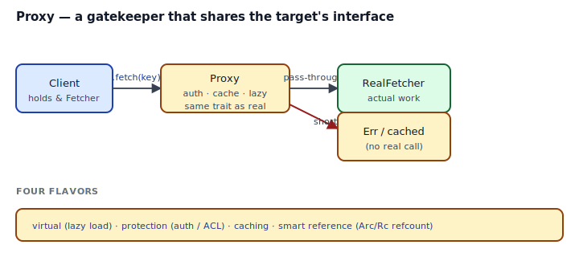
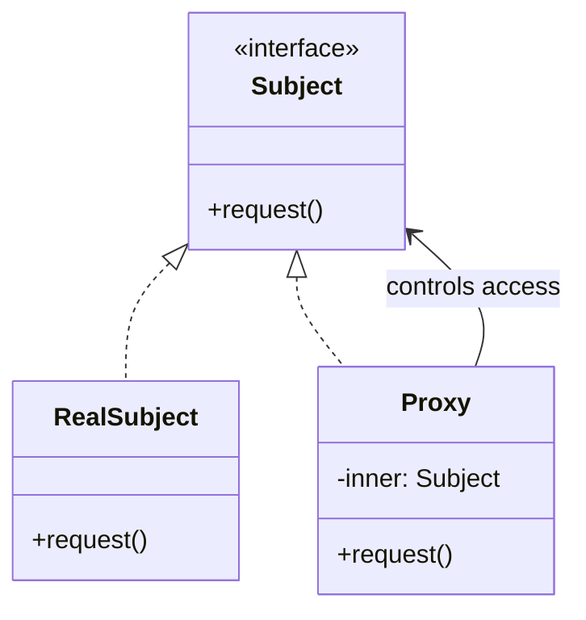
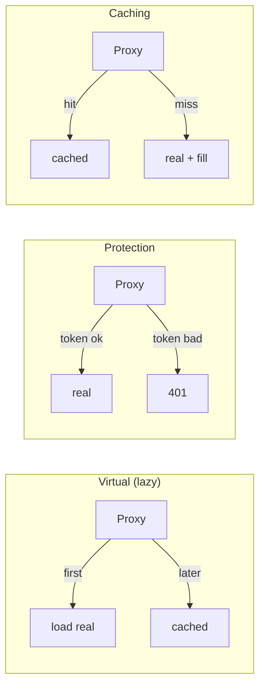

## Intent

Provide a surrogate or placeholder for another object to control access to it.

A Proxy shares the **exact same interface** as the real object (`impl Fetcher for Proxy` where `Fetcher` is what `RealFetcher` also implements), so callers can swap the two transparently. What the proxy *adds* on top varies: auth, caching, lazy loading, instrumentation, reference counting.

Proxy is a close cousin of [Decorator](../decorator/index.md): both wrap an inner value that implements a trait. The difference is **intent** — Decorator *extends* behavior while always forwarding; Proxy *controls access* and may refuse, delay, cache, or multiplex.

## Problem / Motivation

Four recurring situations:

| Flavor | Intent |
|---|---|
| **Virtual proxy** | Defer expensive construction until first real use |
| **Protection proxy** | Check credentials before forwarding |
| **Caching proxy** | Serve repeat requests from local memory |
| **Smart reference** | Track refcounts; `Arc<T>` / `Rc<T>` are exactly this |



Each wraps a `Fetcher` and exposes `fn fetch(&self, key: &str) -> Result<Vec<u8>, FetchError>`. The wrapping is the pattern; what happens inside `fetch` is the flavor.

## Classical GoF Form



Rust port: a trait (`Fetcher`) plus a newtype proxy (`CachingProxy`, `AuthProxy`, etc.) that implements the same trait and delegates — or refuses — based on its flavor.

## Idiomatic Rust Form

Full code: [`code/idiomatic.rs`](./code/idiomatic.rs). Three proxies behind one trait:

### A. Protection proxy

```rust
pub struct AuthProxy<F: Fetcher> { pub inner: F, pub token: String }

impl<F: Fetcher> Fetcher for AuthProxy<F> {
    fn fetch(&self, key: &str) -> Result<Vec<u8>, FetchError> {
        if self.token != "secret" { return Err(FetchError::Unauthorized); }
        self.inner.fetch(key)
    }
}
```

Short-circuit with `Err` when credentials don't check out. No real call happens.

### B. Caching proxy

```rust
pub struct CachingProxy<F: Fetcher> {
    inner: F,
    cache: RefCell<HashMap<String, Vec<u8>>>,
}

impl<F: Fetcher> Fetcher for CachingProxy<F> {
    fn fetch(&self, key: &str) -> Result<Vec<u8>, FetchError> {
        if let Some(hit) = self.cache.borrow().get(key).cloned() {
            return Ok(hit);
        }
        let v = self.inner.fetch(key)?;
        self.cache.borrow_mut().insert(key.to_string(), v.clone());
        Ok(v)
    }
}
```

`RefCell` is mandatory: `fetch` takes `&self` (to match the trait), but the cache needs mutation. See [Interior Mutability](../../rust-idiomatic/interior-mutability/index.md). For multi-threaded access, swap to `Mutex<HashMap<...>>`.

### C. Virtual (lazy) proxy

```rust
pub struct LazyFetcher<F, B>
where F: Fetcher, B: Fn() -> F
{
    builder: B,
    cache: RefCell<Option<F>>,
}

impl<F, B> Fetcher for LazyFetcher<F, B>
where F: Fetcher, B: Fn() -> F
{
    fn fetch(&self, key: &str) -> Result<Vec<u8>, FetchError> {
        if self.cache.borrow().is_none() {
            *self.cache.borrow_mut() = Some((self.builder)());
        }
        self.cache.borrow().as_ref().unwrap().fetch(key)
    }
}
```

Constructor runs on first `fetch`. Subsequent calls reuse the cached `F`. Zero cost until the value is actually needed.

### D. Smart reference — already built

`Arc<T>` is the Proxy pattern the standard library gives you for free:

- `clone()` bumps a refcount (proxied operation).
- `drop()` decrements it; last drop frees the value (proxied cleanup).
- Deref makes the proxy transparent — `arc.foo()` calls `T::foo` with no syntactic tax.

When you need a thread-safe shared-ownership Proxy, reach for `Arc<T>` before writing one by hand.

## Proxy vs Decorator



The shapes are identical. Tell them apart by the *intent*:

- **Decorator** always forwards and adds something (logging, compression, retry).
- **Proxy** may refuse, defer, or substitute. Its job is gatekeeping or lifecycle management.

If your wrapper *chooses whether* to call the inner, you have a Proxy.

## Anti-patterns & Rust-specific Caveats

- ⚠️ **Don't change the trait signature in the proxy.** The whole point is transparency: `impl Fetcher for MyProxy` with the same `fetch` signature. If you add parameters, callers can't use the proxy through `&dyn Fetcher`. See [`code/broken.rs`](./code/broken.rs).
- ⚠️ **Don't forget interior mutability in caching/counting proxies.** `fn fetch(&self, ...)` can't mutate a plain `HashMap` field — E0596. Use `RefCell<HashMap<...>>` (single-thread) or `Mutex<HashMap<...>>` (multi-thread).
- ⚠️ **Don't reimplement `Arc<T>`.** Smart-reference proxies that track refcounts are exactly `Arc<T>` for thread-safe or `Rc<T>` for single-thread. Write your own only if you need *custom* lifecycle behavior on the counts (e.g., log when the last reference drops).
- ⚠️ **Don't make a Proxy for "future extensibility".** If today's code has one RealFetcher and no proxies, introducing one now is YAGNI. Reach for the pattern when you have a concrete first flavor (auth / cache / lazy) to implement.
- ⚠️ **Don't use Proxy to smuggle in side effects.** A CachingProxy that *also* logs and bumps metrics is doing three jobs. Stack smaller proxies instead (`AuthProxy<CachingProxy<LoggingProxy<RealFetcher>>>`). Composition > conglomeration.
- ⚠️ **Don't panic in a proxy.** The proxy's job is to preserve the trait's contract. A proxy that panics on a cache miss, an auth failure, or a network error is breaking the contract. Return `Err`.
- ⚠️ **Don't hold a lock across the inner call.** In `CachingProxy`, if you keep `cache.borrow_mut()` alive while calling `self.inner.fetch(key)`, any reentrant call deadlocks (runtime panic for `RefCell`, actual deadlock for `Mutex`). Read, release, call, write.

## Compiler-Error Walkthrough

[`code/broken.rs`](./code/broken.rs) shows two mistakes.

### Mistake 1: proxy with a different signature

```rust
impl<F: Fetcher> WrongProxy<F> {
    pub fn fetch(&self, key: &str, tracing_id: u64) -> Option<Vec<u8>> {
        self.inner.fetch(key)
    }
}
```

The proxy can't `impl Fetcher for WrongProxy<F>` — its `fetch` takes an extra argument. Any call site that wanted to pass `&dyn Fetcher` cannot use it. The proxy is no longer transparent; it's a differently-shaped object with a confusing name.

**Fix**: preserve the signature. Put the extra argument elsewhere — on the proxy's constructor, on a builder, or captured in a closure field.

### Mistake 2: mutating `&self` without interior mutability

```rust
pub struct CachingProxy<F: Fetcher> {
    inner: F,
    cache: HashMap<String, Vec<u8>>,   // plain HashMap — no RefCell
}

impl<F: Fetcher> Fetcher for CachingProxy<F> {
    fn fetch(&self, key: &str) -> Option<Vec<u8>> {
        ...
        self.cache.insert(key.to_string(), v.clone());
        //          ^^^^^ E0596: cannot borrow as mutable behind `&`
    }
}
```

```
error[E0596]: cannot borrow `self.cache` as mutable, as it is behind a `&` reference
  |     fn fetch(&self, key: &str) -> Option<Vec<u8>> {
  |              ----- help: consider changing this to be a mutable reference: `&mut self`
  |         self.cache.insert(key.to_string(), v.clone());
  |         ^^^^^^^^^^ cannot borrow as mutable
```

**Fix**: change `cache: HashMap<_, _>` to `cache: RefCell<HashMap<_, _>>`. `fn fetch(&self, ...)` stays — the trait contract is preserved. The mutation goes through `RefCell::borrow_mut()`.

`rustc --explain E0596` covers mutable-borrow-behind-shared-ref; `rustc --explain E0277` covers the trait-implementation issue for the first mistake.

## When to Reach for This Pattern (and When NOT to)

**Use Proxy when:**
- You need auth / access control in front of an existing service.
- You need caching / memoization with the same interface.
- You need lazy construction of an expensive object.
- You need instrumentation (metrics, tracing) with no caller changes.

**Skip Proxy when:**
- You just need `Arc<T>` / `Rc<T>`. Use those.
- The wrapper always forwards and always adds behavior. That's a [Decorator](../decorator/index.md).
- You'd be adding a Proxy purely to "make the code layered." Layers cost maintenance; add them when they pay for themselves.
- The interface needs to *change* to accommodate the new behavior. Then it's not transparent and not a Proxy.

## Verdict

**`use-with-caveats`** — Proxy is real and frequent in Rust (wrappers for auth, caching, lazy init are common). The caveats: preserve the exact trait signature, reach for interior mutability when state is needed behind `&self`, and remember that `Arc<T>` is already the smart-reference proxy. Don't reinvent.

## Related Patterns & Next Steps

- [Decorator](../decorator/index.md) — shape-identical sibling; Decorator adds behavior, Proxy controls access.
- [Interior Mutability](../../rust-idiomatic/interior-mutability/index.md) — caching and counting proxies require `RefCell` / `Mutex` / atomics.
- [Chain of Responsibility](../../gof-behavioral/chain-of-responsibility/index.md) — a middleware chain is a stack of proxies, each forwarding or short-circuiting.
- [Adapter](../adapter/index.md) — Adapter changes the interface; Proxy preserves it.
- [Singleton](../../gof-creational/singleton/index.md) — a virtual proxy that's global is effectively a lazy Singleton; `OnceLock` handles the pattern already.
