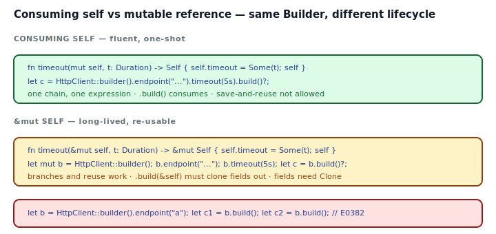
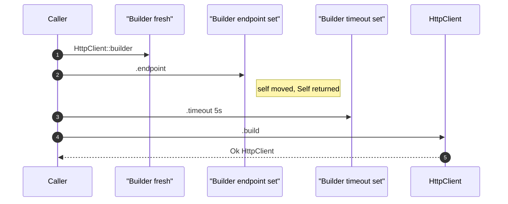

## Intent

The idiomatic Rust *builder setter signature*: each setter takes `self` by value and returns `Self`. The fluent chain is pure ownership transfer — no `Rc<RefCell<_>>`, no cloning, no interior mutability. `.build(self)` is the last word, consuming the fully-configured builder to produce the target.

This is a deep dive on the [Builder](../../gof-creational/builder/index.md) pattern's core decision: **consuming `self` vs `&mut self`**. Pick correctly and every detail flows from there.

## Problem / Motivation

A builder's whole job is to accumulate configuration and, at one moment, produce a valid value. In Rust, there are two reasonable setter signatures:

```rust
fn timeout(self, v: Duration) -> Self              // consuming — the default
fn timeout(&mut self, v: Duration) -> &mut Self    // long-lived
```

They look similar. They behave differently enough that picking the wrong one drags every caller into awkwardness.



## The Consuming-self Form



Full code: [`code/idiomatic.rs`](./code/idiomatic.rs).

```rust
impl HttpClientBuilder {
    pub fn endpoint(mut self, v: impl Into<String>) -> Self {
        self.endpoint = Some(v.into());
        self
    }
    pub fn timeout(mut self, v: Duration) -> Self {
        self.timeout = Some(v);
        self
    }
    pub fn build(self) -> Result<HttpClient, BuildError> { ... }
}
```

Properties:

- **Ownership moves through the chain.** Each `.foo()` consumes the builder and returns a fresh one. The chain reads as a single expression.
- **`mut self` vs `self`.** `mut self` in the *setter signature* is local — it lets the setter mutate the value it owns. It does **not** require the caller to declare the binding `let mut`.
- **`.build()` is the last word.** `.build(self)` consumes the builder; the old binding is gone, so calling `.build()` twice is E0382.
- **No `Clone` required.** Fields are moved from the builder into the product.
- **`#[must_use]`** on the builder warns if a chain is ignored (the returned `Self` has nowhere to go).

## The `&mut self` Alternative

Use when callers need to **branch mid-chain** or **call `.build()` repeatedly** with small variations:

```rust
impl LongLivedBuilder {
    pub fn endpoint(&mut self, v: impl Into<String>) -> &mut Self { ... }
    pub fn timeout(&mut self, v: Duration) -> &mut Self { ... }
    pub fn build(&self) -> Result<HttpClient, BuildError> {
        // Fields must be Clone: we don't consume the builder.
        let endpoint = self.endpoint.clone().ok_or(BuildError::MissingEndpoint)?;
        ...
    }
}

let mut b = LongLivedBuilder::default();
b.endpoint("https://api.example.com").timeout(Duration::from_secs(5));
for retries in [0_u8, 3, 5] {
    b.retries(retries);
    let c = b.build()?;    // builder stays alive
}
```

Costs:

- Every field the builder holds must be `Clone` (or you expose `fn build_once(self)` alongside).
- The call site needs `let mut b = ...` so the binding is mutable.
- The chain reads less fluently — `b.endpoint("...").timeout(...);` works, but `let c = b.endpoint("...").timeout(...).build()?` returns `&mut Self` through the chain, so you'd have to re-borrow to reach `.build()`. Most APIs pick consuming self specifically to avoid this.

## Decision Guide

| Situation | Pick |
|---|---|
| One-shot construction, fluent chain, no reuse | **Consuming `self`** (default) |
| Many near-duplicate builds from one configuration | **`&mut self` + `build(&self)`** |
| Fields are `Clone`-expensive (large `Vec`, etc.) | Consuming `self` (avoid the clone) |
| Configuration is computed incrementally in a loop with branches | `&mut self` |
| Need to call `.build()` inside a callback with captured `&self` | `&mut self`, or restructure |

Default to consuming `self` unless a specific reuse pattern justifies the switch. Both forms can coexist — ship `build()` on consuming self and `build_copy(&self)` for the rare re-use case.

## Anti-patterns & Rust-specific Caveats

- ⚠️ **Don't write `fn endpoint(mut self, ...) -> &mut Self`.** Mixing the two signatures — consume the builder but return a mutable reference — means the returned ref points to a value that just got moved out. Borrow-check rejects it. Pick one.
- ⚠️ **Don't call `.build()` twice on the same binding.** Consuming self means the first call moves the builder away; the second call is a compile error (E0382). The fix is to chain — `.endpoint("...").build()?` — or derive `Clone` on the builder and `.clone().build()`.
- ⚠️ **Don't make the builder `Clone` "just in case".** If cloning the builder doesn't make sense (e.g., it holds a unique resource), deriving `Clone` is a lie. Make it explicit: `build_copy(&self)` that returns a clone-built product.
- ⚠️ **Don't reach for `Rc<RefCell<T>>` in a builder.** Consuming-self ownership is strictly better. The only reason to reach for interior mutability in a builder is to support a shared-mutable configuration object — which is usually a design smell, not a builder problem.
- ⚠️ **Don't forget `#[must_use]`.** `HttpClient::builder().endpoint("...").timeout(5s);` as a full statement (no `.build()` at the end) is almost always a bug. `#[must_use]` makes the compiler warn.
- ⚠️ **Don't forget `impl Into<String>` on setters.** `fn endpoint(self, v: String)` forces callers to `.to_string()` at the call site. `fn endpoint(self, v: impl Into<String>)` accepts `&str`, `String`, `Cow<str>`, and anything else that implements `Into<String>`. Callers love it.
- ⚠️ **Don't require `let mut builder`.** Consuming-self setters take `mut self` internally — the call site doesn't need `mut` on the binding. If your API requires `let mut b = builder()`, you've accidentally picked `&mut self` setters. Check the signatures.

## Compiler-Error Walkthrough

[`code/broken.rs`](./code/broken.rs) saves the builder then tries to call `.build()` twice:

```rust
let builder = Builder::default().endpoint("a");
let _c1 = builder.build();
let _c2 = builder.build();          // E0382
```

```
error[E0382]: use of moved value: `builder`
  |
  |     let builder = Builder::default().endpoint("a");
  |         ------- move occurs because `builder` has type `Builder`,
  |                 which does not implement the `Copy` trait
  |     let _c1 = builder.build();
  |               ------- `builder` moved due to this method call
  |     let _c2 = builder.build();
  |               ^^^^^^^ value used here after move
  |
note: `Builder::build` takes ownership of the receiver `self`, which
      moves `builder`
```

Read it literally: `build(self)` takes ownership. After the first call, `builder` is moved. The compiler's diagnostic points at exactly the signature reason.

### Fixes, ranked

1. **Chain the build inline** — `let c = Builder::default().endpoint("a").build();`. Usually the right fix.
2. **Derive `Clone`** on the builder and `builder.clone().build()` for each use. Cheap if the builder is small.
3. **Switch to `&mut self` setters** and `build(&self)` — only if this pattern is common and costs more than a few clones.

`rustc --explain E0382` covers use-after-move in detail.

## When to Reach for This Pattern (and When NOT to)

**Use consuming `self` setters when:**
- The builder is constructed, configured, and consumed at one call site.
- Fields may be expensive to clone (large buffers, strings, config trees).
- You want `#[must_use]` to enforce that a chain terminates in `.build()`.

**Use `&mut self` setters when:**
- You build many near-identical values from one long-lived template.
- The builder holds state that's naturally accumulated across distinct code paths (e.g., loop branches).
- You're writing an SDK where users expect Java-style chained setters with a persistent binding.

**Skip a builder entirely when:**
- Two or three fields, all required: `HttpClient::new(endpoint, timeout, retries)` is clearer.
- The type is an enum. Use variants or `From`/`Into`.

## Verdict

**`use`** — consuming-self is the default Rust builder shape and the right choice for most APIs (`std::process::Command`, `std::thread::Builder`, `tokio::runtime::Builder`, `reqwest::ClientBuilder`). The `&mut self` form is a specific tool for specific situations. Pick consuming self first; switch only when the reuse story demands it.

## Related Patterns & Next Steps

- [Builder](../../gof-creational/builder/index.md) — the overarching pattern. This page is the deep dive on setter signature choice.
- [Typestate](../typestate/index.md) — upgrade a runtime-checked consuming-self builder to compile-time with typestate markers for each required field.
- [From / Into Conversions](../from-into-conversions/index.md) — builders usually accept `impl Into<String>` / `impl Into<Duration>` for ergonomic call sites.
- [Error-as-Values](../error-as-values/index.md) — `.build(self) -> Result<T, BuildError>` uses the standard error shape; never `panic!` or `Option` for missing-field failures.
- [RAII & Drop](../raii-and-drop/index.md) — if the builder owns resources (open file handles, network connections), consuming self ensures Drop runs exactly once, when the builder is finally consumed.
