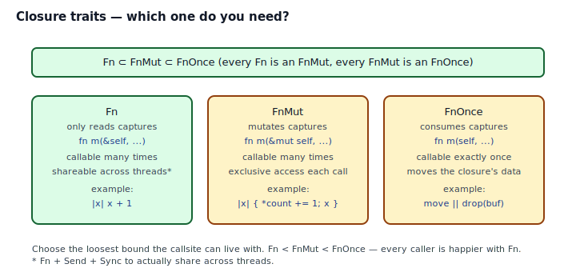
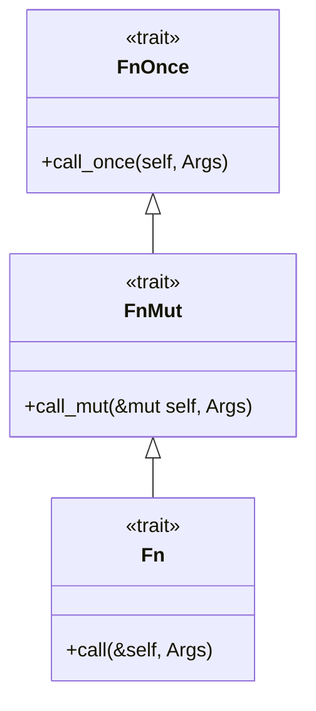
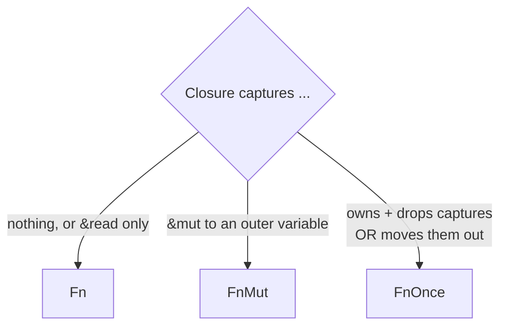

## Intent

Accept a *function-valued* argument and let the caller supply behavior inline. In Rust this almost always means a closure bounded by one of `Fn`, `FnMut`, or `FnOnce` — no callback interface, no `Observer` trait, no function-pointer typedef.

Closures are Rust's answer to the GoF patterns that C++ solves with abstract base classes: **Strategy**, **Command**, **Observer**, **Visitor**, **Template Method**. All of them collapse when you can pass behavior as a value.

## Problem / Motivation

You write `retry(3, || http_get("..."))`. You write `Vec::sort_by(|a, b| a.len().cmp(&b.len()))`. You register an event handler with `bus.on(|e| log(e))`. These are all "closure as callback" — the API takes behavior, not data.

Three questions determine which `Fn*` trait you need:

1. **How many times will the callback run?**
2. **Does it mutate something it captured?**
3. **Does it need to outlive the call site?**



## The Fn Hierarchy



The traits form a subtype chain — every `Fn` is an `FnMut`, every `FnMut` is an `FnOnce`. You always accept the *loosest* bound the call site can tolerate, because that makes the API usable with the most closures.

| Bound | Receiver | Call count | Captures used as |
|---|---|---|---|
| `FnOnce` | `self` | exactly once | owned/moved |
| `FnMut` | `&mut self` | many | mutated |
| `Fn` | `&self` | many, concurrent-ish | read-only |

Every closure automatically implements one (or more) of these based on what it captures and how:

- Closure that only reads captures → implements **all three** (`Fn`, `FnMut`, `FnOnce`).
- Closure that mutates captures → implements **`FnMut` and `FnOnce`**, but not `Fn`.
- Closure that consumes (moves and drops) captures → implements **only `FnOnce`**.

The `move` keyword changes *what* the closure owns, not *which* trait it implements.

## Idiomatic Rust Forms

Full code: [`code/idiomatic.rs`](./code/idiomatic.rs).

### Form A — `impl Fn/FnMut/FnOnce` argument

```rust
pub fn retry<T, F: Fn() -> Result<T, &'static str>>(
    attempts: u32,
    f: F,
) -> Result<T, &'static str> { /* ... */ }
```

- **Monomorphized**: one specialized copy per closure type.
- **Inlined**: no indirection, no vtable.
- **Preferred when** the callback is used inside the function and not stored.

### Form B — `Box<dyn Fn/FnMut/FnOnce>` field

```rust
pub struct EventBus<E> {
    callbacks: HashMap<SubscriptionId, Box<dyn Fn(&E)>>,
}
```

- **Stored** across calls, across tasks, or at runtime.
- **Vtable lookup** per call, heap allocation once per registration.
- **Preferred when** you need to keep the callback around or swap it.

### Form C — `SubscriptionId` + RAII guard

Returning a `SubscriptionId` lets callers unsubscribe. Wrapping the id in a `Subscription<'a, E>` with a `Drop` impl upgrades that to *automatic* unsubscription when the handle drops — so leaking a listener becomes impossible.

```rust
pub struct Subscription<'a, E> {
    bus: &'a mut EventBus<E>,
    id:  Option<SubscriptionId>,
}
impl<E> Drop for Subscription<'_, E> { /* calls bus.off(id) */ }
```

This is [RAII & Drop](../raii-and-drop/index.md) applied to event subscriptions. The pattern pair is worth studying together.

## When Each Trait Is Correct



- **`FnOnce`** for "call the closure immediately, maybe never again": `std::thread::spawn`, `tokio::spawn`, `Option::map`, `std::iter::once_with`.
- **`FnMut`** for "call the closure many times and let it accumulate state": `Iterator::for_each`, `.filter_map`, `Vec::retain`.
- **`Fn`** for "call the closure many times, possibly from many threads": async worker pools, retry loops, event buses with read-only handlers.

Rule of thumb: start with `FnOnce` (most permissive for the caller). Move up to `FnMut`, then `Fn` only if the body requires it.

## Anti-patterns & Rust-specific Caveats

- ⚠️ **Don't default to `Box<dyn Fn>`.** Generic `impl Fn` is free at the call site and usually the right shape. Reach for `Box<dyn>` only when the closure must be stored, passed through trait-object boundaries, or unified with others.
- ⚠️ **Don't collect two closures into one `Vec<_>`.** Every closure has a distinct, anonymous type — `|x| x + 1` and `|x| x + 2` are different types, even with identical signatures. Use `Vec<Box<dyn Fn(i32) -> i32>>`. See [`code/broken.rs`](./code/broken.rs).
- ⚠️ **Don't request `Fn` when `FnMut` will do.** It makes the API stricter than it needs to be. Callers with mutating closures will get E0525.
- ⚠️ **Don't request `FnMut` when `FnOnce` will do.** Same principle in reverse — if you call the closure exactly once, take `FnOnce` so callers can move non-`Copy` captures (like `String` or `File`) in.
- ⚠️ **Don't forget `+ 'static`** when storing closures past the current stack frame. `Box<dyn Fn(&E)>` is `Box<dyn Fn(&E) + 'static>` almost always — closures that borrow from the caller's stack cannot outlive it.
- ⚠️ **Don't forget `+ Send + Sync`** when the callback runs on other threads. The bounds don't materialize automatically; if you push the callback to `tokio::spawn` or `std::thread::spawn`, spell out `Send`.
- ⚠️ **Don't build a callback API when a return-`Result` would do.** If there's exactly one caller and one handler, a direct function call beats every callback mechanism. Reserve closures for "behavior injected by the caller I cannot predict."

## Compiler-Error Walkthrough

[`code/broken.rs`](./code/broken.rs) contains two instructive failures.

### Mistake 1: closure mutates captures, signature asked for `Fn`

```rust
pub fn run_twice<F: Fn()>(f: F) { f(); f(); }

let mut count = 0;
run_twice(|| count += 1);    // E0525
```

```
error[E0525]: expected a closure that implements the `Fn` trait,
              but this closure only implements `FnMut`
  |
  |     run_twice(|| count += 1);
  |               ^^ ----- this closure implements `FnMut`, not `Fn`
  |
help: consider changing the bound to `FnMut`
```

Read it: your closure is `FnMut` (because it mutates `count`), and you asked for `Fn`. Either relax the bound on `run_twice` to `FnMut` (correct — `run_twice` only holds the closure locally), or change the closure not to mutate captures.

### Mistake 2: two closures, one Vec

```rust
let greet = || println!("hello");
let bye   = || println!("bye");
let _hooks = vec![greet, bye];   // E0308
```

```
error[E0308]: mismatched types
  |     let _hooks = vec![greet, bye];
  |                              ^^^ expected closure, found a different closure
```

Each closure has its own anonymous type. The fix is a shared trait object:

```rust
let hooks: Vec<Box<dyn Fn()>> = vec![Box::new(greet), Box::new(bye)];
```

`rustc --explain E0525` and `rustc --explain E0308` cover both.

## When to Reach for This Pattern (and When NOT to)

**Use a closure callback when:**
- The behavior is small, one-off, and the caller wants to express it inline.
- You'd otherwise be defining a trait with exactly one method.
- You need to capture local state — a tag, a channel, a counter — that a trait impl would awkwardly store.
- The Strategy/Observer/Command/Visitor pattern applies and the class hierarchy GoF prescribes feels heavier than the problem.

**Don't use a closure callback when:**
- The behavior is shared across many call sites and deserves its own name. Write a trait.
- The behavior carries invariants that a trait impl would enforce (e.g., "every `Serializer` must also implement `Debug`"). Write a trait.
- The API needs to be stable across language boundaries (FFI). Write a function pointer or extern fn.

## Verdict

**`use`** — Closures + the `Fn` family are idiomatic Rust for callback-shaped problems. Master the three traits, accept the loosest one your body allows, and you replace Strategy, Command, Observer, and Visitor with a single well-picked type.

## Related Patterns & Next Steps

- [Strategy](../../gof-behavioral/strategy/index.md) — closures are the "just use a closure" answer to Strategy.
- [Observer](../../gof-behavioral/observer/index.md) — the `EventBus` in `code/idiomatic.rs` is the idiomatic Rust replacement for GoF's Observer.
- [Command](../../gof-behavioral/command/index.md) — a `Vec<Box<dyn FnOnce()>>` is a command queue with zero ceremony.
- [Iterator as Strategy](../iterator-as-strategy/index.md) — iterator adapters (`filter`, `map`, `fold`) are Strategy-shaped closures all the way down.
- [RAII & Drop](../raii-and-drop/index.md) — the `Subscription` guard shows how to attach automatic cleanup to a callback registration.
- [Typestate](../typestate/index.md) — when a callback's lifecycle has states (registered, paused, closed), a typestate wrapper adds compile-time safety on top.
