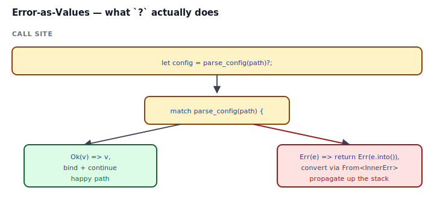
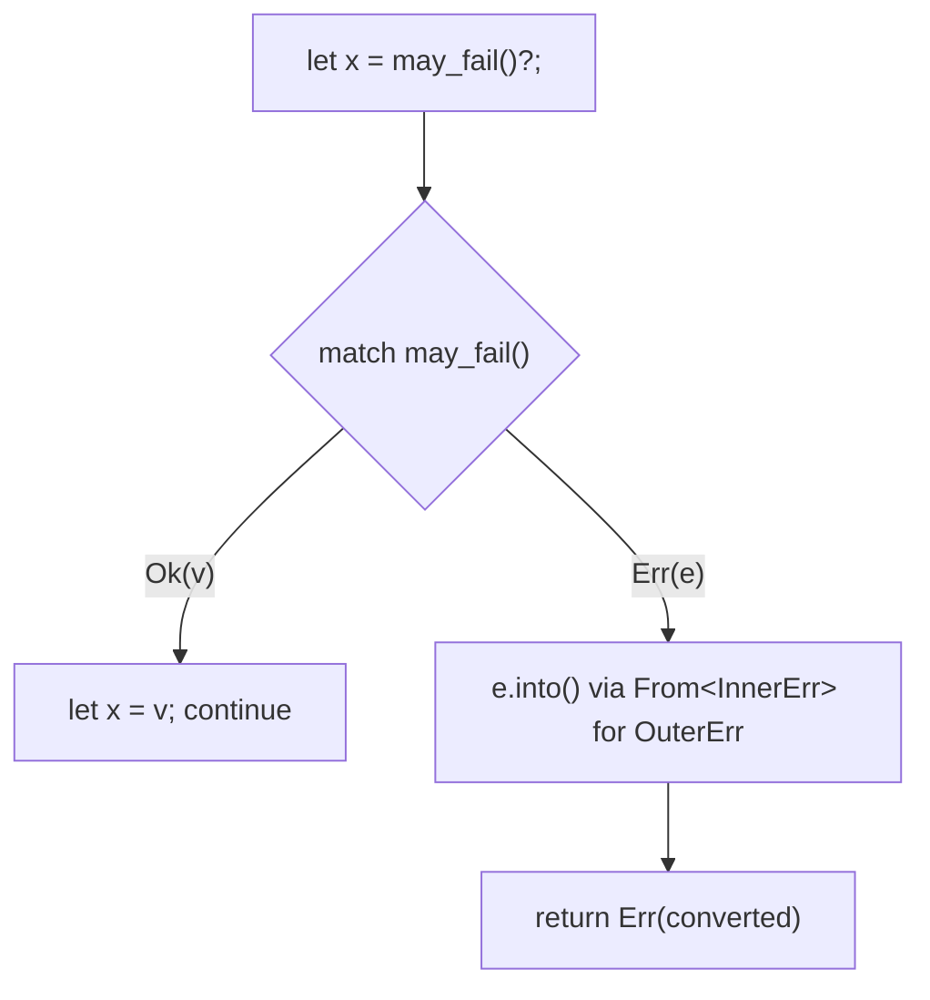

## Intent

Treat errors as ordinary values, not as control-flow side channels. A fallible function's signature says *what* can go wrong (`Result<T, MyError>`), the caller handles it with `match`, `?`, or a combinator, and at no point does an exception jump across frames.

This is not a pattern you opt into. It is the shape of every fallible API in the Rust standard library — `std::fs::read_to_string`, `HashMap::get`, `str::parse`, `TcpStream::connect`. The "pattern" is *how* you design the error type and wire it to the rest of the ecosystem.

## Problem / Motivation

Pick any real API:

- "Read this config file" — the file may not exist, may have bad UTF-8, may parse wrong.
- "Connect to this service" — network down, TLS handshake failed, remote hung up.
- "Debit this account" — account not found, insufficient funds, race lost to a concurrent transfer.

Every failure mode is a *case the caller must handle*. Languages with exceptions hide those cases in the signature (`fn debit(amount: f64)` — does it throw? which exceptions? you have to read the implementation). Rust puts them back: `fn debit(amount: Money) -> Result<(), DebitError>`, and the compiler will force you to deal with the `Err` branch.



## The `?` Operator

`?` is the single character that makes this pattern ergonomic:



`let x = may_fail()?` desugars to roughly:

```rust
let x = match may_fail() {
    Ok(v) => v,
    Err(e) => return Err(From::from(e)),
};
```

The `From::from` call is the secret sauce — it lets you propagate *different* error types through a function that returns *one* error type, as long as the outer error has an `impl From<Inner>`.

## Idiomatic Rust Forms

```mermaid
classDiagram
    class Result~T, E~ {
        <<enum>>
        +Ok(T)
        +Err(E)
    }
    class ConfigError {
        <<enum>>
        +Missing{field}
        +InvalidPort{value}
        +Io(io::Error)
        +Parse{field, source}
    }
    class Error {
        <<trait>>
        +source() Option&lt;&dyn Error&gt;
    }
    class Display {
        <<trait>>
    }
    Result --> ConfigError : E
    ConfigError ..|> Error
    ConfigError ..|> Display
```

Full code: [`code/idiomatic.rs`](./code/idiomatic.rs). The recipe for a well-behaved error type is:

1. **Enum with one variant per failure mode**, not one blanket `String` field. The variants *are* the documentation.
2. **`#[non_exhaustive]`** so adding a new variant later is not a breaking change for downstream `match` users.
3. **`#[derive(Debug)]`** so the error integrates with the `?` operator on `main() -> Result<(), Box<dyn Error>>`.
4. **`impl Display`** for the user-facing message. Keep it one line; let `source()` carry detail.
5. **`impl std::error::Error` with `source()`** pointing at the underlying cause, so error chains print cleanly.
6. **`impl From<InnerError>`** for every foreign error type you want `?` to convert automatically.
7. **`map_err` for the cases `From` can't express** — e.g., when you want to attach a field name or context that's only known at the call site.

### Library vs Binary — `thiserror` vs `anyhow`

The recipe above is tedious. Two crates do it for you:

| | `thiserror` | `anyhow` |
|---|---|---|
| Role | Define your error enum | Propagate any error with context |
| Produces | Named error type with derives | `anyhow::Error` (opaque, `Box<dyn Error + Send + Sync + 'static>`) |
| Use in | **Libraries** — callers must pattern-match | **Binaries** — nobody pattern-matches on your errors |
| Ergonomics | `#[derive(Error)]`, `#[from]`, `#[error("…")]` | `.context("...")` chains messages on the way up |

Rule of thumb: if you're writing a library, use `thiserror`. If you're writing the top of an application that just reports errors to the user, use `anyhow`. Both compose: a library returns `thiserror`, a binary catches it with `anyhow::Result<()>` + `.context(...)`.

## Anti-patterns & Rust-specific Caveats

- ⚠️ **Don't use `unwrap()` in library code.** A library that panics on a recoverable error forces every caller to catch that panic. Return `Result` and let the caller decide.
- ⚠️ **Don't use `expect("should never happen")`.** When it does happen — and it will — "should never happen" is useless for debugging. Either `unreachable!` with a real invariant name, or pattern-match and produce a typed error.
- ⚠️ **Don't return `Box<dyn Error>` from a library's public API.** Downstream users cannot match on it. Return a named error enum with `thiserror`.
- ⚠️ **Don't return `String` as an error type.** It throws away the structure. `enum ParseError { Empty, BadChar(char, usize) }` is strictly more useful than `"parse failed: bad char"`.
- ⚠️ **Don't forget `#[non_exhaustive]`.** A library adding `ConfigError::DbSchemaMismatch` in v1.1 should not break every downstream `match`.
- ⚠️ **Don't mix "the happy path uses `?`, the sad path `panic!`s."** If the sad path panics, the `Result<_, E>` return type was a lie. Either handle it or remove the `Err` arm.
- ⚠️ **Don't swallow `source()`.** `From<io::Error> for MyError` without wiring `source()` loses the original IO message. Return a wrapping variant (`MyError::Io(e)`) and implement `source` to point at the inner error.
- ⚠️ **Don't `?` at every call site and then `unwrap()` at the top.** If the binary's entry point is `fn main() -> Result<(), Error>`, you get `?` all the way to the root — and `cargo run` prints the Debug form automatically.

## Compiler-Error Walkthrough

[`code/broken.rs`](./code/broken.rs) tries to `?` an `io::Error` through a function returning `ConfigError` without the matching `From` impl:

```rust
pub fn load(path: &str) -> Result<String, ConfigError> {
    let body = read_file(path)?;     // io::Error -> ConfigError?
    Ok(body)
}
```

The compiler says:

```
error[E0277]: `?` couldn't convert the error to `ConfigError`
  |
  |     let body = read_file(path)?;
  |                          ^^^^^^^ the trait `From<std::io::Error>` is not
  |                                  implemented for `ConfigError`
  |
  = note: the question mark operation (`?`) implicitly performs a
          conversion on the error value using the `From` trait
help: the following other types implement trait `From<T>`:
```

Read it: `?` wants to convert the inner error into the outer error, and the only mechanism is the `From` trait. Without `impl From<io::Error> for ConfigError`, `?` has no conversion path.

### Two fixes, ranked

1. **Add a `From` impl** — the normal fix, shown in `code/idiomatic.rs`:
    ```rust
    impl From<io::Error> for ConfigError {
        fn from(e: io::Error) -> Self { Self::Io(e) }
    }
    ```

2. **`.map_err(...)?` inline** — for one-off conversions where a field name or message matters:
    ```rust
    let body = read_file(path).map_err(|e| ConfigError::IoAt { path, source: e })?;
    ```

`rustc --explain E0277` covers the canonical explanation.

## When to Reach for This Pattern (and When NOT to)

**Design errors as values when:**
- The operation can fail for reasons the caller legitimately needs to know about.
- Your crate is a library or reusable API — callers will want to match on failure modes.
- You can enumerate the failure modes up front. If there are too many, group them into categories (e.g., `Network`, `Parse`, `Auth`).

**Panic (or at least `unwrap`) when:**
- An invariant the code *itself* guarantees has been violated (`vec[i]` where `i` is already known in range).
- The program cannot meaningfully continue (out of memory, poisoned mutex in a fatal context, corrupted internal state).
- You're writing a test and crashing is the correct failure signal.

**Use `anyhow::Result<()>` when:**
- You're writing the binary's entry point and want `.context("loading config")` all the way up.
- The caller will only print the error and exit — they won't pattern-match.

## Verdict

**`use`** — this is Rust. Every public API you write that can fail should return `Result<T, E>` with a typed `E`. Every `?` makes the fallibility visible in the code without obscuring the happy path. Every `From` impl makes your error enum a target that `?` can reach.

## Related Patterns & Next Steps

- [Newtype](../newtype/index.md) — wrap a validated value so the compiler tracks whether validation happened, complementing typed errors.
- [Typestate](../typestate/index.md) — complementary pattern: some errors are *so* bad you want them to be compile errors, not runtime errors.
- [Builder](../../gof-creational/builder/index.md) — `build()` returning `Result<T, BuildError>` is the same pattern applied to construction.
- [Closure as Callback](../closure-as-callback/index.md) — `Fn() -> Result<T, E>` is the common callback shape in this ecosystem.
- [RAII & Drop](../raii-and-drop/index.md) — Drop cannot return `Result`. If cleanup can fail, expose an explicit `.close()` method that returns one.
