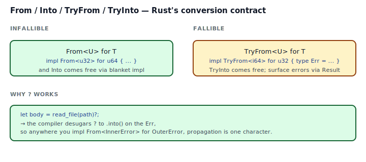
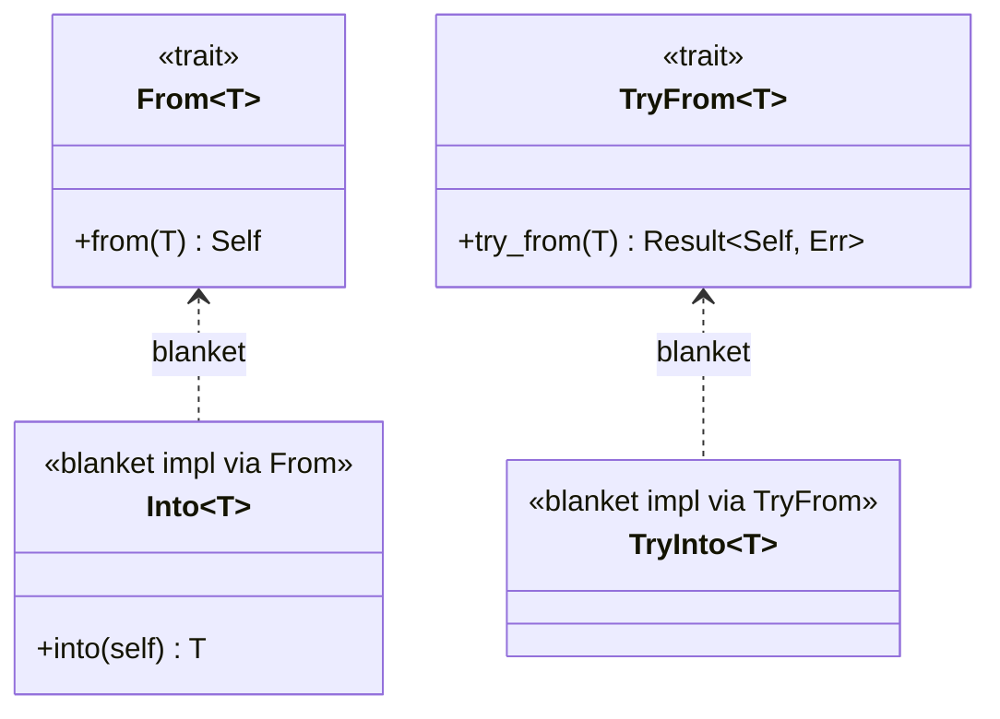
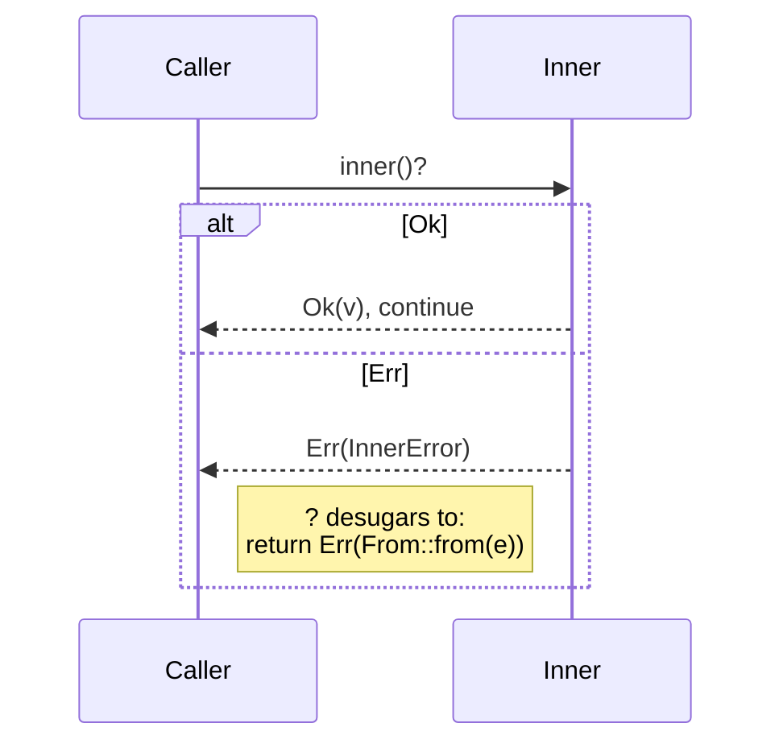

## Intent

Define how values of one type convert to values of another, using Rust's standard conversion traits: `From` / `Into` for infallible conversions, `TryFrom` / `TryInto` for fallible ones. These four traits are the lingua franca that `?`, `.into()`, `.parse::<T>()`, and `collect::<T>()` all speak.

Every crate grows conversion functions. Use the standard traits and your functions compose with the rest of the ecosystem for free; roll your own (`fn to_celsius`, `fn into_fahrenheit_unchecked`) and every caller has to learn your vocabulary.

## Problem / Motivation

You have a `Name` newtype, a `Port` newtype, a `ConfigError` enum, and you want to:

- Construct `Name` from `&str` ergonomically: `let n: Name = "Rajesh".into();`
- Validate a `Port` from an `i64` returning an error: `let p: Port = raw.try_into()?;`
- Let `?` propagate a `ParseIntError` through a function returning `ConfigError` with zero boilerplate.



All three are standard conversion problems. Rust has one answer shape for each, and the traits compose: `?` automatically calls `.into()` on error values, so the moment you `impl From<InnerError> for OuterError`, every `?` through the crate that already propagated `InnerError` starts working for `OuterError` too.

## The Four Traits



- **`From<U> for T`** — `U -> T` is infallible. Implement this. You automatically get `impl Into<T> for U`.
- **`Into<T> for U`** — don't implement directly. Use it as a *bound* in your function signatures (`fn f(x: impl Into<String>)`), not as a target for impls.
- **`TryFrom<U> for T`** — `U -> T` may fail, with a typed `Error`. Implement this. `TryInto` comes automatically.
- **`TryInto<T> for U`** — again, don't implement; use as a bound.

### Why `?` just works



The `?` operator desugars to `match expr { Ok(v) => v, Err(e) => return Err(From::from(e)) }`. Every `From` impl you write makes one more "error type bridge" that `?` can cross.

## Idiomatic Rust Form

Full code: [`code/idiomatic.rs`](./code/idiomatic.rs).

### A. Infallible: `impl From<&str> for Name`

```rust
pub struct Name(String);

impl From<&str> for Name {
    fn from(s: &str) -> Self { Name(s.to_string()) }
}
```

Usage at the call site is a single token:

```rust
let n: Name = "Rajesh".into();      // calls Name::from under the hood
fn greet(n: impl Into<Name>) { ... } // accepts &str, String, Name, anything with From
```

`impl Into<Name>` as a function bound is *more flexible* than `impl AsRef<str>` because the function owns the converted `Name` — no lifetimes, no double-conversion.

### B. Fallible: `impl TryFrom<i64> for Port`

```rust
pub struct Port(u16);
pub struct OutOfRange { pub value: i64 }

impl TryFrom<i64> for Port {
    type Error = OutOfRange;
    fn try_from(v: i64) -> Result<Self, Self::Error> {
        if (1..=65535).contains(&v) { Ok(Port(v as u16)) }
        else                         { Err(OutOfRange { value: v }) }
    }
}
```

Usage:

```rust
let p: Port = raw.try_into()?;  // converts + propagates error via ?
```

`TryFrom` is the *right* trait for any conversion that can fail. Don't use `From` and panic; don't return `Option<Self>` when `Result<Self, TypedError>` is the right signal.

### C. `From` for errors — the `?` bridge

```rust
impl From<OutOfRange> for ConfigError {
    fn from(e: OutOfRange) -> Self {
        ConfigError::InvalidPort { value: e.value }
    }
}
```

Now anywhere in the crate that says `let p: Port = raw.try_into()?;` inside a function returning `Result<_, ConfigError>`, propagation works. No `map_err`, no boilerplate. This is the shape [Error-as-Values](../error-as-values/index.md) relies on.

### When to reach for `map_err` instead

When the conversion needs *extra context* the `From` impl cannot supply — e.g., you want to attach the field name where the error occurred:

```rust
let raw = s.parse::<i64>()
    .map_err(|source| ConfigError::Parse { field: "port", source })?;
```

Rule of thumb: `From` for context-free conversions, `map_err` for ad-hoc context attached at the call site.

## Anti-patterns & Rust-specific Caveats

- ⚠️ **Don't implement `Into` directly.** The blanket `impl<T, U: From<T>> Into<T> for U` already gives you Into whenever you impl From. A manual `impl Into<T> for U` conflicts with the blanket (E0119) and is never needed.
- ⚠️ **Don't use `From` for a fallible conversion.** `From::from` returns `Self`, so you have no Result to return. Either panic (bad), corrupt silently (worse), or use `TryFrom` (right). If a `.into()` call site ever needs to handle failure, the trait is `TryInto`.
- ⚠️ **Don't impl `From` in both directions for non-trivial types.** `From<A> for B` plus `From<B> for A` is legal but usually a smell — conversions aren't always symmetric (e.g., `String` -> `&str` is a borrow, `&str` -> `String` allocates; don't pretend they're equivalent).
- ⚠️ **Don't add a `From<T>` just to silence a `?`.** If a conversion needs context (field name, location, retry count), the `From` impl can't carry it. Use `map_err` at the call site.
- ⚠️ **Don't forget the orphan rule.** You can `impl From<Foreign> for YourType` (at least one side is yours), but not `impl From<Foreign> for AnotherForeign`. A newtype solves it: `impl From<Foreign> for MyNewtype`.
- ⚠️ **Don't use `as`-casts when a `TryFrom` exists.** `let p = v as u16` silently truncates out-of-range `i64`s. `let p: u16 = v.try_into()?` surfaces the error. Clippy has lints (`cast_possible_truncation`) for exactly this.
- ⚠️ **Don't accept `String` when `impl Into<String>` is just as easy.** `fn greet(n: impl Into<String>)` takes `String`, `&str`, `&String`, `Name`, and anything else that says "I know how to become a String." Callers love it.
- ⚠️ **Don't implement `From`/`TryFrom` when a method name is clearer.** `fn to_decimal(&self) -> BigDecimal` reads better than `impl From<&Self> for BigDecimal` when the conversion is domain-specific and unlikely to appear in generic code.

## Compiler-Error Walkthrough

[`code/broken.rs`](./code/broken.rs) implements `Into` manually when `From` already exists:

```rust
impl From<Celsius> for Fahrenheit { ... }

// conflicts with the blanket impl From → Into
impl Into<Fahrenheit> for Celsius { ... }
```

```
error[E0119]: conflicting implementations of trait `Into<Fahrenheit>`
              for type `Celsius`
  |
  |     impl From<Celsius> for Fahrenheit { ... }
  |     --------------------------------- first implementation here
  |     impl Into<Fahrenheit> for Celsius { ... }
  |     ^^^^^^^^^^^^^^^^^^^^^^^^^^^^^^^^^ conflicting implementation
  = note: conflicting implementation in crate `core`:
          - impl<T, U> Into<U> for T where U: From<T>;
```

Read it: the standard library provides `impl<T, U: From<T>> Into<U> for T`. Implementing From triggered that blanket, so a manual `impl Into` duplicates what the compiler already generated. The fix is to **delete the manual Into impl** — it's unnecessary.

### The second mistake in `broken.rs`

`impl From<i64> for Port` silently truncates out-of-range values. That's a logical bug, not a compile error. The clippy lint `cast_possible_truncation` may flag it, but the real fix is to use `TryFrom`.

`rustc --explain E0119` covers conflicting implementations.

## When to Reach for This Pattern (and When NOT to)

**Implement `From`/`TryFrom` when:**
- The conversion is *well-defined* and *context-free* — the source type fully determines the target.
- You want call sites to use `.into()` / `.try_into()` without ceremony.
- You want `?` to propagate your inner error through outer functions.
- The conversion is likely to appear in generic code (`fn process<T: Into<Config>>(t: T)`).

**Skip `From`/`TryFrom` when:**
- The conversion needs runtime context the source value alone doesn't carry (user id, request headers, global state).
- The conversion has a domain name that reads better as a method (`.to_minutes()`, `.as_chars_upper()`).
- You're tempted to `impl From<A> for B` to make an unrelated API call more convenient. That usually leaks abstraction.

## Verdict

**`use`** — `From`/`Into`/`TryFrom`/`TryInto` are Rust's standard vocabulary for conversions. Every typed API benefits from speaking it: `?` integrates, `.into()` call sites stay tight, and generic code composes. Get the infallible-vs-fallible choice right and the whole ecosystem cooperates with your types.

## Related Patterns & Next Steps

- [Newtype](../newtype/index.md) — every newtype benefits from `From<Inner>` / `TryFrom<Inner>` impls so callers can construct it ergonomically.
- [Error-as-Values](../error-as-values/index.md) — `impl From<InnerError> for OuterError` is the core mechanism that makes `?` reach across error types.
- [Builder](../../gof-creational/builder/index.md) — builders accept `impl Into<String>` for string-like fields so callers don't care about `&str` vs `String` at the call site.
- [Typestate](../typestate/index.md) — state transitions can be modeled as `From` impls when the transition is infallible (`Unauthenticated -> AuthPending`) or `TryFrom` when it can fail.
- [Factory Method](../../gof-creational/factory-method/index.md) — sometimes a `From<Config>` is a simpler factory than a function + enum + match.
