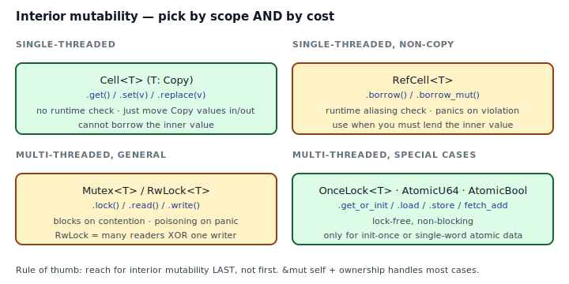
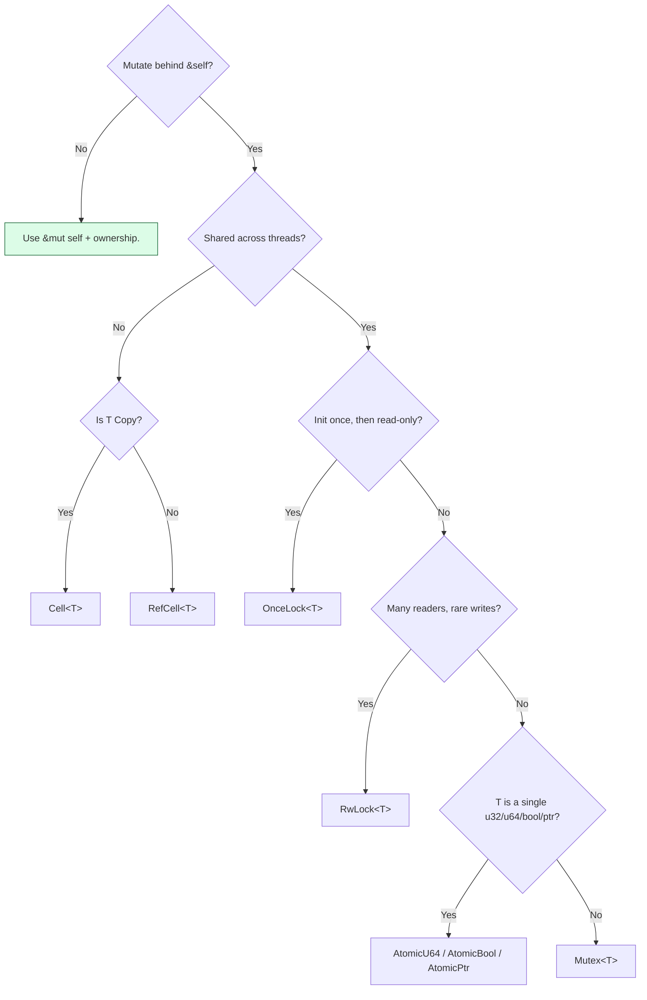

## Intent

Mutate a value through a shared reference (`&self`), in a way the borrow checker accepts and the runtime either proves safe or enforces at cost. Interior mutability is the escape hatch when exclusive-ownership Rust can't model your data's actual aliasing pattern.

The first thing to learn about interior mutability is when *not* to use it. The second is which of the six standard tools fits your use case.

## Problem / Motivation

Rust's normal rule is **aliasing XOR mutation** enforced at compile time: `&self` means "shared", `&mut self` means "exclusive". For ~90% of code, this is the right rule and you should not fight it.

The remaining cases:

1. **Observer-style instrumentation.** A `Counter` whose `.bump()` takes `&self` but updates an internal count. `&mut self` would force every caller to hold an exclusive borrow, which defeats the point of a shared instrument.
2. **Graph structures where children are shared.** Traditional tree/graph algorithms often pass `&Graph` around and mutate children through it. Restructuring is possible, but sometimes honest interior mutability is cleaner than gymnastics.
3. **Shared configuration that can be swapped.** A `ConfigStore` read by many, updated rarely.
4. **Lazy initialization.** A `OnceLock<T>` you fill on first access.
5. **Atomic state.** A lock-free counter, a spin flag, a generation number.
6. **Poisoned-mutex recovery.** Sometimes you really do need `Arc<Mutex<T>>` for shared mutable state.



## Decision Tree



## The Six Tools

Full code: [`code/idiomatic.rs`](./code/idiomatic.rs). Each tool shown with its canonical use.

### `Cell<T>` — single-threaded, `T: Copy`

```rust
pub struct Counter { hits: Cell<u64> }
impl Counter {
    pub fn bump(&self) { self.hits.set(self.hits.get() + 1); }
    pub fn value(&self) -> u64 { self.hits.get() }
}
```

- No runtime check. Moves `Copy` values in and out.
- `.get()` returns a *value*, never a borrow.
- Smallest and cheapest tool. Use when the value is `Copy` and you only need to read/write it whole.

### `RefCell<T>` — single-threaded, dynamic borrow-check

```rust
let c = RefCell::new(vec![1, 2, 3]);
let r = c.borrow();         // Ref<'_, Vec<u32>>
let w = c.borrow_mut();     // RUNTIME PANIC: already borrowed
```

- `.borrow()` and `.borrow_mut()` track aliasing at runtime.
- Violating aliasing XOR mutation *panics*. That's the tradeoff: correctness at runtime cost.
- Use when the inner value isn't `Copy` and you need to lend it temporarily (`&` or `&mut`) through a shared reference.

### `Mutex<T>` — multi-threaded, blocking

```rust
let n = self.inner.lock().expect("mutex poisoned");
*n += 1;
```

- Blocks other threads until released.
- **Poisoning**: if a thread panics while holding the lock, subsequent locks return `Err(PoisonError)`. For program-fatal state, `expect("poisoned")` is usually correct; for recoverable state, handle `PoisonError::into_inner()`.
- Lock is released when the `MutexGuard` drops (RAII).

### `RwLock<T>` — multi-threaded, many readers XOR one writer

```rust
let cfg = self.inner.read().expect("rwlock poisoned");
// ... or
*self.inner.write().expect("rwlock poisoned") = new_value;
```

- Many readers *or* one writer at a time.
- Writers starve under heavy read contention on most implementations. If reads are truly dominant, consider `arc-swap` (a crate) for lock-free reads.
- Poisoning semantics are identical to `Mutex`.

### Atomic types — multi-threaded, lock-free, single-word data

```rust
pub struct AtomicCounter { v: AtomicU64 }
impl AtomicCounter {
    pub fn bump(&self) { self.v.fetch_add(1, Ordering::Relaxed); }
    pub fn value(&self) -> u64 { self.v.load(Ordering::Relaxed) }
}
```

- `AtomicU64`, `AtomicBool`, `AtomicPtr<T>`, `AtomicUsize`, etc.
- Beats `Mutex<u64>` for plain counters; `fetch_add` is a single instruction on modern hardware.
- **Memory ordering** is the gotcha. `Relaxed` is fine for counters; use `AcqRel` / `SeqCst` when you need to synchronize other reads/writes across threads. When in doubt, `SeqCst` is the safest and rarely measurably slower.

### `OnceLock<T>` — init exactly once

```rust
fn config() -> &'static String {
    static CONFIG: OnceLock<String> = OnceLock::new();
    CONFIG.get_or_init(|| "loaded-once".to_string())
}
```

- Race-free lazy initialization. Runs the closure on the first caller; every subsequent caller gets the cached `&T`.
- Stable since Rust 1.70. Prefer it to `lazy_static!` / `once_cell`.
- See [Singleton](../../gof-creational/singleton/index.md) for the full Rust story of "one instance, initialized once".

## Anti-patterns & Rust-specific Caveats

- ⚠️ **Don't reach for `RefCell` first.** Nine times out of ten, `&mut self` or restructuring the data is the right answer. `RefCell` is a signal that exclusive ownership can't model your problem — that's rare.
- ⚠️ **Don't share a `RefCell` across threads.** `RefCell<T>` is `!Sync`. Compile error, by design. The cross-thread equivalent is `Mutex<T>` (or `RwLock`, or atomics, or `OnceLock`).
- ⚠️ **Don't hold a `RefCell::borrow_mut()` across a callback that might re-enter.** Reentrancy panics. Scope the borrow tightly: `{ let mut g = cell.borrow_mut(); g.foo(); }` — drop at the brace.
- ⚠️ **Don't hold a `MutexGuard` across `.await`.** In async code, other tasks on the same executor cannot progress until you release. Use `tokio::sync::Mutex` if you truly need an await-safe lock; prefer to restructure so the guard is dropped before the await.
- ⚠️ **Don't use `Mutex<u64>` when `AtomicU64` will do.** A `fetch_add` is a hundred times cheaper than a lock. Mutexes are for *structured* shared state, not for integer counters.
- ⚠️ **Don't use interior mutability as a dependency-injection hack.** A `RefCell<Option<Dependency>>` that callers "set later" is almost always a design smell — the dependency should be passed into the constructor, or threaded explicitly.
- ⚠️ **Don't forget poisoning.** `Mutex::lock()` returns `Result` because a thread that held the lock might have panicked. Blindly `.unwrap()` works only if "another thread crashed" is already fatal to your program. Otherwise handle `PoisonError` explicitly.
- ⚠️ **Don't `borrow()` and `borrow_mut()` on the same `RefCell` at the same time.** Panic at runtime, discovered under load. The compile-time version (shared + exclusive borrow) is the safer path if you can arrange it.

## Compiler-Error Walkthrough

[`code/broken.rs`](./code/broken.rs) shares a `RefCell` across threads:

```rust
let data = std::sync::Arc::new(RefCell::new(0u64));
let d2 = data.clone();
std::thread::spawn(move || {
    *d2.borrow_mut() += 1;
});
```

```
error[E0277]: `RefCell<u64>` cannot be shared between threads safely
  |
  |     std::thread::spawn(move || {
  |                        ^^^^^^^ `RefCell<u64>` cannot be shared between threads safely
  |
  = help: within `Arc<RefCell<u64>>`, the trait `Sync` is not
          implemented for `RefCell<u64>`
```

Read it: `RefCell` is `Send` (you can move it to another thread) but not `Sync` (you can't share it between threads). `std::thread::spawn` requires the captured value to be `Send`, which is fine, *and* requires anything borrowed from it to be `Sync`, which is where it breaks.

The fix is to pick a cross-thread primitive: `Arc<Mutex<u64>>` for general state, or `Arc<AtomicU64>` for a counter.

The second mistake in `broken.rs` is a *runtime* one — a `RefCell::borrow` live when a `borrow_mut` is requested — which panics with:

```
thread 'main' panicked at 'already borrowed: BorrowMutError'
```

There's no compile-time check for this. It's why the decision tree prefers `&mut self` + ownership whenever it's viable.

`rustc --explain E0277` covers the trait-bound story.

## When to Reach for This Pattern (and When NOT to)

**Use interior mutability when:**
- Exclusive ownership cannot model your data (shared instrumentation, graphs, caches).
- The mutation pattern is small and well-scoped (one counter, one config cell, one lazy init).
- You can justify the runtime cost against exclusive ownership (atomics over mutex for hot paths, `RefCell` over `&mut self` when the alternative is noisy plumbing).

**Skip interior mutability when:**
- `&mut self` works. It's cheaper, safer, and statically verified.
- The "shared state" is actually data you could pass as arguments.
- You'd be wrapping business-domain state in `Arc<Mutex<T>>` for convenience. That state usually deserves a cleaner ownership story.
- You're reaching for `RefCell` because "the borrow checker is being annoying." That annoyance is usually a design smell pointing at a better structure.

## Verdict

**`use-with-caveats`** — interior mutability is a legitimate Rust pattern, but the default should always be exclusive ownership. When you do reach for it, pick the *cheapest* tool that fits: `Cell` over `RefCell`, `AtomicU64` over `Mutex<u64>`, `OnceLock` over `Mutex<Option<T>>`.

## Related Patterns & Next Steps

- [Singleton](../../gof-creational/singleton/index.md) — the process-wide singleton is usually `OnceLock<T>` or `OnceLock<Mutex<T>>`.
- [Observer](../../gof-behavioral/observer/index.md) — an `EventBus` implementation often uses `RefCell`/`Mutex` for its subscriber list, though channels are often cleaner.
- [RAII & Drop](../raii-and-drop/index.md) — `MutexGuard`, `Ref`, `RefMut`, `RwLockReadGuard` are RAII types; their Drop releases the lock or updates borrow counts.
- [Closure as Callback](../closure-as-callback/index.md) — callbacks that mutate captured state often need `RefCell`/`Mutex` if they must take `&self`.
- [Typestate](../typestate/index.md) — sometimes a typestate upgrade eliminates the need for interior mutability entirely by encoding state in the type.
