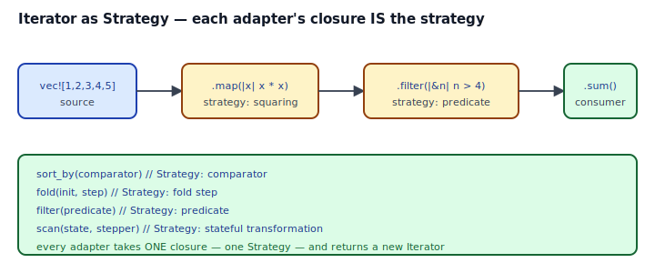

## Intent

Observe that Rust's iterator adapters *are* the Strategy pattern — each combinator (`map`, `filter`, `fold`, `sort_by`, `scan`, `take_while`) takes a closure that parameterizes its behavior, and the closure is the Strategy. No `trait Strategy`, no `Box<dyn>`, no ceremony. Write one closure, get the whole algorithm.

This is the Rust-native refinement of [Strategy](../../gof-behavioral/strategy/index.md): instead of a Strategy hierarchy, you get a first-class iterator-combinator library where the "strategy" is a closure you pass inline.

## Problem / Motivation

You want to:

- Transform every item of a collection (`map`).
- Keep only items that match a predicate (`filter`).
- Reduce a collection to one value under some combining rule (`fold`).
- Sort by a custom comparator (`sort_by`).
- Emit running sums until a threshold (`scan`).

In a language without first-class closures, each of these would be a Strategy hierarchy:

```java
interface Mapper<T, R> { R apply(T item); }
class SquareMapper implements Mapper<Integer, Integer> { public Integer apply(Integer x) { return x * x; } }
list.stream().map(new SquareMapper()).toList();
```

Rust's `xs.iter().map(|n| n * n).sum()` does all of that inline. The closure IS the Strategy; the adapter IS the Strategy-consumer.



## The Core Moves

```mermaid
flowchart LR
    Src[vec![1,2,3,4,5]] --> M[".map(|n| n * n)"]
    M --> F[".filter(|&n| n > 4)"]
    F --> C{consumer}
    C -->|.sum| Sum[i32]
    C -->|.collect| Vec[Vec]
```

- Each **adapter** takes a closure whose type (`FnMut`, `Fn`, `FnOnce`) matches what it needs (see [Closure as Callback](../closure-as-callback/index.md) for the trait hierarchy).
- Each **closure** is a Strategy — typically one line.
- Adapters are **lazy**: `map` and `filter` return adapter structs whose `next()` pulls one item through the closure on demand. Nothing runs until a **consumer** (`collect`, `sum`, `fold`, `count`, `for_each`) drives the chain.

## Idiomatic Rust Form

Full code: [`code/idiomatic.rs`](./code/idiomatic.rs). Five adapter families:

| Adapter | Strategy shape | Example |
|---|---|---|
| `map` | `FnMut(Item) -> T` | `.map(|n| n * n)` |
| `filter` | `FnMut(&Item) -> bool` | `.filter(|&n| n % 2 == 0)` |
| `fold` | `FnMut(Acc, Item) -> Acc` | `.fold(0, |a, n| a + n)` |
| `sort_by` | `FnMut(&T, &T) -> Ordering` | `v.sort_by(\|a, b\| a.cmp(b))` |
| `scan` | `FnMut(&mut State, Item) -> Option<Item>` | stateful running sum |

Each adapter's closure is the Strategy. Compose them into pipelines; each pipeline is a Strategy-of-Strategies without a trait in sight.

### Your own adapters

Take the same shape in your own APIs:

```rust
fn reduce<I, F, T>(iter: I, init: T, step: F) -> T
where
    I: IntoIterator,
    F: FnMut(T, I::Item) -> T,
{
    iter.into_iter().fold(init, step)
}
```

This is Strategy-the-pattern reduced to two lines. Callers pass a closure; that closure is their Strategy.

### Early termination

Combinators like `take`, `take_while`, `find`, `any`, `all` let the pipeline *stop early* when the strategy says so. Want the first even square greater than 100? `.map(|n| n * n).find(|&n| n % 2 == 0 && n > 100)`.

### `Iterator` + `FnMut` vs storing closures

If you need to parameterize at runtime over several strategies, store them:

```rust
let strategies: Vec<Box<dyn Fn(i32) -> i32>> = vec![
    Box::new(|x| x * x),
    Box::new(|x| x * 2),
];
```

Every closure has a unique *anonymous* type (even with identical signatures), so the trait-object boxing is necessary to collect them into one container. See [`code/broken.rs`](./code/broken.rs) for the compile error when this is omitted.

## Anti-patterns & Rust-specific Caveats

- ⚠️ **Don't pick the wrong closure signature.** `sort_by` wants `FnMut(&T, &T) -> Ordering`, not `bool`. `fold` wants `FnMut(Acc, Item) -> Acc`. Read the adapter's signature; the type error tells you the rest. See `code/broken.rs`.
- ⚠️ **Don't materialize intermediate `Vec`s.** `xs.iter().filter(p).collect::<Vec<_>>().iter().count()` allocates a Vec you immediately throw away. `.filter(p).count()` does the same work without allocation.
- ⚠️ **Don't reach for `Box<dyn Fn>` by default.** Each closure is a distinct anonymous type; generics over `impl Fn(...)` monomorphize and inline. Box only when you need to store multiple strategies heterogeneously (see above).
- ⚠️ **Don't write `.collect::<Vec<_>>().into_iter()` to "reset" an iterator.** If you truly need two passes, clone the source or rebuild the iterator from scratch (`xs.iter().filter(p).collect::<Vec<_>>()` once, then iterate).
- ⚠️ **Don't abuse `fold` when a named combinator exists.** `.fold(0, |a, n| a + n)` is `.sum()`. `.fold(1, |a, n| a * n)` is `.product()`. `.fold((0, 0), |(s, n), x| (s + x, n + 1))` is often clearer as `.sum()` + `.count()` in two passes — unless you really need one pass.
- ⚠️ **Don't hide side effects in `map`.** `map` is for pure transformations. If the closure writes to a logger or a counter, use `.inspect(|n| log(n))` (which preserves the item) or `for_each` (which runs for side effects and consumes the iterator).
- ⚠️ **Don't capture locks inside closures carelessly.** `.map(|x| shared_mutex.lock().unwrap().translate(x))` locks once per item — possibly once per thousand items in a pipeline. Capture the guard outside the map, or restructure the data.
- ⚠️ **Don't lean on `FnMut` for accumulators when `fold` is cleaner.** A closure that captures `&mut acc` through `for_each` is the same algorithm as `fold(init, |acc, item| ...)`, but the fold form is one expression and returns the result.

## Compiler-Error Walkthrough

[`code/broken.rs`](./code/broken.rs) passes a boolean-returning closure to `sort_by`:

```rust
let mut v = vec![3, 1, 4];
v.sort_by(|a, b| a < b);   // E0308
```

```
error[E0308]: mismatched types
  |
  |     v.sort_by(|a, b| a < b);
  |                      ^^^^^ expected `Ordering`, found `bool`
  |
note: expected closure signature `fn(&i32, &i32) -> std::cmp::Ordering`
```

Read it: `sort_by` wants a *comparator* (`Ordering`), not a *less-than test* (`bool`). The closure shape must match the adapter's signature. Two fixes:

```rust
v.sort_by(|a, b| a.cmp(b));   // explicit Ordering
v.sort_by_key(|&x| x);         // simpler for sort-by-key uses
```

### The second mistake in `broken.rs`

Putting two different closures into a `Vec<_>` fails with E0308 because each closure has a unique, anonymous type. The fix is `Vec<Box<dyn Fn(i32) -> i32>>` so both can live behind a trait object.

`rustc --explain E0308` covers the mismatched-types family.

## When to Reach for This Pattern (and When NOT to)

**Use iterator adapters as Strategy when:**
- The "strategy" is a small, pure, context-free function.
- You're processing a collection or stream.
- You'd otherwise define a one-method trait used at one call site.
- You want laziness, early termination, and composition.

**Skip iterator adapters when:**
- The algorithm is genuinely not a per-item transformation (e.g., global reshuffling of the whole dataset). A plain loop + Vec manipulation is clearer.
- The "strategy" requires mutable shared state across calls beyond what `scan` can express. Consider restructuring to extract the state.
- The pipeline would span ten adapters and five nested closures. Break it into named helper functions; readability beats cleverness.

## Verdict

**`use`** — iterator adapters are Rust's canonical refinement of Strategy. Every `.map`, `.filter`, `.fold` is a Strategy you wrote in one line. Combine freely; compose into pipelines; stop defining `Strategy` traits for per-item transformations — the standard library already has them.

## Related Patterns & Next Steps

- [Iterator](../../gof-behavioral/iterator/index.md) — the trait and mechanism this pattern rests on. Implement `Iterator` for your own types to plug into the whole combinator library.
- [Strategy](../../gof-behavioral/strategy/index.md) — the generalization. Iterator-as-Strategy is the "closure instance" of that pattern.
- [Closure as Callback](../closure-as-callback/index.md) — the Fn/FnMut/FnOnce story that determines which closures work with which adapters.
- [Visitor](../../gof-behavioral/visitor/index.md) — `iter().fold(init, step)` is a Visitor over a sequence; the step function is the Visitor's logic.
- [Builder with Consuming Self](../builder-with-consuming-self/index.md) — builders often use `impl Into<...>` for inputs; iterator pipelines often use `impl IntoIterator<Item = ...>` for the same ergonomics.
