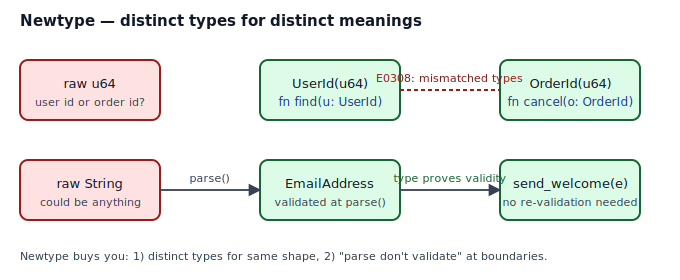
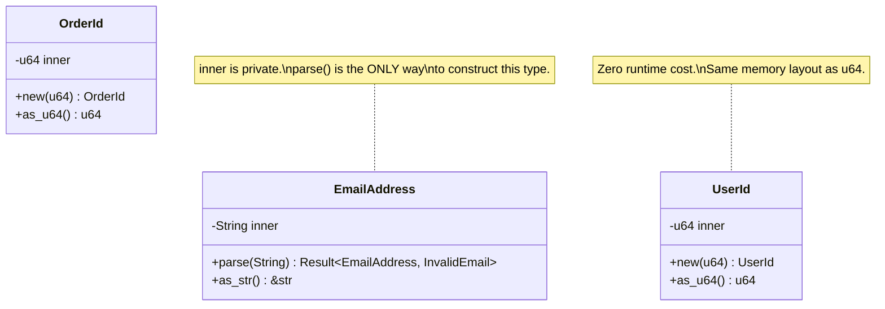

## Intent

Wrap a primitive (or any existing type) in a single-field tuple struct so that the type system distinguishes values with different meanings. Combine with a smart constructor to push validation to the boundary of your program ("parse, don't validate").

Newtype is the smallest type-system pattern in Rust. It is also the one that catches the most real-world bugs.

## Problem / Motivation

Two problems at once.

**1. Primitive obsession.** A `u64` could be a user id, an order id, an account balance in paise, a byte offset, or a Unix timestamp. When `find_user` and `cancel_order` both take `u64`, the compiler cannot stop you from passing the wrong one.

```rust
fn find_user(_id: u64) {}
fn cancel_order(_id: u64) {}

let user_id  = 42_u64;
let order_id = 7_u64;
cancel_order(user_id);   // ← silently wrong. ships to prod. pages oncall.
```

**2. Validate-everywhere.** If "a valid email" is just `&str`, every function that receives one has to remember to re-check. Miss one place and you have an incident.



Newtype collapses both problems:

- `struct UserId(u64);` and `struct OrderId(u64);` are *different types*. Passing one where the other is expected is a compile error (E0308).
- `struct EmailAddress(String);` with a **private** field and a public `parse` constructor means a value of type `EmailAddress` is a *proof* the string inside is valid. Functions that accept `&EmailAddress` never re-validate.

This is the "parse, don't validate" discipline from Alexis King's essay, expressed in one Rust struct.

## Idiomatic Rust Form



Full code: [`code/idiomatic.rs`](./code/idiomatic.rs).

Mechanics worth naming:

- **Tuple-struct syntax.** `pub struct UserId(u64);` — one field, unnamed, accessed as `.0` internally. Deriving `Clone`, `Copy`, `Debug`, `PartialEq`, `Eq`, `Hash` is usually boilerplate you want and should not skip.
- **Zero runtime cost.** Rust guarantees that a single-field tuple struct has the same in-memory representation as its inner field. `UserId` is a `u64` with a compiler-enforced label.
- **Private inner field.** For the "parse, don't validate" use, the inner field **must** be private. If callers can write `EmailAddress("not-an-email".to_owned())`, the invariant dies. Expose `as_str(&self) -> &str` for read access; never expose `&mut self.0`.
- **Smart constructors return `Result`.** `EmailAddress::parse` is infallible-on-success: once you get `Ok(EmailAddress)`, the value is provably valid. Nothing downstream has to check.
- **`#[non_exhaustive]` on error enums.** `InvalidEmail` uses it so that adding `InvalidEmail::Length(usize)` later is not a breaking change for downstream `match`es.

### `Deref`, `From`, and `Into` — use them carefully

- **`From<Inner>`** — only implement when constructing the newtype is infallible. For `UserId::from(42_u64)` this is fine. For `EmailAddress::from("...")` it is **not**: construction can fail, so use `TryFrom` instead.
- **`Deref<Target = Inner>`** — tempting, but dangerous for validated newtypes. If `EmailAddress: Deref<Target = String>`, then `email.push_str("💀")` silently bypasses your invariant. Prefer explicit `as_str()` / `as_inner()` accessors.
- **`From<Newtype> for Inner`** — fine, and often useful for serialization: `let id: u64 = user.into();`.

## Anti-patterns & Rust-specific Caveats

- ⚠️ **Don't leave the inner field public** on a validated newtype. `pub struct EmailAddress(pub String)` is a newtype in name only — anyone can construct an invalid one.
- ⚠️ **Don't implement `Deref` on validated newtypes.** It leaks mutating methods of the inner type and destroys the invariant. Prefer named accessors.
- ⚠️ **Don't newtype everything.** If you have one function that takes a `u64` and no risk of confusion, the newtype is ceremony without benefit. Reach for it when confusion is plausible or when validation lives in one place and is referenced from many.
- ⚠️ **Don't forget the derives.** `UserId(42) == UserId(42)` is `false` without `PartialEq`. `HashMap<UserId, _>` does not compile without `Hash`. Derive the set you need up front.
- ⚠️ **Don't expose a public `fn inner(self) -> Inner`** if unwrapping breaks downstream invariants. For a read-only `EmailAddress`, exposing `as_str()` is safe. For a `SecretKey(Vec<u8>)`, exposing the inner bytes is how secrets leak into logs.
- ⚠️ **Don't `unwrap()` the result of `parse()` in a library.** That replaces your typed error with a panic at an arbitrary distance from the call site. Propagate with `?` and let the caller decide.

## Compiler-Error Walkthrough

[`code/broken.rs`](./code/broken.rs) deliberately mixes two newtypes that share an underlying shape:

```rust
let user = UserId(42);
cancel_order(user);      // expects OrderId, got UserId
```

The compiler says:

```
error[E0308]: mismatched types
  --> broken.rs:18:18
   |
18 |     cancel_order(user);
   |     ------------ ^^^^ expected `OrderId`, found `UserId`
   |     |
   |     arguments to this function are incorrect
   |
note: function defined here
  --> broken.rs:10:4
   |
10 | fn cancel_order(_o: OrderId) {
   |    ^^^^^^^^^^^^ -----------
```

This is the bug `code/naive.rs` would happily ship. **E0308 is Newtype's entire reason for existing**: turn "we passed the wrong id" from a production incident into a compile error. The fix is to use the correct id at the call site, or — if this confusion is genuinely common in your codebase — to add a checked `From<UserId> for OrderId` conversion that makes the intent explicit.

`rustc --explain E0308` gives the canonical explanation.

## When to Reach for This Pattern (and When NOT to)

**Use Newtype when:**
- Two or more places in your codebase use the same primitive shape for different meanings (ids of different entities, different currencies, different units of time).
- Validation logic exists and you want to run it exactly once, at the boundary.
- You want to attach behavior (methods, trait impls) to a primitive you don't own — `struct Seconds(u64)` can `impl Display` however you like; `u64` cannot.
- You want to *seal* a value so downstream code can't forge it (e.g., `struct AuthenticatedUser(UserId)` constructed only after an auth check).

**Skip Newtype when:**
- The primitive is used in exactly one place and there's no realistic confusion.
- The newtype would wrap a `Vec` or `String` and you genuinely want all of the inner type's methods. `Deref` is tempting here, but think twice — most of the time you want a handful of methods, not all of them.
- You're tempted to newtype for "clean code" reasons without naming a specific bug it prevents.

## Verdict

**`use`** — Newtype is the Rust pattern that earns its keep fastest. If you have two `u64`s with different meanings, or any value that needs to be validated once, reach for it.

## Related Patterns & Next Steps

- [Typestate](../typestate/index.md) — the state-in-type pattern. A typestate is essentially a newtype whose phantom parameter encodes *what* the value is currently allowed to do.
- [Phantom Types](../phantom-types/index.md) — `PhantomData<T>` lets you parameterize a newtype without storing a T, e.g., `struct Wrapping<Unit>(u64, PhantomData<Unit>)` for distinguishing `Wrapping<Seconds>` from `Wrapping<Milliseconds>`.
- [Sealed Trait](../sealed-trait/index.md) — combine with a newtype to prevent downstream crates from constructing unauthorized variants.
- [Builder](../../gof-creational/builder/index.md) — often pairs with Newtype: the builder validates individual fields into newtype values, then assembles them.
- [Error-as-Values](../error-as-values/index.md) — the `InvalidEmail` error enum in this pattern follows that track's conventions (`#[non_exhaustive]`, `impl Display`, `impl Error`).
