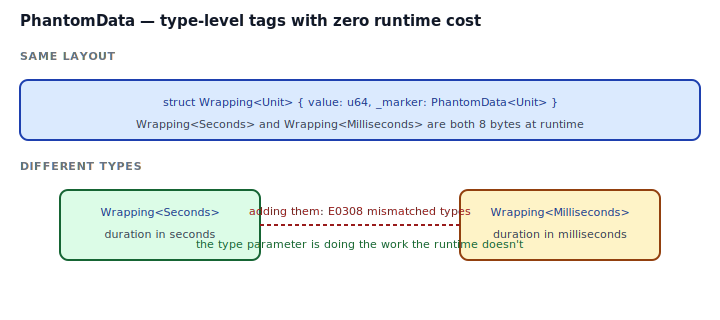

## Intent

Parameterize a type over something the type *does not store at runtime*. The parameter exists only at the type level — for distinguishing meanings, propagating lifetimes, controlling variance, or gating auto-traits. `std::marker::PhantomData<T>` is the zero-sized field that tells the compiler "treat this struct as if it held a `T`."

Phantom types are the primitive behind Typestate, behind units of measure, behind tag-based identifiers, and behind several of the standard library's ownership tricks. Master them and several other patterns become simple.

## Problem / Motivation

Any of these three situations needs "a generic parameter I don't store":

1. **Units of measure.** You want `Duration<Seconds>` and `Duration<Milliseconds>` to be distinct types so the compiler rejects `total = secs + ms`. Both are 8-byte `u64` internally, but passing one where the other is expected must be a compile error.
2. **Typestate.** `HttpClientBuilder<Missing>` and `HttpClientBuilder<Provided>` have the same fields. The state lives only in the type parameter. (See [Typestate](../typestate/index.md).)
3. **Variance / auto-trait control.** A `RawHandle<T>` wraps a raw OS handle and wants to be covariant in `T`, without implementing `Send` automatically. `PhantomData<fn() -> T>` expresses "covariant, not auto-`Send`".



The naive attempt breaks:

```rust
struct Duration<Unit> { amount: u64 }
```

```
error[E0392]: parameter `Unit` is never used
```

The compiler refuses a type parameter that has no effect. `PhantomData<Unit>` is the way to say "yes it has effect — at the type level."

## Canonical Uses

```mermaid
flowchart TB
    subgraph Units["Units of measure"]
        U1[Duration&lt;Seconds&gt;]
        U2[Duration&lt;Milliseconds&gt;]
        U3[mixing them: E0308]
        U1 --> U3
        U2 --> U3
    end
    subgraph State["Typestate markers"]
        S1[Conn&lt;Disconnected&gt;] --> S2[Conn&lt;Connected&gt;]
        S2 --> S3[.send() only on Connected]
    end
    subgraph Variance["Variance / auto-trait control"]
        V1[PhantomData&lt;fn() -&gt; T&gt;] --> V2[covariant in T,<br/>not auto-Send/Sync]
    end
```

## Idiomatic Rust Form

Full code: [`code/idiomatic.rs`](./code/idiomatic.rs).

### Unit-typed `Duration`

```rust
pub struct Seconds;
pub struct Milliseconds;

pub struct Duration<Unit> {
    amount: u64,
    _unit: PhantomData<Unit>,
}

impl Duration<Seconds> {
    pub fn to_ms(self) -> Duration<Milliseconds> { ... }
}
impl Duration<Milliseconds> {
    pub fn to_secs(self) -> Duration<Seconds> { ... }
}
```

At runtime, a `Duration<Seconds>` is one `u64`. At compile time, passing it where a `Duration<Milliseconds>` is expected produces E0308. Conversions are explicit methods (`to_ms`, `to_secs`) that live only on the appropriate impl block.

### Typed identifiers

```rust
pub struct User; pub struct Order;

pub struct Id<T> { value: u64, _type: PhantomData<fn() -> T> }

fn find_user(_id: Id<User>) { }
fn cancel_order(_id: Id<Order>) { }
```

Every id is 8 bytes. Mixing them is E0308. Same idea as [Newtype](../newtype/index.md), but the *generic* form lets you define one `Id<T>` and reuse it for every entity.

### Variance & auto-trait control — choosing the right PhantomData

The `T` inside `PhantomData` is not just a tag — it determines subtyping and auto-trait behavior. Three common choices:

| Declaration | Drop-check | Variance in T | Auto-`Send`/`Sync`? |
|---|---|---|---|
| `PhantomData<T>` | owns a T | covariant | same as T |
| `PhantomData<&'a T>` | borrows a T | covariant | `Sync` if T: Sync |
| `PhantomData<fn() -> T>` | borrows nothing | covariant | `Send` + `Sync` regardless of T |
| `PhantomData<fn(T)>` | borrows nothing | contravariant | `Send` + `Sync` regardless of T |

Rule of thumb:
- **Wrapping a real value of type T?** Use `PhantomData<T>` so Drop-check knows the struct conceptually owns one.
- **Tracking a lifetime from outside?** Use `PhantomData<&'a T>` or `PhantomData<&'a ()>`.
- **Using T only as a *tag* that never gets dropped or borrowed?** Use `PhantomData<fn() -> T>`. It's the "pure tag" form — correct variance, and it opts *out* of tying `Send/Sync` to T.

The canonical reference for this is the [std::marker::PhantomData rustdoc table][phantomdata].

[phantomdata]: https://doc.rust-lang.org/std/marker/struct.PhantomData.html

## Anti-patterns & Rust-specific Caveats

- ⚠️ **Don't use `std::mem::zeroed` or `transmute` to "construct" phantom markers.** A marker struct is a unit struct (`pub struct Seconds;`) — just name it. `PhantomData` itself is also a unit value: `PhantomData` on its own (or `PhantomData::<T>` in cases the compiler cannot infer T) is the whole thing.
- ⚠️ **Don't expose phantom markers publicly unless you want downstream to parameterize over them.** For unit tags, seal them (see [Sealed Trait](../sealed-trait/index.md)) so downstream can't invent new `Units` or state markers and break your invariants.
- ⚠️ **Don't pick `PhantomData<T>` when you mean `PhantomData<fn() -> T>`.** They're not equivalent: the former ties `Send/Sync` and Drop-check to T; the latter doesn't. For pure tag types, the `fn()` form is almost always what you want.
- ⚠️ **Don't chain conversions through phantom types by hand in hot loops.** If `u64 -> Duration<Seconds> -> u64` is an identity at runtime, the compiler will inline away the wrapping — but a cast-heavy loop with mismatched conversion types accidentally prevents inlining. Test with `cargo bench` or `--release` + profiling if it matters.
- ⚠️ **Don't forget Drop-check.** If your struct conceptually owns a `T`, use `PhantomData<T>` so the compiler knows the struct is invalid after `T` is dropped. For a library that claims to own data it doesn't actually hold, `PhantomData<fn() -> T>` is the lie that might bite you later.
- ⚠️ **Don't overuse phantom types.** "Bag of compile-time tags" is where a simple enum variant would've sufficed. Reach for PhantomData when a runtime tag can't represent the invariant you need.

## Compiler-Error Walkthrough

[`code/broken.rs`](./code/broken.rs) omits `PhantomData` on a parameterized struct:

```rust
pub struct Duration<Unit> { amount: u64 }
```

```
error[E0392]: parameter `Unit` is never used
  |     pub struct Duration<Unit> { amount: u64 }
  |                         ^^^^ unused parameter
  |
  = help: consider removing `Unit`, referring to it in the body of the type,
          or using a marker such as `PhantomData`
```

Read it: the compiler refuses to let you declare a type parameter that has no effect. Two legitimate fixes:

1. If you don't need the parameter, remove it.
2. If you do, store `PhantomData<Unit>`:
    ```rust
    pub struct Duration<Unit> {
        amount: u64,
        _unit: PhantomData<Unit>,
    }
    ```

The second mistake in `broken.rs` is the payoff once `#1` is fixed: passing `Duration<Seconds>` where `Duration<Milliseconds>` is expected triggers E0308 (mismatched types) — which is the *point* of the pattern. `rustc --explain E0392` and `rustc --explain E0308` cover both errors.

## When to Reach for This Pattern (and When NOT to)

**Use PhantomData when:**
- You need distinct types that share a runtime representation (units, currencies, typed ids).
- You're implementing [Typestate](../typestate/index.md) and need markers for each state.
- You want a wrapper whose variance or auto-trait behavior is specifically controlled.
- You want to track a lifetime for a resource you don't actually store (`PhantomData<&'a ()>`).

**Skip PhantomData when:**
- The parameter can just be stored as a real field. `struct Wrapping<T>(T)` is simpler than `struct Wrapping<T> { v: u64, _m: PhantomData<T> }` unless you really need a T-less shape.
- A plain enum variant would work. `enum Currency { Usd(f64), Inr(f64) }` is simpler than `Money<Usd>` for a closed set.
- You just want a tag. A unit struct (`struct Seconds;`) *is* a tag and needs no PhantomData unless you parameterize over it.

## Verdict

**`use`** — PhantomData is one of the most under-taught and most load-bearing tools in a Rust library author's kit. It's how you express "this type has a meaning that the runtime shape doesn't reveal." Typestate, units of measure, sealed ownership tricks — they all sit on top of it.

## Related Patterns & Next Steps

- [Typestate](../typestate/index.md) — phantom types are how typestate markers get stored without runtime cost.
- [Newtype](../newtype/index.md) — the non-generic version of "distinct types for the same shape". Combine when you need both.
- [Sealed Trait](../sealed-trait/index.md) — seal your phantom markers so downstream can't invent new units, states, or tags that bypass your invariants.
- [Builder](../../gof-creational/builder/index.md) — typestate builders use PhantomData to track which required fields have been set.
- [RAII & Drop](./../raii-and-drop/index.md) — `PhantomData<T>` influences drop-check; pick the right form when your handle conceptually owns or borrows.
