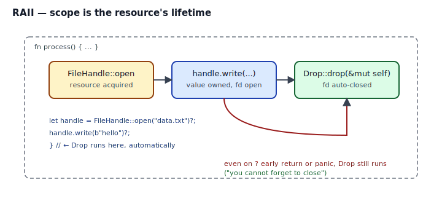
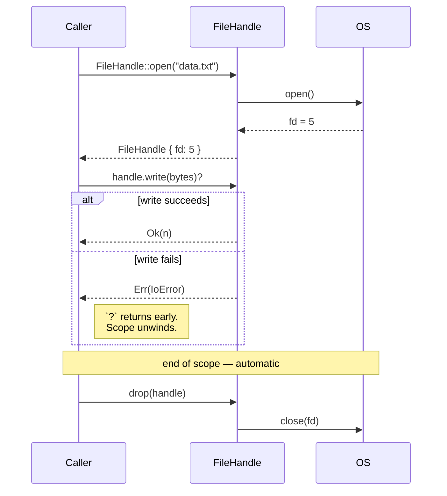

## Intent

Tie the lifetime of a resource (file, socket, lock, database connection, heap allocation, transaction) to the lifetime of an owning value. When the value goes out of scope, the resource is released — automatically, deterministically, on every control-flow path.

RAII ("Resource Acquisition Is Initialization") predates Rust — C++ gets credit — but Rust makes it the *default* rather than a discipline you have to remember. The mechanism is the `Drop` trait plus ownership tracking by the borrow checker.

## Problem / Motivation

Pick any resource that must be released:

- A file descriptor must be `close()`'d or the OS runs out.
- A `Mutex` must be unlocked or the next thread deadlocks.
- A database transaction must be committed or rolled back, never both.
- A heap allocation must be freed or you leak memory.

Every language solves this somehow:

| Language | Mechanism | Breaks on |
|---|---|---|
| C | Manual `close()` / `free()` | Any early return, any panic, any path you forgot |
| Java | `try`/`finally`, or `try-with-resources` | Syntactic — you must remember to use it |
| Go | `defer close()` | You must remember to defer |
| Python | `with` + context managers | Scoped, but opt-in per call site |
| **Rust** | `Drop` impl — automatic on scope exit | Only the `mem::forget` and `ManuallyDrop` escape hatches |

Rust's version is the strongest: *the caller cannot forget*, because there is nothing for them to remember.



## Classical Form (C++ RAII)

C++ gives you destructors that run at end-of-scope. Same idea — `std::unique_ptr`, `std::lock_guard`, `std::fstream`. The difference is that C++ lets you bypass RAII by forgetting to wrap a raw resource (a naked `FILE*`, a `new` without matching `delete`, a `pthread_mutex_lock` without matching `unlock`). Rust's ownership rules make the safe wrapper the path of least resistance: you can't construct a `File` without getting a value that has a `Drop` impl.

## Idiomatic Rust Form



Full code: [`code/idiomatic.rs`](./code/idiomatic.rs).

The three moves that make RAII work in Rust:

1. **Ownership of the handle implies ownership of the resource.** A `FileHandle` value owns the `fd`. Move the value, the resource moves with it. Drop the value, the resource is released. The compiler enforces that the value has exactly one owner at a time.
2. **`impl Drop` runs at end-of-scope.** You write the cleanup once; the compiler inserts the call wherever the value goes out of scope — normal return, `?` early return, panic unwinding. No manual `defer`, no `try-finally`, no context manager.
3. **The borrow checker stops use-after-close.** After `drop(h)` or any move, `h` is gone. Trying to use it is a compile error (E0382). You cannot write to a closed file.

### The "you cannot forget" property

This is the whole payoff. Compare `code/idiomatic.rs` (Drop) with `code/naive.rs` (manual `.close()`):

- With Drop, every one of these paths releases the resource automatically:
  - `let h = FileHandle::open("x")?; /* body */ Ok(())`
  - `let h = FileHandle::open("x")?; h.write(..)?;  // ← `?` returns early`
  - `panic!("something")` anywhere downstream
  - `return Err(...)` from a conditional

- Without Drop, *each* of those paths needs an explicit `.close()`. Miss one, and you have a leak. It's always the rare error path that leaks — which is why the bug ships.

### Drop order

Struct fields are dropped in declaration order. Local variables are dropped in *reverse* declaration order. This matters when one resource depends on another:

```rust
fn connect() -> Result<(), Error> {
    let conn = Connection::open()?;     // dropped second (last in)
    let tx   = conn.begin_transaction()?; // dropped first (first out) — releases tx before closing conn
    // ...
    Ok(())
}
```

If you ever see "use after free" reasoning in a Drop implementation, it's probably a drop-order issue. Move fields around in the struct, or use explicit `.drop(x)` calls to force ordering.

### What Drop cannot do

- **`Drop::drop` cannot return a `Result`.** If closing the resource can fail (e.g., `fsync` on shutdown), the failure is swallowed — or you log it and move on. For resources where close errors *must* be handled, expose an explicit `.close()` method that returns `Result` and have `Drop` log a warning if it wasn't called.
- **`Drop` cannot take `self` by value.** The signature is `fn drop(&mut self)` — the struct is about to be deallocated, and you get one last chance to touch it. If you need to move fields out, use `Option::take()` or `mem::replace`.
- **`Drop` does not run for `static`s.** Statics live for the whole program; Rust never drops them. If you put a `Mutex` in a `static`, the OS gets the mutex back when the process exits, not via Drop.
- **`mem::forget` skips Drop entirely.** It's safe (not `unsafe`!) to leak a value. `Box::leak`, `mem::forget`, and reference-cycle `Rc`s all bypass Drop. This is by design — leaks are not memory-unsafe, so they're allowed.

## Anti-patterns & Rust-specific Caveats

- ⚠️ **Don't rely on Drop for user-visible side effects.** Printing "transaction committed" or flushing logs in Drop is fine; closing an irreplaceable network connection and ignoring the error is not. For those, expose an explicit `.close()` that returns `Result`.
- ⚠️ **Don't implement Drop on a `Copy` type.** Rust forbids it for a reason: copies would duplicate the resource without duplicating the cleanup. If you impl Drop, you cannot derive `Copy`.
- ⚠️ **Don't use `drop(x)` for synchronization.** It looks like you're "telling the compiler" to drop `x` right now, but in debug builds it works slightly differently than you expect, and in optimized builds it's usually a no-op after inlining. If you need a lock released at a specific point, scope it or use `mem::drop` explicitly and test.
- ⚠️ **Don't ignore `Drop` in `Arc`/`Rc` cycles.** A cycle keeps reference counts > 0, Drop never runs, resources leak. Use `Weak` to break cycles.
- ⚠️ **Don't call `unwrap()` inside `Drop`.** Panicking during unwind aborts the process. If your cleanup can fail, handle it gracefully (log, retry, swallow) or expose explicit close.
- ⚠️ **Don't implement `Drop` "because you can."** Types that own no resources (a plain `struct Point { x, y }`) should not have a Drop impl. It adds cost for nothing and disables some compiler optimizations.

## Compiler-Error Walkthrough

[`code/broken.rs`](./code/broken.rs) explicitly drops a handle and then tries to use it:

```rust
let mut h = FileHandle::new(3);
drop(h);
h.write(b"second");   // use after move
```

The compiler says:

```
error[E0382]: borrow of moved value: `h`
  --> broken.rs:25:5
   |
22 |     let mut h = FileHandle::new(3);
   |         ----- move occurs because `h` has type `FileHandle`,
   |               which does not implement the `Copy` trait
...
24 |     drop(h);
   |          - value moved here
25 |     h.write(b"second");
   |     ^ value borrowed here after move
```

Read it literally: `std::mem::drop<T>` is a normal function with signature `fn drop<T>(_: T)`. Calling `drop(h)` *moves* `h` into that function, which consumes it and immediately lets it go out of scope — running your `Drop::drop` impl. After that line, `h` is uninitialized storage and using it is a compile error.

**E0382 is the borrow checker proving that the resource lifetime is correct.** In C++, `delete` lets you keep the pointer and dereference it later — at runtime cost. In Rust, the compiler simply refuses to let you write that code.

`rustc --explain E0382` gives the canonical explanation.

## When to Reach for This Pattern (and When NOT to)

**Implement `Drop` when:**
- Your struct owns a resource that must be released.
- Releasing the resource is idempotent or defensively guarded (`Option::take()` + `if let Some`).
- The cleanup logic is short, synchronous, and infallible (or its failure is logged, not returned).

**Don't implement `Drop` when:**
- Your struct owns only "plain old data" — `String`, `Vec`, `HashMap` — those already have Drop impls you shouldn't duplicate.
- The cleanup can genuinely fail and the error must surface to the caller. Use an explicit `.close() -> Result<(), Error>` instead, and optionally have `Drop` warn if the explicit close wasn't called.
- You'd be writing `impl Drop` because the type "feels" like a resource. Ask what it owns; if the answer is "nothing that needs cleanup," skip it.

## Verdict

**`use`** — RAII via Drop is not optional Rust. It is how every resource-owning type in the standard library works (`File`, `MutexGuard`, `TcpStream`, `Box`, `Vec`, `Arc`). Implement it for your own resource wrappers, and refuse to write manual `close()` routines that callers have to remember.

## Related Patterns & Next Steps

- [Typestate](../typestate/index.md) — combine with RAII to make "used a file after close" a compile error, not just a runtime one.
- [Newtype](../newtype/index.md) — a resource handle is almost always a newtype over a raw handle (`FileHandle(i32)`, `TxGuard(Connection)`).
- [Builder with Consuming self](../builder-with-consuming-self/index.md) — consuming-self style shares the "ownership ends here" intuition with Drop.
- [Facade](../../gof-structural/facade/index.md) — a friendly RAII type (e.g., `FileHandle`) often plays the role of a facade over a raw platform API.
- [Observer](../../gof-behavioral/observer/index.md) — unregistration is cleanest when the subscription handle is an RAII value whose Drop removes itself.
