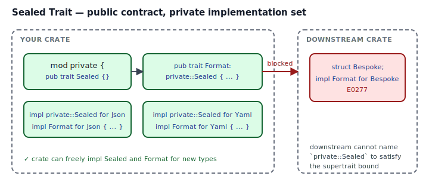
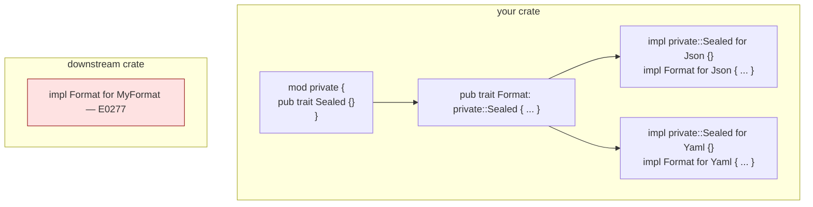

## Intent

Expose a public trait for downstream code to *use as a bound*, while keeping the set of *implementations* closed to types inside your crate. The Rust idiom is a supertrait in a private module that downstream code cannot name, so their `impl` blocks fail to satisfy it.

Sealed traits are how the standard library enforces "these are all the iterator adapters you get" and how ecosystem crates like `tower`, `hyper`, and `sqlx` protect invariants their API would otherwise bleed.

## Problem / Motivation

You publish a crate with a public trait:

```rust
pub trait Format {
    fn extension(&self) -> &'static str;
    fn render(&self, data: &[(&str, i64)]) -> String;
}
pub struct Json;
pub struct Yaml;
impl Format for Json { ... }
impl Format for Yaml { ... }
```

Downstream code can now write `impl Format for BespokeFormat`. That's a feature — until you:

- Want to add a new required method. Now every downstream impl is a breaking change.
- Want to write `match kind { Json => ..., Yaml => ... }` in a consumer. You can't — there could be a `BespokeFormat` in the wild.
- Want to guarantee an invariant across all impls (e.g., "no format re-orders keys"). You can't audit code you don't own.

Sealing says: "this trait is ours. You can use it as a bound. You can call its methods. You cannot implement it."



## How the Seal Works



Two moves:

1. **Private supertrait.** Define an empty trait `Sealed` inside a *private* module (`mod private`), so downstream code cannot `use` it.
2. **Require the supertrait on the public trait.** `pub trait Format: private::Sealed { ... }`. To implement `Format`, a type must also implement `private::Sealed`. Only code inside your crate can write that impl, because only code inside your crate can name the module path.

Downstream tries `impl Format for MyType`, the compiler checks the bounds, sees `Sealed` isn't satisfied, refuses to compile with E0277. No extra lints, no convention — pure visibility.

## Idiomatic Rust Form

Full code: [`code/idiomatic.rs`](./code/idiomatic.rs).

```rust
mod private { pub trait Sealed {} }

pub trait Format: private::Sealed {
    fn extension(&self) -> &'static str;
    fn render(&self, data: &[(&str, i64)]) -> String;
}

pub struct Json;  impl private::Sealed for Json {} impl Format for Json { ... }
pub struct Yaml;  impl private::Sealed for Yaml {} impl Format for Yaml { ... }
```

Downstream consumers can still:

- Write `fn write_report<F: Format>(fmt: &F, ...)` — use `Format` as a generic bound.
- Call every method of `Format` on `Json`, `Yaml`, and any future concrete types you add.
- Pattern-match on values (if your types expose enough information) and reason about the closed set.

Downstream consumers **cannot**:

- Add their own `impl Format for BespokeFormat`. The supertrait bound fails.
- Import `private::Sealed` to work around the seal. The module is not `pub`.

### Variants

- **Seal a specific generic parameter**, not the whole trait: `pub trait Container { type Item: private::Sealed; ... }`.
- **Seal with a lifetime or constant bound** if a type-level-only seal isn't enough.
- **Publicly-known-but-unimplementable seal**: document the supertrait as pub (in the public docs) but keep the module private. Downstream *knows* the trait is sealed, but still can't implement it. Good for error messages.

## Anti-patterns & Rust-specific Caveats

- ⚠️ **Don't seal everything by default.** Sealing is a forever-commitment to maintaining every variant you ship. If your API is "this is a reasonable bound, but I have no skin in what else implements it," don't seal. Seal when you'd be broken by an unknown fourth impl, not when you're vaguely worried about one.
- ⚠️ **Don't expose the supertrait module.** The whole seal depends on downstream code being unable to name the path. Re-exporting `private::Sealed` at the crate root undoes the seal silently.
- ⚠️ **Don't seal with a marker trait you forgot to document.** Downstream users staring at `E0277: the trait bound X: private::Sealed is not satisfied` deserve a comment in the docs explaining why the trait is closed and what to do if they want similar functionality. (Often the answer is "file an issue and we'll consider adding a variant.")
- ⚠️ **Don't use `#[doc(hidden)]` alone.** Hiding an item from docs doesn't hide it from the compiler. `pub fn` and `pub trait` with `#[doc(hidden)]` can still be used by downstream code. The real seal is module privacy.
- ⚠️ **Don't forget to seal type parameters.** `pub trait Container { type Item; }` lets downstream swap in anything for `Item`. If you want to restrict `Item` to a closed set, bound it: `type Item: private::Sealed;`.
- ⚠️ **Don't ship a sealed trait without a future-compatible way to add variants.** New variants in a sealed world are non-breaking (downstream couldn't impl it anyway). But new *required methods* on a sealed trait are still breaking — even for your own impls. Use default methods, or add methods behind a new sealed subtrait.

## Compiler-Error Walkthrough

[`code/broken.rs`](./code/broken.rs) simulates a downstream crate impl failing the supertrait bound:

```rust
struct MyFormat;
impl upstream::Format for MyFormat {
    fn name(&self) -> &'static str { "mine" }
}
```

```
error[E0277]: the trait bound `MyFormat: upstream::private::Sealed` is not satisfied
  |     impl upstream::Format for MyFormat {
  |          ^^^^^^^^^^^^^^^^ the trait `upstream::private::Sealed`
  |                           is not implemented for `MyFormat`
  = note: this error originates in the trait definition
```

Read it: the public trait has a private-module supertrait. Downstream code cannot implement that supertrait (the path isn't visible), so the public impl is rejected by bound-check.

**E0277 is the compiler proving the seal works.** The fix, for a downstream user, is to *not* try to impl the sealed trait. For the crate author, the fix is to add `impl private::Sealed for TheirType` inside the crate if you *want* to allow that type — which is the whole point: the crate controls the set.

`rustc --explain E0277` covers the generic "trait bound not satisfied" story.

## When to Reach for This Pattern (and When NOT to)

**Seal a trait when:**
- You want to reserve the right to add required methods without breaking downstream.
- You want exhaustive reasoning over the implementations (e.g., "all my formats round-trip; if a round-trip bug exists, it's in one of these three files").
- Your trait's contract is *hard* and you don't trust random impls to honor it.
- You want downstream to use the trait as a bound but not to extend the set.

**Don't seal a trait when:**
- Extending the set is the whole point. Sealing `Iterator` would kill the ecosystem; the standard library is right not to.
- The trait is a data contract with trivial methods and downstream impls are harmless.
- You would be sealing "just in case." YAGNI applies to API design, too.

## Verdict

**`use`** — sealing is how Rust crates keep their promises without paying the breakage tax. Use it for public traits whose invariants you need to maintain; skip it for everything else.

## Related Patterns & Next Steps

- [Newtype](../newtype/index.md) — sealing is often applied to traits that accept newtypes; the combination prevents forging validated values.
- [Typestate](../typestate/index.md) — typestate marker types (`Missing`, `Provided`) are usually sealed so downstream can't add rogue state variants.
- [Phantom Types](../phantom-types/index.md) — phantom markers are almost always sealed so consumers can't invent new unit types or dimension markers.
- [Strategy](../../gof-behavioral/strategy/index.md) — sealing lets you expose a `Strategy` trait whose impls are a finite, auditable set.
- [Facade](../../gof-structural/facade/index.md) — a sealed facade is a public API surface whose impls you fully control.
