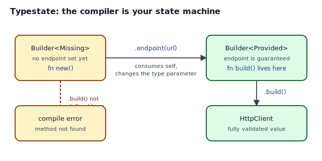
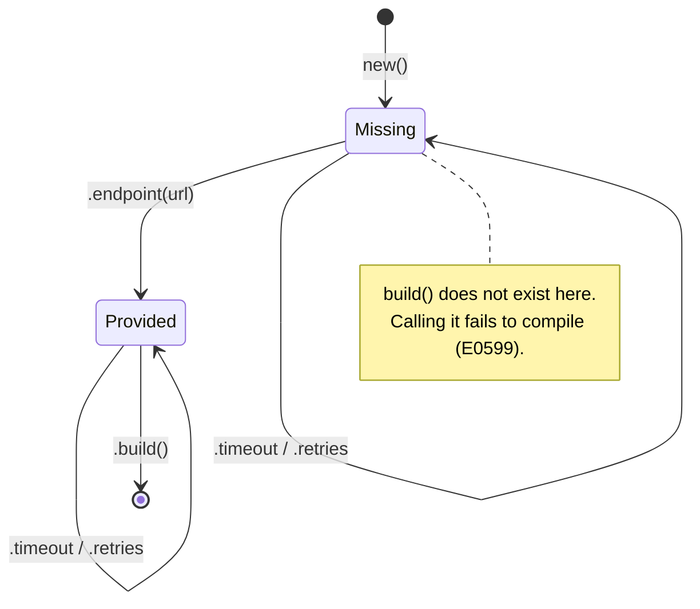
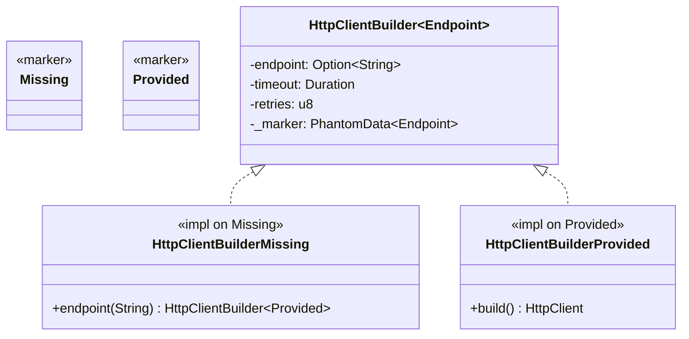

## Intent

Encode the **state** of a value in its **type**, so that methods which are illegal in a given state *do not exist* for that state. The compiler becomes the state machine. Forbidden transitions stop being runtime errors — they stop compiling.

## Problem / Motivation

Consider a builder whose `endpoint` field is required. There are three places that invariant can live:

1. **Documentation** — "remember to call `.endpoint()`". Hopes for the best.
2. **Runtime check** — `build()` returns `Result<_, BuildError::MissingEndpoint>`. The bug surfaces in production the first time a path forgets.
3. **The type system** — `build()` only *exists* when the endpoint has been set. The bug cannot surface, because the code doesn't compile.

Typestate is option 3.



## Classical Form in Other Languages

Most languages cannot express "this method is available only in this state" at the type level without simulating it via separate classes and a factory. The GoF **State** pattern solves a different, related problem — it swaps behavior based on a runtime state variable, but every method of the State interface still exists in every state. Typestate is sharper: the very *shape* of the API changes with the state.



## Idiomatic Rust Form

A typestate builder:



Full code: [`code/idiomatic.rs`](./code/idiomatic.rs).

Mechanics worth naming:

- **Zero-sized state markers.** `struct Missing;` and `struct Provided;` have no fields and no runtime cost. They exist only to distinguish two versions of `HttpClientBuilder` at the type level.
- **`PhantomData<Endpoint>` is mandatory.** Without it, `Endpoint` is an unused type parameter and the compiler rejects the definition. `PhantomData` tells the compiler "yes, I am using this parameter, trust me," at zero runtime cost.
- **State transitions are consuming calls.** `.endpoint(url)` takes `self` (of type `HttpClientBuilder<Missing>`) and returns a *different* type (`HttpClientBuilder<Provided>`). The old binding is moved; the new one carries the new state.
- **Optional fields use a blanket `impl<E>`.** `.timeout()` and `.retries()` should not change the endpoint state, so their `impl` block is generic over `E`.
- **`build()` lives in the `Provided` impl block only.** That is the entire trick. `HttpClientBuilder<Missing>::build(...)` has no meaning — the compiler has no such method to call.

## Why Typestate Beats Runtime Validation

`code/naive.rs` is the honest comparison — same builder, but `build()` returns `Result<HttpClient, BuildError>`. It works. It's idiomatic. It is also strictly weaker:

| | Runtime-checked (`naive.rs`) | Typestate (`idiomatic.rs`) |
|---|---|---|
| Forgot `.endpoint()`? | Runtime `Err(MissingEndpoint)` | Compile error (E0599) |
| Visible in CI? | Only if a test exercises that path | Always — `cargo check` catches it |
| Visible in `cargo check`? | No | Yes |
| API complexity | One builder type | One builder + N state markers |
| Runtime cost | Zero | Zero |
| Good for | Optional/configurable fields | Required fields & protocol order |

Typestate is not free — it adds type parameters and marker structs. Use it when a mistake would be genuinely dangerous or expensive to catch at runtime (network protocols, filesystem handles, crypto state machines, finite-state workflows).

## Anti-patterns & Rust-specific Caveats

- ⚠️ **Don't forget `PhantomData`.** `struct Builder<T> { field: String }` without `PhantomData<T>` is a compile error (E0392). The error message is helpful — read it.
- ⚠️ **Don't use an `enum` for the state.** `enum State { Missing, Provided }` as a *field* puts the state at runtime and defeats the point. Typestate's state is in the *type*, not the value.
- ⚠️ **Don't seal the states carelessly.** If callers can implement their own state marker, they can break the invariant. Make the marker traits and types `pub(crate)` or use the [Sealed Trait](../sealed-trait/index.md) pattern to prevent that.
- ⚠️ **Don't `.unwrap()` inside `build()`.** Even though the type system guarantees the `Option<String>` is `Some`, an `unwrap()` is still a panic in the source text. Use `match self.endpoint { Some(e) => e, None => unreachable!("typestate guarantees ...") }` to name the invariant in place.
- ⚠️ **Don't over-apply.** Three-state machines are lovely; ten-state ones are a combinatorial explosion of impl blocks. When the state graph grows, promote to a trait-based approach or accept a runtime enum with `match`.

## Compiler-Error Walkthrough

`code/broken.rs` constructs a `HttpClientBuilder<Missing>` and calls `.build()` on it directly:

```rust
let client = HttpClientBuilder::<Missing>::new().build();
//                                               ^^^^^ no method named `build`
```

The compiler says:

```
error[E0599]: no method named `build` found for struct
              `HttpClientBuilder<Missing>` in the current scope
  --> broken.rs:44:10
   |
44 |         .build();
   |          ^^^^^ method not found in `HttpClientBuilder<Missing>`
   |
note: the method `build` exists for `HttpClientBuilder<Provided>`,
      but not for `HttpClientBuilder<Missing>`
```

Read it: the method exists for *one* instantiation of the generic, and we tried to call it on *another*. The fix is to call `.endpoint(...)` first, which changes the type parameter from `Missing` to `Provided`, unlocking `.build()`.

`rustc --explain E0599` gives the canonical explanation — but the note telling you which instantiation *does* have the method is usually enough.

## When to Reach for This Pattern (and When NOT to)

**Use Typestate when:**
- A protocol has a required order: `open` → `write` → `close`, never `write` before `open`.
- Certain operations are only valid in certain modes: a `File` opened read-only cannot be written to.
- Forgetting a required step is dangerous or expensive (auth not completed, transaction not committed, crypto key not derived).
- The state graph is small (2–5 states). Each state typically needs its own `impl` block.

**Skip Typestate when:**
- All fields are optional and defaults are fine.
- The "state" is really user-supplied data that must be matched at runtime anyway.
- The state graph has more than ~6 nodes. The impl-block combinatorics get ugly; consider a session-types crate or a plain enum + runtime check instead.
- You just want to gate one method. A `Result<_, Err>` is often simpler than two marker types.

## Verdict

**`use`** — Typestate is a signature Rust pattern and the most common way to upgrade a "runtime-checked" API into a "compile-time-proven" one. Whenever you would write `panic!("this should never happen")`, ask first whether typestate can make that line unreachable.

## Related Patterns & Next Steps

- [Builder](../../gof-creational/builder/index.md) — the runtime-checked form. Typestate is its compile-time upgrade.
- [Phantom Types](../phantom-types/index.md) — `PhantomData` deserves its own page; this one just uses it.
- [Sealed Trait](../sealed-trait/index.md) — use it to make sure downstream crates cannot add their own state markers.
- [Newtype](../newtype/index.md) — combine with typestate to keep state markers from leaking into user code.
